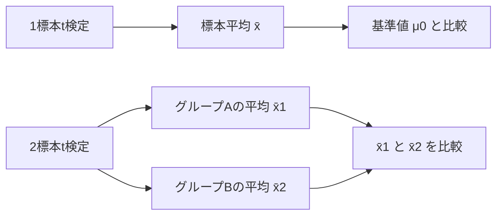
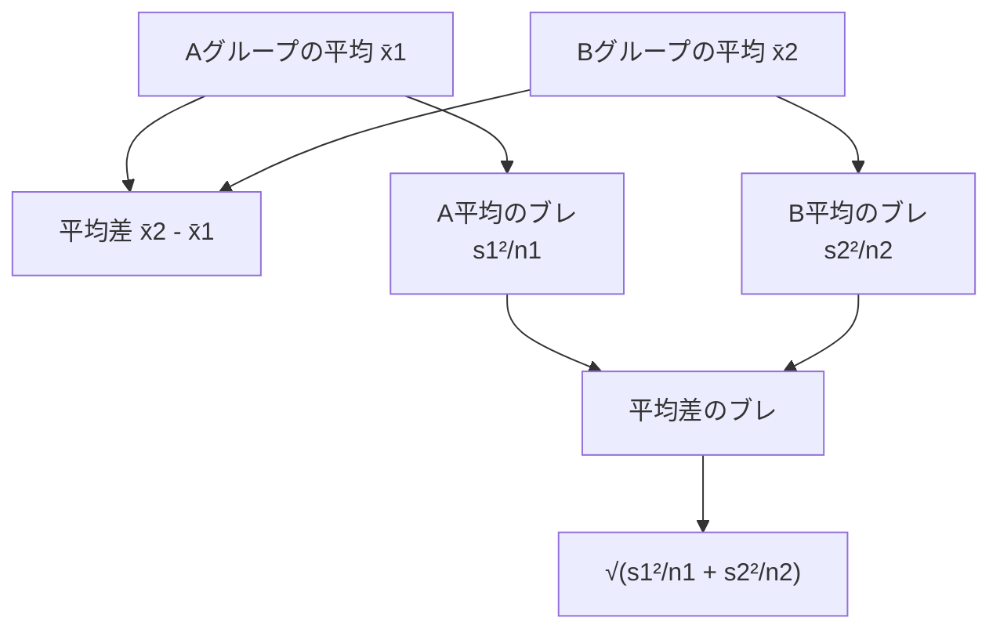

では次に進みます。

前回までは、1つの標本平均を基準値と比べる **1標本t検定** を扱いました。

今回は、2つのグループを比べます。

テーマは、

> AグループとBグループの平均に、本当に差があると言えるか？

です。

---

# 1. まず例から考える

ある学校で、2つの勉強法を比べたいとします。

```text
Aグループ：従来の勉強法
Bグループ：新しい勉強法
```

それぞれの平均点がこうだったとします。

|グループ|人数|平均点|標本標準偏差|
|---|--:|--:|--:|
|A：従来法|20人|70点|10点|
|B：新方法|20人|76点|12点|

Bグループの平均点は、Aグループより6点高いです。

ここで、すぐに

```text
新しい勉強法の方が良い
```

と言いたくなります。

でも、統計ではまだそう断言しません。

なぜなら、この6点差は、たまたま選ばれた生徒の違いによるブレかもしれないからです。

---

# 2. 2標本t検定とは何か

2標本t検定とは、

> 2つの独立したグループの平均に差があると言えるかを調べる検定

です。

たとえば、

|比較|問い|
|---|---|
|男子と女子|平均身長に差があるか|
|A教材とB教材|平均点に差があるか|
|薬あり群と薬なし群|平均血圧に差があるか|
|戦略Aと戦略B|平均回収率に差があるか|

共通しているのは、

```text
2つの独立した標本平均を比べる
```

ということです。

---

# 3. 1標本t検定との違い

1標本t検定は、

```text
1つの標本平均 vs 1つの基準値
```

でした。

一方、2標本t検定は、

```text
1つ目の標本平均 vs 2つ目の標本平均
```

です。

|検定|比べるもの|
|---|---|
|1標本t検定|標本平均と基準値|
|2標本t検定|2つの標本平均|

図で見るとこうです。



---

# 4. 独立した2群とは何か

2標本t検定で大事なのは、2つのグループが **独立** していることです。

独立とは、

> AグループのデータとBグループのデータが、別々の人・別々の対象から取られている

という意味です。

たとえば、

```text
Aクラス20人
Bクラス20人
```

なら独立した2群です。

一方で、

```text
同じ20人の、勉強前と勉強後
```

これは独立ではありません。

同じ人を2回測っているからです。

この場合は、2標本t検定ではなく、**対応のあるt検定** を使います。

ここはかなり重要です。

|データ|使う検定|
|---|---|
|A群とB群が別人|2標本t検定|
|同じ人の前後比較|対応のあるt検定|

対応のあるt検定は次回以降で扱います。

---

# 5. 仮説の立て方

2標本t検定では、2つの母平均を比べます。

グループAの母平均を、

```text
μ1
```

グループBの母平均を、

```text
μ2
```

とします。

## 両側検定

「平均に差があるか」を調べるなら、

```text
H₀：μ1 = μ2
H₁：μ1 ≠ μ2
```

です。

これは両側検定です。

---

## 右片側検定

「Bの方がAより高いか」を調べるなら、

```text
H₀：μ1 = μ2
H₁：μ2 > μ1
```

です。

これは右片側検定です。

または、差を

```text
μ2 - μ1
```

で考えるなら、

```text
H₀：μ2 - μ1 = 0
H₁：μ2 - μ1 > 0
```

です。

---

# 6. 2標本t検定の考え方

1標本t検定では、

```text
標本平均 - 基準値
```

を見ました。

2標本t検定では、

```text
2つの標本平均の差
```

を見ます。

つまり、

```text
x̄2 - x̄1
```

です。

ただし、平均差だけでは判断しません。

重要なのは、

> その平均差が、平均差のブレに対して十分大きいか

です。

だから、2標本t検定では、

```text
平均差 ÷ 平均差の標準誤差
```

を計算します。

---

# 7. Welchのt検定を基本にする

2標本t検定には、大きく2種類あります。

|種類|前提|
|---|---|
|等分散を仮定するt検定|2群の母分散が等しいと仮定|
|Welchのt検定|2群の母分散が等しいと仮定しない|

最初に覚えるなら、**Welchのt検定**を基本にしてよいです。

理由は単純です。

> 現実には、2つのグループの分散が等しいとは限らないから

です。

統計検定2級では、等分散仮定つきの問題が出ることもありますが、考え方としてはまずWelchを押さえるのが安全です。

---

# 8. Welchのt値

Welchのt検定では、検定統計量はこうです。

```text
t = (x̄1 - x̄2) / √(s1²/n1 + s2²/n2)
```

または、B - A で見るなら、

```text
t = (x̄2 - x̄1) / √(s1²/n1 + s2²/n2)
```

どちらで書いてもよいです。

大事なのは、分子と対立仮説の向きを合わせることです。

|記号|意味|
|---|---|
|x̄1|グループ1の標本平均|
|x̄2|グループ2の標本平均|
|s1|グループ1の標本標準偏差|
|s2|グループ2の標本標準偏差|
|n1|グループ1の標本サイズ|
|n2|グループ2の標本サイズ|

分母の、

```text
√(s1²/n1 + s2²/n2)
```

は、**平均差の標準誤差**です。

---

# 9. なぜ標準誤差を足すのか

2つの平均を比べるとき、ブレるのは片方だけではありません。

```text
Aグループの平均もブレる
Bグループの平均もブレる
```

だから、平均差のブレには、両方のブレが入ります。



ここで分散を足してから平方根を取る、という形になっています。

---

# 10. 例題：A教材とB教材の平均点に差はあるか

次の条件で考えます。

|グループ|n|標本平均|標本標準偏差|
|---|--:|--:|--:|
|A教材|20|70|10|
|B教材|20|76|12|

問い：

> B教材の方がA教材より平均点が高いと言えるか？

有意水準5%の右片側検定で考えます。

---

# 11. 仮説を立てる

今回は、Bの方が高いかを見たいので、

```text
H₀：μB = μA
H₁：μB > μA
```

です。

差を、

```text
μB - μA
```

で考えるなら、

```text
H₀：μB - μA = 0
H₁：μB - μA > 0
```

です。

---

# 12. 平均差を出す

```text
x̄B - x̄A = 76 - 70 = 6
```

平均差は6点です。

ただし、6点差が大きいかどうかは、まだ分かりません。

次に、平均差の標準誤差を出します。

---

# 13. 平均差の標準誤差を出す

Welchの標準誤差は、

```text
SE = √(sA²/nA + sB²/nB)
```

です。

今回、

```text
sA = 10
nA = 20
sB = 12
nB = 20
```

なので、

```text
SE = √(10²/20 + 12²/20)
   = √(100/20 + 144/20)
   = √(5 + 7.2)
   = √12.2
   ≒ 3.493
```

---

# 14. t値を出す

```text
t = 平均差 / 平均差の標準誤差
```

なので、

```text
t = 6 / 3.493
  ≒ 1.718
```

t値は約 **1.718** です。

これは、

> BとAの平均差6点は、平均差の標準誤差の約1.718個分

という意味です。

---

# 15. 自由度について

Welchのt検定では、自由度の計算が少し複雑です。

統計検定2級の学習初期では、まずは、

> Welchの自由度は問題文で与えられることが多い

と考えてよいです。

今回、自由度を約36とします。

自由度36、有意水準5%、右片側検定の臨界値は、だいたい、

```text
1.688
```

です。

今回のt値は、

```text
1.718
```

なので、

```text
1.718 > 1.688
```

です。

したがって、帰無仮説を棄却します。

結論：

> 有意水準5%で、B教材の方がA教材より平均点が高いと言える。

---

# 16. ただし、かなりギリギリ

ここで注意です。

```text
t = 1.718
臨界値 = 1.688
```

なので、かなりギリギリです。

こういうときに、

```text
完全にB教材が優れている
```

と強く言うのは危険です。

正しくは、

> このデータでは、有意水準5%の右片側検定で、B教材の平均点がA教材より高いという結果になった。ただし、判定はかなり境界に近い。

くらいです。

統計では、言い過ぎないことが重要です。

---

# 17. 両側検定ならどうなるか

もし問いが、

```text
A教材とB教材の平均点に差があるか？
```

なら、両側検定です。

仮説は、

```text
H₀：μA = μB
H₁：μA ≠ μB
```

です。

自由度36、両側5%の臨界値は、だいたい、

```text
±2.028
```

です。

今回のt値は、

```text
1.718
```

なので、

```text
|1.718| < 2.028
```

です。

したがって、両側検定では棄却しません。

つまり、

> 有意水準5%では、A教材とB教材の平均点に差があるとは言えない

となります。

同じデータでも、問いが変われば結論が変わります。

---

# 18. 1標本t検定との比較

|項目|1標本t検定|2標本t検定|
|---|---|---|
|比べるもの|標本平均と基準値|2つの標本平均|
|分子|x̄ - μ0|x̄1 - x̄2|
|分母|s/√n|√(s1²/n1 + s2²/n2)|
|使う場面|基準値と違うか|2群に差があるか|

共通している考え方は、

```text
差 ÷ その差のブレ
```

です。

1標本でも2標本でも、本質は同じです。

---

# 19. 競馬AIで考える

たとえば、2つの戦略A・Bを比較します。

|戦略|レース数|平均回収率|標本標準偏差|
|---|--:|--:|--:|
|戦略A|100|105%|60%|
|戦略B|100|120%|80%|

問い：

> 戦略Bは戦略Aより平均回収率が高いと言えるか？

仮説は、

```text
H₀：μB = μA
H₁：μB > μA
```

です。

平均差は、

```text
120 - 105 = 15
```

です。

平均差の標準誤差は、

```text
SE = √(60²/100 + 80²/100)
   = √(3600/100 + 6400/100)
   = √(36 + 64)
   = √100
   = 10
```

t値は、

```text
t = 15 / 10 = 1.5
```

です。

このt値だけ見ると、そこまで強くありません。

つまり、

> Bの平均回収率はAより15ポイント高いが、ばらつきも大きいため、統計的には強い差とは言いにくい可能性がある

ということです。

ここでも、平均値だけを見るのは危険です。

---

# 20. よくあるミス

## ミス1：平均差だけで判断する

```text
Bの方が6点高いから優れている
```

これは雑です。

必要なのは、

```text
6点差が、平均差の標準誤差に対して十分大きいか
```

です。

---

## ミス2：独立2群と対応ありを混同する

```text
同じ人の前後比較
```

なのに2標本t検定を使うのは違います。

同じ人の前後比較なら、対応のあるt検定です。

---

## ミス3：片側・両側を後出しする

結果を見てから、

```text
Bの方が高かったから片側検定
```

はダメです。

問いが事前に、

```text
Bの方が高いか
```

なら片側。

問いが、

```text
差があるか
```

なら両側です。

---

# 21. 練習問題

## 問1

AグループとBグループのテスト点を比較します。

|グループ|n|平均|標本標準偏差|
|---|--:|--:|--:|
|A|16|68|8|
|B|16|74|10|

Bの方がAより平均点が高いと言えるかを、右片側検定で考えます。

自由度を約29、片側5%の臨界値を **1.699** とします。

次を求めてください。

```text
1. 平均差
2. 平均差の標準誤差
3. t値
4. 棄却するか
```

---

## 問2

次の2つのグループの平均に差があるかを、両側検定で考えます。

|グループ|n|平均|標本標準偏差|
|---|--:|--:|--:|
|A|25|100|20|
|B|25|108|22|

自由度を約48、両側5%の臨界値を **±2.011** とします。

次を求めてください。

```text
1. 平均差
2. 平均差の標準誤差
3. t値
4. 棄却するか
```

---

# 22. 解答

## 問1

平均差：

```text
B - A = 74 - 68 = 6
```

平均差の標準誤差：

```text
SE = √(8²/16 + 10²/16)
   = √(64/16 + 100/16)
   = √(4 + 6.25)
   = √10.25
   ≒ 3.202
```

t値：

```text
t = 6 / 3.202
  ≒ 1.874
```

片側5%、自由度約29の臨界値は1.699です。

```text
1.874 > 1.699
```

なので、帰無仮説を棄却します。

結論：

> 有意水準5%で、Bの方がAより平均点が高いと言える。

---

## 問2

平均差：

```text
B - A = 108 - 100 = 8
```

平均差の標準誤差：

```text
SE = √(20²/25 + 22²/25)
   = √(400/25 + 484/25)
   = √(16 + 19.36)
   = √35.36
   ≒ 5.947
```

t値：

```text
t = 8 / 5.947
  ≒ 1.345
```

両側5%、自由度約48の臨界値は±2.011です。

```text
|1.345| < 2.011
```

なので、帰無仮説を棄却しません。

結論：

> 有意水準5%では、AとBの平均に差があるとは言えない。

---

# 今日のまとめ

2標本t検定は、

> 2つの独立したグループの平均に差があるかを調べる検定

です。

基本の形は、

```text
t = 平均差 / 平均差の標準誤差
```

Welchのt検定では、

```text
t = (x̄1 - x̄2) / √(s1²/n1 + s2²/n2)
```

です。

重要なのはこれです。

> 2標本t検定も、「差そのもの」ではなく、「差がブレに対してどれくらい大きいか」を見る。

そして、

```text
独立した2群 → 2標本t検定
同じ対象の前後比較 → 対応のあるt検定
```

ここを間違えないこと。

次回は、**対応のあるt検定** に進みます。