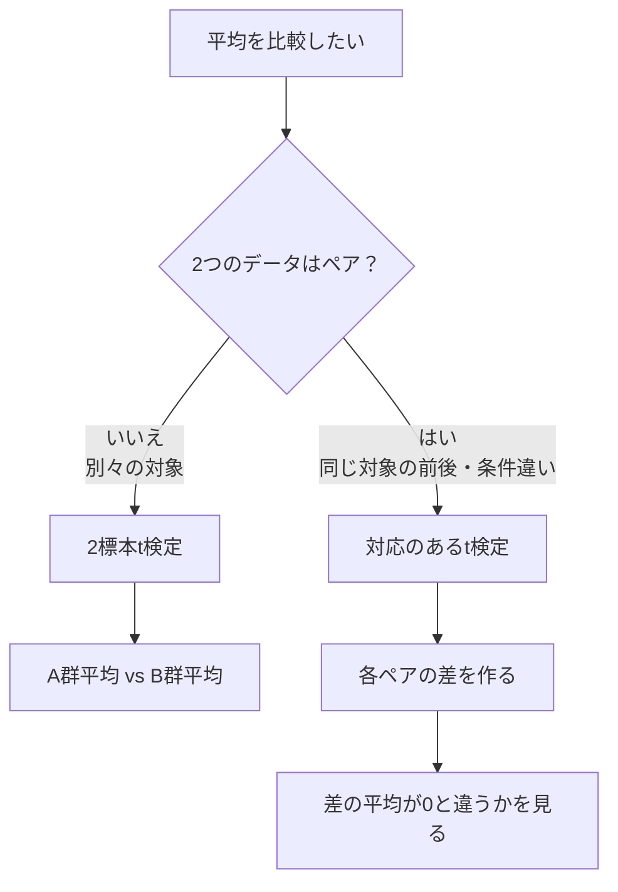
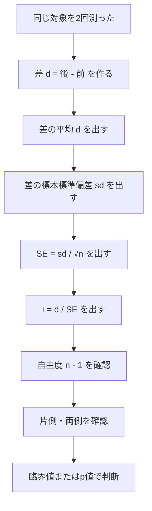
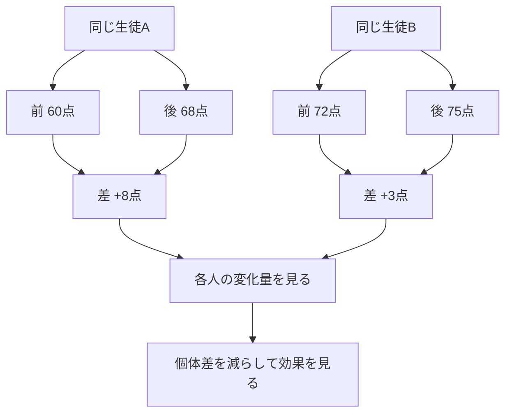

前回は **2標本t検定** をやりました。

2標本t検定は、

```text
AグループとBグループが別々の人・別々の対象
```

のときに使う検定でした。

今回は、別々のグループではなく、

```text
同じ人・同じ対象を2回測った
```

場合の検定です。

これを **対応のあるt検定** といいます。

---

# 1. まず例から考える

ある生徒5人に、新しい勉強法を試してもらったとします。

同じ5人について、勉強法を使う前と後でテスト点を測りました。

|生徒|前|後|
|---|--:|--:|
|A|60|68|
|B|72|75|
|C|80|82|
|D|65|70|
|E|73|77|

このとき、知りたいのは、

> 新しい勉強法によって点数が上がったと言えるか？

です。

ここで注意です。

これは **2標本t検定ではありません**。

なぜなら、前と後は別々の人ではないからです。

同じ生徒を2回測っています。

---

# 2. 対応があるとは何か

**対応がある**とは、

> 1つ目のデータと2つ目のデータがペアになっている

という意味です。

今回なら、

```text
生徒Aの前の点数
生徒Aの後の点数
```

がペアです。

生徒Bも、生徒Cも、それぞれ前後でペアになっています。

つまり、データはこういう形です。

```text
同じ対象の before / after
```

または、

```text
同じ対象を条件A / 条件Bで測る
```

です。

---

# 3. 2標本t検定との違い

違いはかなり重要です。

|状況|使う検定|
|---|---|
|A群とB群が別人|2標本t検定|
|同じ人の前後比較|対応のあるt検定|
|同じ馬・同じレース・同じ対象を2条件で比較|対応のあるt検定|

図で見るとこうです。



対応のあるt検定の本質は、

> 2つの平均を直接比べるのではなく、各ペアの差を作って、その差の平均を見る

ことです。

---

# 4. 対応のあるt検定の考え方

先ほどのデータをもう一度見ます。

|生徒|前|後|
|---|--:|--:|
|A|60|68|
|B|72|75|
|C|80|82|
|D|65|70|
|E|73|77|

ここで、各生徒について、

```text
後 - 前
```

を計算します。

|生徒|前|後|差 後 - 前|
|---|--:|--:|--:|
|A|60|68|8|
|B|72|75|3|
|C|80|82|2|
|D|65|70|5|
|E|73|77|4|

差だけ見ると、

```text
8, 3, 2, 5, 4
```

です。

対応のあるt検定では、この差の平均が0より大きいかを見ます。

---

# 5. なぜ差を見るのか

対応のあるデータでは、人ごとの個体差が大きいです。

たとえば、生徒Cはもともと80点です。  
生徒Aはもともと60点です。

このように、元々の実力が違います。

もし単純に「前の平均」と「後の平均」だけを見ると、個体差の影響が混ざります。

でも、各人の差を見ると、

```text
その人自身がどれくらい変化したか
```

が分かります。

つまり、対応のあるt検定は、

> 個体差を取り除いて、変化量だけを見る

方法です。

---

# 6. 対応のあるt検定は、実は1標本t検定

ここがかなり大事です。

対応のあるt検定は、難しそうに見えますが、実はやっていることは **1標本t検定** です。

ただし、元データではなく、

```text
差のデータ
```

に対して1標本t検定をします。

流れはこうです。

```text
前後の差を作る
↓
差の平均を出す
↓
差の平均が0と違うか、または0より大きいかを見る
```

図にするとこうです。


つまり、対応のあるt検定の基準値は、

```text
差 = 0
```

です。

差が0なら、前後で変化なし。  
差がプラスなら、後の方が高い。  
差がマイナスなら、後の方が低い。

---

# 7. 対応のあるt検定の公式

差を、

```text
d = 後 - 前
```

とします。

差の平均を、

```text
d̄
```

差の標本標準偏差を、

```text
s_d
```

ペアの数を、

```text
n
```

とします。

このとき、検定統計量は、

```text
t = d̄ / (s_d / √n)
```

です。

これは、1標本t検定の式とほぼ同じです。

1標本t検定は、

```text
t = (x̄ - μ0) / (s / √n)
```

でした。

対応のあるt検定では、

```text
x̄ → d̄
μ0 → 0
s → s_d
```

になっただけです。

---

# 8. 例題：勉強法で点数は上がったか

データは次の通りです。

|生徒|前|後|差 後 - 前|
|---|--:|--:|--:|
|A|60|68|8|
|B|72|75|3|
|C|80|82|2|
|D|65|70|5|
|E|73|77|4|

差のデータは、

```text
8, 3, 2, 5, 4
```

です。

今回は、

> 点数が上がったと言えるか？

を調べます。

つまり、片側検定です。

---

# 9. 仮説を立てる

差を、

```text
d = 後 - 前
```

とします。

点数が上がったなら、差の平均は0より大きいはずです。

したがって、

```text
H₀：μd = 0
H₁：μd > 0
```

です。

ここで μd は、

```text
母集団における差の平均
```

です。

---

# 10. 差の平均を求める

差は、

```text
8, 3, 2, 5, 4
```

です。

合計は、

```text
8 + 3 + 2 + 5 + 4 = 22
```

人数は5人なので、

```text
d̄ = 22 / 5 = 4.4
```

差の平均は **4.4点** です。

つまり、この5人では平均して4.4点上がっています。

---

# 11. 差の標本標準偏差を求める

平均との差を計算します。

|差 d|d - d̄|
|--:|--:|
|8|3.6|
|3|-1.4|
|2|-2.4|
|5|0.6|
|4|-0.4|

平均との差の二乗を計算します。

|差 d|d - d̄|二乗|
|--:|--:|--:|
|8|3.6|12.96|
|3|-1.4|1.96|
|2|-2.4|5.76|
|5|0.6|0.36|
|4|-0.4|0.16|

二乗和は、

```text
12.96 + 1.96 + 5.76 + 0.36 + 0.16 = 21.2
```

不偏分散は、

```text
21.2 / (5 - 1) = 21.2 / 4 = 5.3
```

標本標準偏差は、

```text
s_d = √5.3 ≒ 2.302
```

です。

---

# 12. 標準誤差を求める

差の平均の標準誤差は、

```text
SE = s_d / √n
```

です。

今回、

```text
s_d ≒ 2.302
n = 5
```

なので、

```text
SE = 2.302 / √5
   ≒ 2.302 / 2.236
   ≒ 1.029
```

標準誤差は約 **1.029** です。

---

# 13. t値を求める

```text
t = d̄ / SE
```

なので、

```text
t = 4.4 / 1.029
  ≒ 4.276
```

t値は約 **4.276** です。

これは、

> 差の平均4.4点は、標準誤差の約4.276個分だけ0から離れている

という意味です。

かなり大きいズレです。

---

# 14. 自由度を求める

対応のあるt検定の自由度は、

```text
n - 1
```

です。

今回、

```text
n = 5
```

なので、

```text
自由度 = 5 - 1 = 4
```

です。

---

# 15. 棄却判断

今回は右片側検定です。

自由度4、有意水準5%の右片側検定の臨界値は、だいたい、

```text
2.132
```

です。

今回のt値は、

```text
4.276
```

です。

比較すると、

```text
4.276 > 2.132
```

なので、帰無仮説を棄却します。

結論：

> 有意水準5%で、新しい勉強法によって点数が上がったと言える。

---

# 16. ただし、サンプルサイズには注意

今回の例では、t値がかなり大きいので有意になりました。

ただし、n=5はかなり少ないです。

統計検定の計算問題としてはこれでOKですが、現実の分析では、

```text
5人だけで一般化してよいのか？
```

という別問題があります。

ここを混ぜない方がいいです。

検定は、

```text
この標本データ上で、前後差が0とは言いにくいか
```

を見ています。

でも実務判断では、

```text
標本が代表的か
サンプル数は十分か
実験条件は妥当か
外れ値に引っ張られていないか
再現性があるか
```

も見る必要があります。

---

# 17. 対応のあるt検定の全体フロー



この流れを覚えれば大丈夫です。

---

# 18. 両側検定の場合

もし問いが、

> 新しい勉強法によって点数が変わったと言えるか？

なら、上がったか下がったかを限定していません。

この場合は両側検定です。

仮説は、

```text
H₀：μd = 0
H₁：μd ≠ 0
```

です。

今回の t値は、

```text
4.276
```

自由度4、両側5%の臨界値は、だいたい、

```text
±2.776
```

です。

```text
|4.276| > 2.776
```

なので、両側検定でも棄却します。

結論：

> 有意水準5%で、点数は変化したと言える。

ただし、今回は差がプラスなので、実際には「上がった」と解釈できます。

---

# 19. 2標本t検定と対応のあるt検定の比較

ここは試験でも実務でも重要です。

|観点|2標本t検定|対応のあるt検定|
|---|---|---|
|データの関係|A群とB群が別々|同じ対象のペア|
|例|Aクラス vs Bクラス|同じ生徒の前後|
|見るもの|2群の平均差|ペアごとの差の平均|
|個体差|残りやすい|差を取るので消えやすい|
|本質|2つの平均を比較|差に対する1標本t検定|

一番大事なのはこれです。

```text
別人同士の比較 → 2標本t検定
同じ対象の前後比較 → 対応のあるt検定
```

---

# 20. なぜ対応を無視すると危険か

対応のあるデータを、間違えて2標本t検定として扱うと、情報を捨てます。

たとえば、生徒Aはもともと低め、生徒Cはもともと高め、という個体差があります。

対応のあるt検定では、

```text
同じ人の変化量
```

を見るので、個体差をかなり取り除けます。

一方、2標本t検定のように前グループと後グループを別々に扱うと、

```text
誰がどれだけ変化したか
```

という対応情報を捨ててしまいます。

これはもったいないです。

図で見るとこうです。



---

# 21. 競馬AIで考える

競馬AIでも、対応のある考え方はかなり使えます。

たとえば、同じレース集合に対して、

```text
モデルAのスコア
モデルBのスコア
```

を比較する場合です。

同じレースに対して2つのモデルを評価しているなら、これは対応があります。

例：

|レース|モデルAの損益|モデルBの損益|差 B - A|
|---|--:|--:|--:|
|R1|-100|200|300|
|R2|150|100|-50|
|R3|-100|-100|0|
|R4|300|500|200|
|R5|-100|0|100|

この場合に知りたいのは、

> 同じレース上で、モデルBはモデルAより良くなっているか？

です。

これは、単にモデルAの平均とモデルBの平均を独立2群として比べるより、

```text
各レースごとの B - A の差
```

を見る方が自然です。

つまり、対応のあるt検定の考え方です。

ただし、競馬の損益は分布が歪みやすく、外れ値も大きいので、t検定だけを過信してはいけません。

実務では、

```text
対応のある差の平均
ブートストラップ信頼区間
月別・期間別の安定性
最大ドローダウン
外れ値依存
```

を合わせて見るべきです。

---

# 22. よくあるミス

## ミス1：同じ対象の前後比較なのに2標本t検定を使う

これはよくあります。

```text
前の平均
後の平均
```

だけを見て、別々の群として扱ってしまうミスです。

同じ対象なら、差を作ります。

---

## ミス2：差の向きを決めずに計算する

差を、

```text
後 - 前
```

で作るのか、

```text
前 - 後
```

で作るのかを決めておかないと、t値の符号が逆になります。

おすすめは、

```text
改善をプラスにしたいなら、後 - 前
```

です。

---

## ミス3：差の標準偏差ではなく、前後それぞれの標準偏差を使う

対応のあるt検定で使うのは、

```text
差の標本標準偏差 s_d
```

です。

前の標準偏差や後の標準偏差をそのまま使うわけではありません。

ここは重要です。

---

# 23. 練習問題

## 問1

ある5人について、トレーニング前後のスコアを測りました。

|人|前|後|
|---|--:|--:|
|A|50|55|
|B|60|66|
|C|55|58|
|D|70|72|
|E|65|70|

「後の方が前より高い」と言えるかを、有意水準5%、右片側検定で判断します。

差は、

```text
後 - 前
```

で作ってください。

自由度4、右片側5%の臨界値は、

```text
2.132
```

とします。

求めるもの：

```text
1. 差のデータ
2. 差の平均
3. 差の標本標準偏差
4. t値
5. 棄却するか
```

---

## 問2

ある4人について、治療前後の血圧を測りました。

|人|前|後|
|---|--:|--:|
|A|140|132|
|B|135|130|
|C|150|144|
|D|145|139|

「血圧が変わった」と言えるかを、有意水準5%、両側検定で判断します。

今回は差を、

```text
後 - 前
```

で作ってください。

自由度3、両側5%の臨界値は、

```text
±3.182
```

とします。

---

# 24. 解答

## 問1

差を作ります。

|人|前|後|差 後 - 前|
|---|--:|--:|--:|
|A|50|55|5|
|B|60|66|6|
|C|55|58|3|
|D|70|72|2|
|E|65|70|5|

差のデータは、

```text
5, 6, 3, 2, 5
```

です。

差の平均：

```text
d̄ = (5 + 6 + 3 + 2 + 5) / 5
   = 21 / 5
   = 4.2
```

平均との差：

|差|d - d̄|
|--:|--:|
|5|0.8|
|6|1.8|
|3|-1.2|
|2|-2.2|
|5|0.8|

二乗和：

```text
0.8² + 1.8² + (-1.2)² + (-2.2)² + 0.8²
= 0.64 + 3.24 + 1.44 + 4.84 + 0.64
= 10.8
```

不偏分散：

```text
10.8 / (5 - 1) = 10.8 / 4 = 2.7
```

差の標本標準偏差：

```text
s_d = √2.7 ≒ 1.643
```

標準誤差：

```text
SE = 1.643 / √5
   ≒ 1.643 / 2.236
   ≒ 0.735
```

t値：

```text
t = 4.2 / 0.735
  ≒ 5.714
```

臨界値は2.132です。

```text
5.714 > 2.132
```

なので、帰無仮説を棄却します。

結論：

> 有意水準5%で、後の方が前より高いと言える。

---

## 問2

差を作ります。

|人|前|後|差 後 - 前|
|---|--:|--:|--:|
|A|140|132|-8|
|B|135|130|-5|
|C|150|144|-6|
|D|145|139|-6|

差のデータは、

```text
-8, -5, -6, -6
```

です。

差の平均：

```text
d̄ = (-8 - 5 - 6 - 6) / 4
   = -25 / 4
   = -6.25
```

平均との差：

|差|d - d̄|
|--:|--:|
|-8|-1.75|
|-5|1.25|
|-6|0.25|
|-6|0.25|

二乗和：

```text
(-1.75)² + 1.25² + 0.25² + 0.25²
= 3.0625 + 1.5625 + 0.0625 + 0.0625
= 4.75
```

不偏分散：

```text
4.75 / (4 - 1)
= 4.75 / 3
≒ 1.583
```

差の標本標準偏差：

```text
s_d = √1.583 ≒ 1.258
```

標準誤差：

```text
SE = 1.258 / √4
   = 1.258 / 2
   = 0.629
```

t値：

```text
t = -6.25 / 0.629
  ≒ -9.94
```

両側検定なので絶対値で見ます。

```text
|t| = 9.94
```

臨界値は3.182です。

```text
9.94 > 3.182
```

なので、帰無仮説を棄却します。

結論：

> 有意水準5%で、血圧は変わったと言える。

なお、差がマイナスなので、方向としては **血圧は下がった** と解釈できます。

---

# 今日のまとめ

対応のあるt検定は、

> 同じ対象の前後差・条件差を調べる検定

です。

本質は、

```text
差を作る
↓
差の平均が0と違うかを見る
```

です。

使う式は、

```text
t = d̄ / (s_d / √n)
```

です。

一番重要なのはこれです。

> 対応のあるt検定は、「差のデータ」に対する1標本t検定である。

そして、検定の選び方はこうです。

```text
別々の2群を比べる
→ 2標本t検定

同じ対象の前後・条件違いを比べる
→ 対応のあるt検定
```

次回は、**仮説検定まとめ演習**に進むのが自然です。  
ここで、1標本t検定・2標本t検定・対応のあるt検定を整理して、使い分けを固めます。