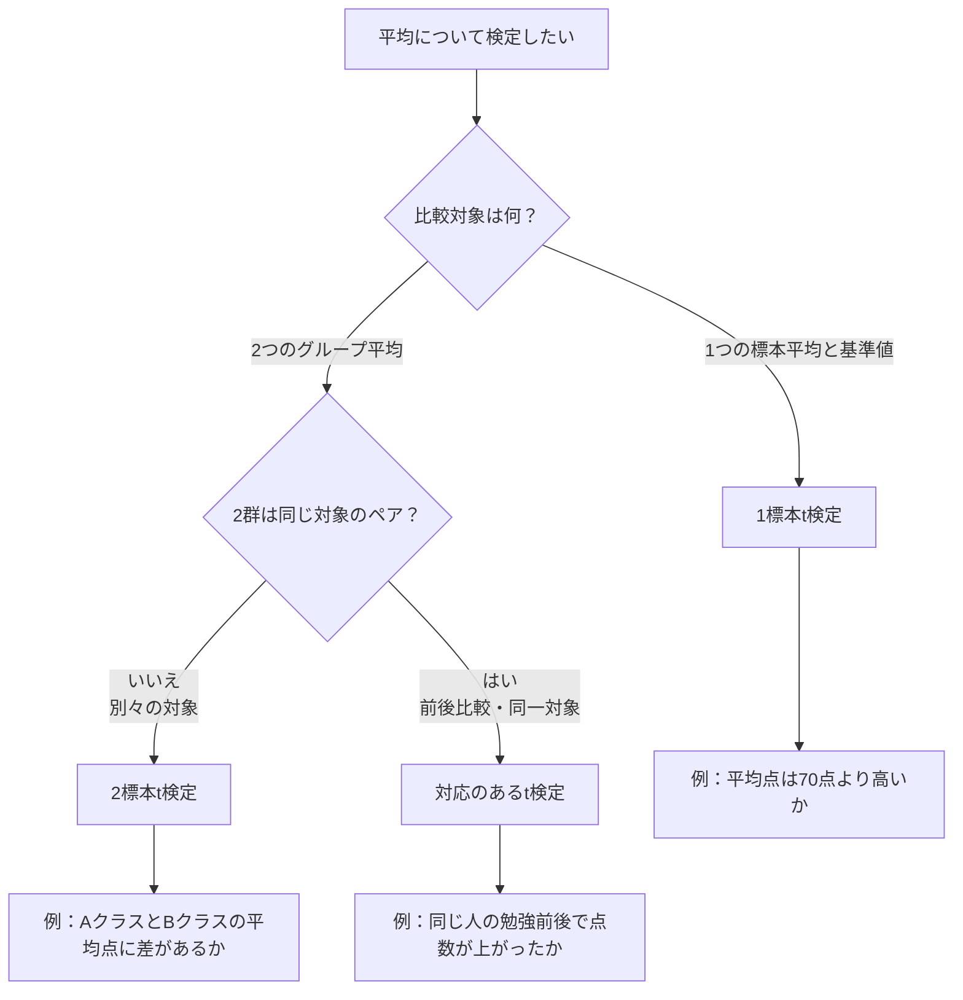

ここまで、3種類のt検定を学びました。

```text
1標本t検定
2標本t検定
対応のあるt検定
```

今回の目的は、

> 問題文を見て、どの検定を使うべきか判断できるようにする

ことです。

計算そのものより、まず **使い分け** が重要です。

---

# 1. まず全体整理

3つのt検定は、次のように整理できます。

|検定|使う場面|比べるもの|
|---|---|---|
|1標本t検定|1つの標本平均を基準値と比べる|標本平均 vs 基準値|
|2標本t検定|別々の2グループの平均を比べる|A群平均 vs B群平均|
|対応のあるt検定|同じ対象の前後・条件違いを比べる|差の平均 vs 0|

一番大事なのはこれです。

```text
1つの標本と基準値 → 1標本t検定
別々の2群 → 2標本t検定
同じ対象のペア → 対応のあるt検定
```

---

# 2. 判断フロー

問題文を読んだら、こう判断します。



このフローを頭に入れておくと、かなり迷いにくくなります。

---

# 3. 3つの検定の公式

## 1標本t検定

```text
t = (x̄ - μ₀) / (s / √n)
```

|記号|意味|
|---|---|
|x̄|標本平均|
|μ₀|基準値|
|s|標本標準偏差|
|n|標本サイズ|

使う場面：

```text
平均が基準値と違うか？
平均が基準値より高いか？
平均が基準値より低いか？
```

---

## 2標本t検定

Welchのt検定では、

```text
t = (x̄1 - x̄2) / √(s1²/n1 + s2²/n2)
```

または、B - Aで考えるなら、

```text
t = (x̄B - x̄A) / √(sA²/nA + sB²/nB)
```

使う場面：

```text
別々の2グループの平均に差があるか？
```

注意点：

```text
A群とB群が別人・別対象であること
```

---

## 対応のあるt検定

まず差を作ります。

```text
d = 後 - 前
```

そして、

```text
t = d̄ / (s_d / √n)
```

|記号|意味|
|---|---|
|d̄|差の平均|
|s_d|差の標本標準偏差|
|n|ペアの数|

使う場面：

```text
同じ対象の前後比較
同じ対象を条件A・条件Bで測った比較
```

本質はこれです。

```text
対応のあるt検定 = 差のデータに対する1標本t検定
```

---

# 4. 片側検定・両側検定の判断

検定の種類を決めたら、次に **片側か両側か** を決めます。

|問い|対立仮説|検定|
|---|---|---|
|高いか|μ > μ₀|右片側検定|
|低いか|μ < μ₀|左片側検定|
|違うか|μ ≠ μ₀|両側検定|

2群比較なら、

|問い|対立仮説|検定|
|---|---|---|
|BがAより高いか|μB > μA|右片側検定|
|BがAより低いか|μB < μA|左片側検定|
|AとBに差があるか|μA ≠ μB|両側検定|

重要なのは、

> 片側か両側かは、結果を見る前に問いで決める

ことです。

結果を見てから有利な方を選ぶのは後出しです。

---

# 5. 練習問題1：どの検定を使う？

次の問題で、どの検定を使うか判断してください。

## 問1

あるクラスの平均点が、全国平均70点より高いかを調べたい。  
クラス30人の平均点と標本標準偏差が分かっている。

これはどの検定ですか？

A. 1標本t検定  
B. 2標本t検定  
C. 対応のあるt検定

答えは **A. 1標本t検定** です。

理由：

```text
1つの標本平均
vs
基準値70点
```

だからです。

また、「高いか」を見ているので、右片側検定です。

---

## 問2

Aクラス20人とBクラス20人の平均点に差があるかを調べたい。  
AクラスとBクラスは別々の生徒である。

これはどの検定ですか？

A. 1標本t検定  
B. 2標本t検定  
C. 対応のあるt検定

答えは **B. 2標本t検定** です。

理由：

```text
別々の2グループの平均を比較している
```

からです。

また、「差があるか」を見ているので、両側検定です。

---

## 問3

同じ10人に対して、トレーニング前後のスコアを測った。  
トレーニング後にスコアが上がったかを調べたい。

これはどの検定ですか？

A. 1標本t検定  
B. 2標本t検定  
C. 対応のあるt検定

答えは **C. 対応のあるt検定** です。

理由：

```text
同じ10人の前後比較
```

だからです。

また、「上がったか」を見ているので、右片側検定です。  
差を「後 - 前」で作るなら、対立仮説は、

```text
H₁：μd > 0
```

です。

---

# 6. 練習問題2：1標本t検定

ある商品の平均評価は、これまで3.5点でした。  
新しいデザインに変更したあと、25人に評価してもらったところ、

```text
n = 25
x̄ = 3.8
s = 0.75
```

でした。

有意水準5%、右片側検定で、

```text
平均評価は3.5点より高くなったと言えるか？
```

を判断します。

自由度24、右片側5%の臨界値は、

```text
1.711
```

とします。

---

## 解答

使う検定は、**1標本t検定**です。

理由：

```text
1つの標本平均 3.8
vs
基準値 3.5
```

だからです。

仮説は、

```text
H₀：μ = 3.5
H₁：μ > 3.5
```

です。

標準誤差：

```text
SE = s / √n
   = 0.75 / √25
   = 0.75 / 5
   = 0.15
```

t値：

```text
t = (x̄ - μ₀) / SE
  = (3.8 - 3.5) / 0.15
  = 0.3 / 0.15
  = 2.0
```

臨界値は1.711です。

```text
2.0 > 1.711
```

なので、帰無仮説を棄却します。

結論：

> 有意水準5%で、平均評価は3.5点より高くなったと言える。

---

# 7. 練習問題3：2標本t検定

A教材とB教材を別々の生徒に使わせました。

|教材|n|平均点|標本標準偏差|
|---|--:|--:|--:|
|A教材|16|68|8|
|B教材|16|74|10|

有意水準5%、右片側検定で、

```text
B教材の方がA教材より平均点が高いと言えるか？
```

を判断します。

自由度を約29、右片側5%の臨界値を、

```text
1.699
```

とします。

---

## 解答

使う検定は、**2標本t検定**です。

理由：

```text
A教材群とB教材群が別々の生徒
```

だからです。

仮説は、

```text
H₀：μB = μA
H₁：μB > μA
```

です。

平均差：

```text
x̄B - x̄A = 74 - 68 = 6
```

平均差の標準誤差：

```text
SE = √(sA²/nA + sB²/nB)
   = √(8²/16 + 10²/16)
   = √(64/16 + 100/16)
   = √(4 + 6.25)
   = √10.25
   ≒ 3.202
```

t値：

```text
t = 6 / 3.202
  ≒ 1.874
```

臨界値は1.699です。

```text
1.874 > 1.699
```

なので、帰無仮説を棄却します。

結論：

> 有意水準5%で、B教材の方がA教材より平均点が高いと言える。

ただし、かなり強い差というより、臨界値を少し上回る程度です。  
言い過ぎは禁物です。

---

# 8. 練習問題4：対応のあるt検定

同じ5人について、トレーニング前後のスコアを測りました。

|人|前|後|
|---|--:|--:|
|A|50|55|
|B|60|66|
|C|55|58|
|D|70|72|
|E|65|70|

有意水準5%、右片側検定で、

```text
トレーニング後にスコアが上がったと言えるか？
```

を判断します。

自由度4、右片側5%の臨界値は、

```text
2.132
```

とします。

---

## 解答

使う検定は、**対応のあるt検定**です。

理由：

```text
同じ5人の前後比較
```

だからです。

差を、

```text
d = 後 - 前
```

で作ります。

|人|前|後|差|
|---|--:|--:|--:|
|A|50|55|5|
|B|60|66|6|
|C|55|58|3|
|D|70|72|2|
|E|65|70|5|

差のデータは、

```text
5, 6, 3, 2, 5
```

です。

差の平均：

```text
d̄ = (5 + 6 + 3 + 2 + 5) / 5
   = 21 / 5
   = 4.2
```

差の標本標準偏差は、前回計算した通り、

```text
s_d ≒ 1.643
```

標準誤差：

```text
SE = s_d / √n
   = 1.643 / √5
   ≒ 1.643 / 2.236
   ≒ 0.735
```

t値：

```text
t = d̄ / SE
  = 4.2 / 0.735
  ≒ 5.714
```

臨界値は2.132です。

```text
5.714 > 2.132
```

なので、帰無仮説を棄却します。

結論：

> 有意水準5%で、トレーニング後にスコアが上がったと言える。

---

# 9. 使い分けで一番危ないミス

## ミス1：前後比較なのに2標本t検定を使う

これはかなり多いです。

同じ人・同じ対象を2回測っているなら、対応があります。

```text
前後比較
同じ対象の条件A・条件B比較
同じレース集合でモデルA・モデルBを比較
```

こういう場合は、まず対応のあるt検定を疑います。

---

## ミス2：「差があるか」と「高いか」を混同する

```text
差があるか → 両側検定
高いか → 右片側検定
低いか → 左片側検定
```

この区別は重要です。

「高そうだから片側にする」ではありません。  
問いが最初から「高いか」だから片側です。

---

## ミス3：平均値だけで判断する

平均差が大きく見えても、ばらつきが大きければ有意とは限りません。

見るべきなのは、

```text
差 ÷ 差の標準誤差
```

です。

これは、1標本・2標本・対応あり、すべてに共通します。

---

# 10. 競馬AIへの対応表

競馬AIに置き換えると、こうです。

|場面|使う考え方|
|---|---|
|ある戦略の平均回収率が100%を超えるか|1標本t検定|
|戦略Aと戦略Bが別々のレース集合で比較されている|2標本t検定|
|同じレース集合で戦略Aと戦略Bの損益差を見る|対応のあるt検定|
|モデル更新前後を同じrace_key集合で比較する|対応のあるt検定|

ただし、ここは注意です。

競馬の損益分布は、正規分布から外れやすいです。

- 大穴で外れ値が出る
    
- 0か大勝ちかになりやすい
    
- 分布が歪む
    
- レース間の独立性が怪しい
    
- 後出し条件選択が入りやすい
    

だから、t検定だけで意思決定するのは危険です。

競馬AIでは、t検定はあくまで補助的に使い、

```text
ブートストラップ信頼区間
期間分割
月別安定性
最大ドローダウン
外れ値依存
再現性
```

を合わせて見るべきです。

これは甘く見ない方がいいです。  
p値だけで運用判断すると、かなり簡単に自分を騙せます。

---

# 11. 総合問題

次のそれぞれについて、

```text
1. 使う検定
2. 片側か両側か
3. 理由
```

を答えてください。

---

## 問1

ある学校の平均睡眠時間が、全国平均6.5時間より短いかを調べたい。  
その学校の生徒40人を調査した。

---

## 問2

A社とB社の社員満足度に差があるかを調べたい。  
A社社員50人、B社社員60人を別々に調査した。

---

## 問3

同じ20人について、研修前後のスキルテストを実施した。  
研修後に点数が上がったかを調べたい。

---

## 問4

ある馬券戦略の平均回収率が100%を超えるかを調べたい。  
過去300レースの回収率データがある。

---

## 問5

同じレース集合に対して、旧モデルと新モデルの損益を比較したい。  
新モデルの方が旧モデルより平均損益が高いかを調べたい。

---

# 12. 総合問題の解答

## 問1

使う検定：

```text
1標本t検定
```

片側か両側か：

```text
左片側検定
```

理由：

```text
1つの標本平均を、全国平均6.5時間という基準値と比べている。
また、「短いか」を見ているので左片側検定。
```

---

## 問2

使う検定：

```text
2標本t検定
```

片側か両側か：

```text
両側検定
```

理由：

```text
A社とB社は別々の社員なので、独立した2群の比較。
また、「差があるか」を見ているので両側検定。
```

---

## 問3

使う検定：

```text
対応のあるt検定
```

片側か両側か：

```text
右片側検定
```

理由：

```text
同じ20人の研修前後なので対応がある。
また、「上がったか」を見ているので右片側検定。
差を 後 - 前 で作る。
```

---

## 問4

使う検定：

```text
1標本t検定
```

片側か両側か：

```text
右片側検定
```

理由：

```text
1つの戦略の平均回収率を、基準値100%と比べている。
また、「100%を超えるか」を見ているので右片側検定。
```

ただし、実務ではt検定だけでは不十分です。  
損益分布の歪み、外れ値、期間安定性、後出し条件選択を必ず見る必要があります。

---

## 問5

使う検定：

```text
対応のあるt検定
```

片側か両側か：

```text
右片側検定
```

理由：

```text
同じレース集合に対して旧モデルと新モデルを比較しているので対応がある。
また、「新モデルの方が高いか」を見ているので右片側検定。
差を 新モデル - 旧モデル で作る。
```

---

# 今日のまとめ

ここまでで、平均に関するt検定の基本は一通り整理できました。

|問い|検定|
|---|---|
|1つの平均が基準値と違うか|1標本t検定|
|別々の2群の平均が違うか|2標本t検定|
|同じ対象の前後差・条件差があるか|対応のあるt検定|

共通する本質はこれです。

```text
差 ÷ 差の標準誤差
```

つまり、

> 見えている差が、偶然のブレに比べて十分大きいか

を見ています。

これで、仮説検定の第1ブロックはかなり整理できました。

次に進むなら、候補は2つあります。

```text
A. 比率の推定・検定へ進む
B. いったん確率・確率分布へ戻る
```

学習順としては、ここまで仮説検定を進めたので、次は **比率の推定・検定** に進むのが自然です。  
そのあと、確率・確率分布を整理し直すとかなり理解しやすくなります。