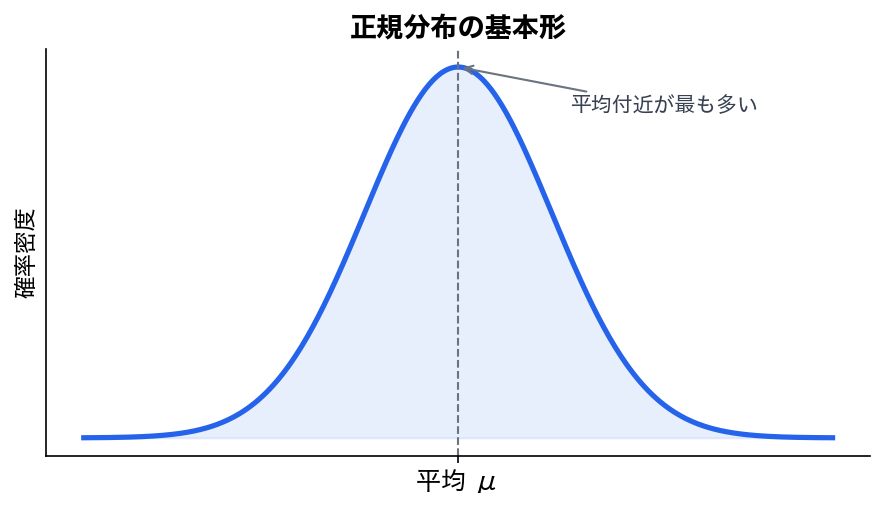
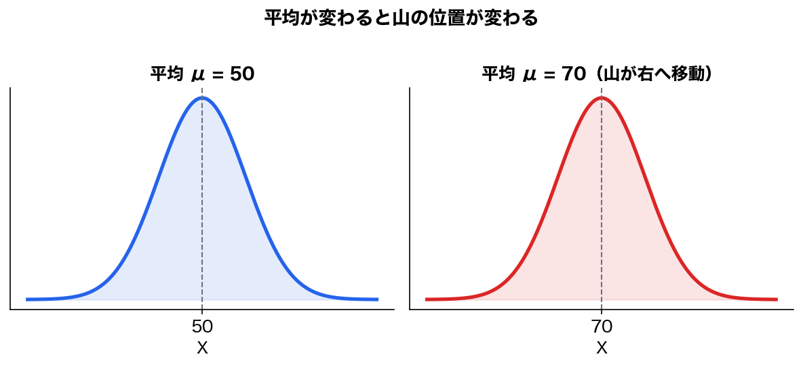
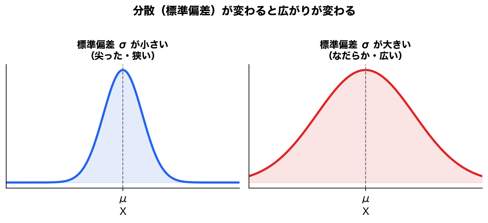
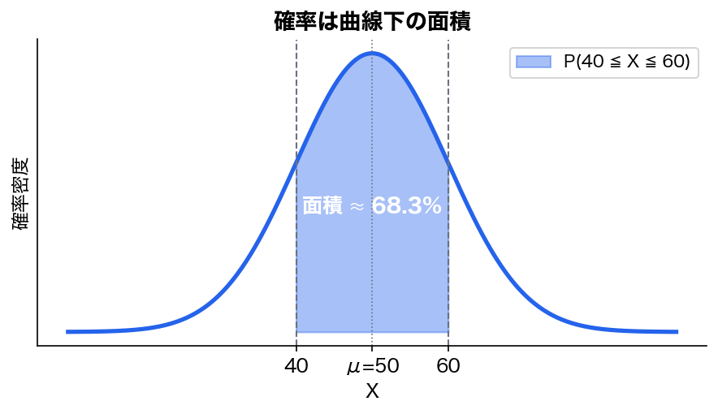

第19回は **正規分布** です。

ここは統計検定2級の中でも超重要です。  
このあと出てくる、

```text
標本分布
推定
仮説検定
t分布
カイ二乗分布
F分布
回帰分析
```

の土台になります。

---

# 第19回：正規分布

## 今日のゴール

今日のゴールはこれです。

> 正規分布とは、  
> 平均の周りに山型に散らばる連続型の確率分布である。

正規分布は、ざっくり言うとこういう形です。



平均に近い値が多く、平均から離れるほど少なくなります。

---

# 1. 正規分布とは何か

正規分布は、連続型確率変数の代表的な分布です。

たとえば、次のようなデータは正規分布に近い形になることがあります。

```text
身長
測定誤差
部品の寸法誤差
テストの点数
自然現象のばらつき
```

ただし、ここで注意です。

> 何でも正規分布になるわけではありません。

「なんとなく山型だから正規分布」と決めつけるのは危険です。

特に、売上、所得、アクセス数、払戻金、待ち時間などは、右に長く歪むことが多いです。

---

# 2. 正規分布の形

正規分布には、次の特徴があります。

|特徴|内容|
|---|---|
|山型|平均付近が一番多い|
|左右対称|平均を中心に左右が同じ形|
|連続型|範囲で確率を考える|
|平均と分散で形が決まる|`μ` と `σ²` が重要|

---

## 平均が変わると場所が変わる

平均 `μ` が変わると、山の中心が移動します。



平均は、山の中心です。

---

## 分散が変わると広がりが変わる

分散 `σ²`、または標準偏差 `σ` が大きいと、分布は広がります。



標準偏差が大きいほど、ばらつきが大きいという意味です。

---

# 3. 正規分布の表記

正規分布はこう書きます。

```text
X ~ N(μ, σ²)
```

読み方は、

```text
Xは、平均μ、分散σ²の正規分布に従う
```

です。

ここはかなり重要です。

第2引数は **標準偏差ではなく分散** です。

---

## 例

```text
X ~ N(50, 10²)
```

なら、

```text
平均 μ = 50
分散 σ² = 10² = 100
標準偏差 σ = 10
```

です。

また、

```text
X ~ N(50, 100)
```

でも、

```text
平均 μ = 50
分散 σ² = 100
標準偏差 σ = 10
```

です。

ここで、

```text
標準偏差 = 100
```

と読んだらアウトです。

---

# 4. 正規分布は連続型分布

前にやったように、連続型確率変数ではピンポイントの確率は基本的に0です。

つまり、正規分布でも、

```text
P(X = 50)
```

のような確率は基本的に0です。

考えるのは範囲です。

```text
P(40 ≦ X ≦ 60)
```

これは、

```text
Xが40以上60以下になる確率
```

です。

---

# 5. 確率は面積で考える

正規分布では、確率は曲線の下の面積です。

たとえば、

```text
P(40 ≦ X ≦ 60)
```

は、次の塗られた部分の面積です。



ここが第13回の「確率を面積として見る」とつながります。

全体の面積は1です。

```text
正規分布全体の面積 = 1
```

そのうち、ある範囲の面積が、その範囲に入る確率になります。

---

# 6. 正規分布の重要な目安

正規分布では、次の目安が非常に重要です。

|範囲|含まれる確率|
|---|--:|
|平均 ± 1標準偏差|約68%|
|平均 ± 2標準偏差|約95%|
|平均 ± 3標準偏差|約99.7%|

これは俗に **68-95-99.7ルール** と呼ばれます。

---

## 例

```text
X ~ N(50, 10²)
```

なら、

```text
平均 μ = 50
標準偏差 σ = 10
```

です。

だから、

|範囲|確率の目安|
|---|--:|
|40〜60|約68%|
|30〜70|約95%|
|20〜80|約99.7%|

です。

---

# 7. 標準正規分布

正規分布の中でも、特に重要なのが **標準正規分布** です。

標準正規分布とは、

```text
平均 0
分散 1
標準偏差 1
```

の正規分布です。

記号ではこう書きます。

```text
Z ~ N(0, 1)
```

この `Z` を標準正規変数と呼びます。

---

# 8. なぜ標準正規分布が必要なのか

正規分布にはいろいろあります。

```text
N(50, 10²)
N(100, 15²)
N(0, 3²)
N(170, 6²)
```

平均も標準偏差も違います。

そのままだと、分布ごとに別々の表が必要になります。

でも、すべての正規分布を標準正規分布に変換できれば、表は1つで済みます。

その変換が **標準化** です。

---

# 9. 標準化

標準化とは、

> ある値が平均から標準偏差何個分離れているかに変換すること

です。

公式はこれです。

```text
Z = (X - μ) / σ
```

ここで、

|記号|意味|
|---|---|
|`X`|元の値|
|`μ`|平均|
|`σ`|標準偏差|
|`Z`|標準化した値|

---

## 例

あるテストの点数が、

```text
X ~ N(50, 10²)
```

に従うとします。

70点を標準化すると、

```text
Z = (70 - 50) / 10
  = 20 / 10
  = 2
```

です。

つまり、70点は、

```text
平均より標準偏差2個分高い
```

という意味です。

---

# 10. 標準化でやっていること

標準化は、値を次のように読み替えています。

```text
X = 50  → Z = 0
X = 60  → Z = 1
X = 70  → Z = 2
X = 40  → Z = -1
X = 30  → Z = -2
```

つまり、

```text
平均を0にする
標準偏差を1にする
```

変換です。

これは、単位をそろえる操作でもあります。

---

# 11. 標準化の注意点

前にも言いましたが、ここは本当に危ないです。

```text
X ~ N(50, 100)
```

だった場合、

```text
μ = 50
σ² = 100
σ = 10
```

です。

標準化では、

```text
Z = (X - μ) / σ
```

なので、割るのは `10` です。

`100` で割ってはいけません。

---

## 例

```text
X ~ N(50, 100)
```

のとき、`X = 70` を標準化する。

正しくは、

```text
Z = (70 - 50) / 10
  = 2
```

です。

間違って分散で割ると、

```text
Z = (70 - 50) / 100
  = 0.2
```

になってしまいます。

完全に別物です。

---

# 12. 標準正規分布表の使い方

統計検定2級では、標準正規分布表を使います。

表の形式はいくつかありますが、よくあるのは、

```text
P(Z ≦ z)
```

を表すタイプです。

つまり、

> Zがz以下になる確率

です。

たとえば、

```text
P(Z ≦ 1.00) = 0.8413
```

なら、

```text
標準正規分布で、1.00以下になる確率は0.8413
```

という意味です。

---

# 13. 代表値

よく使う値は覚えておくと楽です。

|z|P(Z ≦ z)|
|--:|--:|
|0|0.5000|
|1.00|0.8413|
|1.28|約0.9000|
|1.645|約0.9500|
|1.96|約0.9750|
|2.00|0.9772|
|2.576|約0.9950|

特に重要なのは、

```text
1.645
1.96
2.576
```

です。

推定・検定で何度も出ます。

---

# 14. 例題1：ある値以下の確率

あるテストの点数 `X` が、

```text
X ~ N(50, 10²)
```

に従うとします。

70点以下である確率を求めます。

---

## Step 1：標準化する

```text
Z = (X - μ) / σ
```

今回、

```text
X = 70
μ = 50
σ = 10
```

なので、

```text
Z = (70 - 50) / 10
  = 2
```

---

## Step 2：標準正規分布表を見る

求めたいのは、

```text
P(X ≦ 70)
```

です。

標準化すると、

```text
P(Z ≦ 2)
```

です。

標準正規分布表より、

```text
P(Z ≦ 2) ≒ 0.9772
```

です。

---

## 答え

```text
P(X ≦ 70) ≒ 0.9772
```

つまり、約97.7%です。

---

# 15. 例題2：ある値以上の確率

同じく、

```text
X ~ N(50, 10²)
```

で、70点以上である確率を求めます。

---

## Step 1：標準化

70点は、

```text
Z = 2
```

です。

---

## Step 2：上側確率を求める

表が `P(Z ≦ z)` を与えるタイプなら、

```text
P(Z ≧ 2)
= 1 - P(Z ≦ 2)
```

です。

```text
P(Z ≦ 2) ≒ 0.9772
```

なので、

```text
P(Z ≧ 2)
= 1 - 0.9772
= 0.0228
```

---

## 答え

```text
P(X ≧ 70) ≒ 0.0228
```

つまり、約2.28%です。

---

# 16. 例題3：範囲の確率

同じく、

```text
X ~ N(50, 10²)
```

で、

```text
P(40 ≦ X ≦ 70)
```

を求めます。

---

## Step 1：両端を標準化する

40を標準化します。

```text
Z = (40 - 50) / 10
  = -1
```

70を標準化します。

```text
Z = (70 - 50) / 10
  = 2
```

だから、

```text
P(40 ≦ X ≦ 70)
=
P(-1 ≦ Z ≦ 2)
```

です。

---

## Step 2：分布表で引く

```text
P(-1 ≦ Z ≦ 2)
= P(Z ≦ 2) - P(Z ≦ -1)
```

標準正規分布表より、

```text
P(Z ≦ 2) = 0.9772
P(Z ≦ -1) = 0.1587
```

したがって、

```text
P(-1 ≦ Z ≦ 2)
= 0.9772 - 0.1587
= 0.8185
```

---

## 答え

```text
P(40 ≦ X ≦ 70) ≒ 0.8185
```

つまり、約81.85%です。

---

# 17. 対称性を使う

標準正規分布は左右対称です。

だから、

```text
P(Z ≦ -a) = P(Z ≧ a)
```

です。

たとえば、

```text
P(Z ≦ -1) = P(Z ≧ 1)
```

です。

また、

```text
P(Z ≧ 1) = 1 - P(Z ≦ 1)
```

なので、

```text
P(Z ≧ 1) = 1 - 0.8413 = 0.1587
```

です。

---

# 18. 両側確率

推定・検定でよく出るのが両側確率です。

たとえば、

```text
P(|Z| ≧ 1.96)
```

これは、

```text
Z ≦ -1.96 または Z ≧ 1.96
```

の確率です。

標準正規分布では、

```text
P(Z ≧ 1.96) ≒ 0.025
```

なので、両側では、

```text
0.025 × 2 = 0.05
```

です。

だから、95%信頼区間や両側5%検定で `1.96` が出てきます。

---

# 19. 95%信頼区間との接続

正規分布では、

```text
P(-1.96 ≦ Z ≦ 1.96) ≒ 0.95
```

です。

つまり、標準正規分布では、平均0を中心に、

```text
-1.96 から 1.96
```

の範囲に約95%が入ります。

これが、母平均の推定で出てくる、

```text
推定値 ± 1.96 × 標準誤差
```

の元ネタです。

---

# 20. 偏差値との関係

標準化は、偏差値とも関係があります。

偏差値は、

```text
偏差値 = 50 + 10Z
```

です。

つまり、

|Z|偏差値|
|--:|--:|
|-2|30|
|-1|40|
|0|50|
|1|60|
|2|70|

偏差値70は、平均より標準偏差2個分高い、という意味です。

だから、

```text
偏差値70はかなり上位
```

と言えるわけです。

---

# 21. 正規分布と二項分布の関係

二項分布は離散型でした。

でも、`n` が大きいと、二項分布は正規分布に近づきます。

特に、

```text
X ~ B(n, p)
```

のとき、

```text
平均 = np
分散 = np(1-p)
```

でした。

nが大きいと、

```text
X ≒ N(np, np(1-p))
```

と近似できます。

---

## 注意

これは近似です。

二項分布は本来、0回、1回、2回……という離散型です。

正規分布は連続型です。

だから、厳密には違います。

でも、nが大きいと形がかなり似るので、正規分布で近似できます。

この話は、後の標本分布にもつながります。

---

# 22. 正規分布を使うときの注意

正規分布は便利ですが、雑に使うと危険です。

## 危険1：何でも正規分布だと思う

現実データには、正規分布でないものも多いです。

```text
売上
所得
払戻金
待ち時間
アクセス数
損益
```

こういうものは、歪みや外れ値が大きいことがあります。

---

## 危険2：平均と標準偏差だけで全てを見ようとする

正規分布なら、平均と標準偏差でかなり説明できます。

でも、正規分布でない場合は、

```text
歪度
尖度
外れ値
裾の厚さ
ゼロ過剰
極端値
```

なども重要です。

競馬の払戻金やROIは、正規分布で見るとかなり危険な場合があります。

---

## 危険3：分散と標準偏差を混同する

何度も言いますが、

```text
X ~ N(μ, σ²)
```

の第2引数は分散です。

標準化では、割るのは `σ` です。

ここは毎回確認した方がいいです。

---

# 23. 統計検定2級での正規分布

統計検定2級では、正規分布について最低限これを押さえます。

```text
1. 正規分布の形と特徴
2. X ~ N(μ, σ²) の意味
3. 第2引数が分散であること
4. 標準化 Z = (X - μ) / σ
5. 標準正規分布表の読み方
6. 範囲確率の計算
7. 1.96などの代表値
8. 二項分布の正規近似の入口
```

特に、標準化は必須です。

---

# 24. 練習問題

## 問題1

```text
X ~ N(60, 8²)
```

のとき、平均、分散、標準偏差を答えよ。

---

### 解答

```text
平均 μ = 60
分散 σ² = 8² = 64
標準偏差 σ = 8
```

---

## 問題2

```text
X ~ N(60, 64)
```

のとき、平均、分散、標準偏差を答えよ。

---

### 解答

```text
平均 μ = 60
分散 σ² = 64
標準偏差 σ = 8
```

第2引数は分散です。

---

## 問題3

```text
X ~ N(60, 8²)
```

のとき、`X = 76` を標準化せよ。

---

### 解答

```text
Z = (X - μ) / σ
```

なので、

```text
Z = (76 - 60) / 8
  = 16 / 8
  = 2
```

答えは、

```text
Z = 2
```

です。

---

## 問題4

```text
X ~ N(50, 10²)
```

のとき、`P(X ≦ 60)` を求めよ。  
ただし、`P(Z ≦ 1) = 0.8413` とする。

---

### 解答

60を標準化します。

```text
Z = (60 - 50) / 10
  = 1
```

したがって、

```text
P(X ≦ 60) = P(Z ≦ 1)
```

なので、

```text
P(X ≦ 60) = 0.8413
```

です。

---

## 問題5

```text
X ~ N(50, 10²)
```

のとき、`P(X ≧ 60)` を求めよ。  
ただし、`P(Z ≦ 1) = 0.8413` とする。

---

### 解答

60を標準化すると、

```text
Z = 1
```

です。

求めたいのは上側確率なので、

```text
P(X ≧ 60)
= P(Z ≧ 1)
= 1 - P(Z ≦ 1)
= 1 - 0.8413
= 0.1587
```

答えは、

```text
0.1587
```

です。

---

## 問題6

```text
X ~ N(100, 15²)
```

のとき、`P(85 ≦ X ≦ 130)` を求めよ。

ただし、

```text
P(Z ≦ -1) = 0.1587
P(Z ≦ 2) = 0.9772
```

とする。

---

### 解答

85を標準化します。

```text
Z = (85 - 100) / 15
  = -15 / 15
  = -1
```

130を標準化します。

```text
Z = (130 - 100) / 15
  = 30 / 15
  = 2
```

したがって、

```text
P(85 ≦ X ≦ 130)
= P(-1 ≦ Z ≦ 2)
```

これは、

```text
P(Z ≦ 2) - P(Z ≦ -1)
```

なので、

```text
0.9772 - 0.1587 = 0.8185
```

答えは、

```text
0.8185
```

です。

---

# 25. 今日のまとめ

|用語|意味|
|---|---|
|正規分布|平均の周りに山型に散らばる連続型分布|
|`N(μ, σ²)`|平均μ、分散σ²の正規分布|
|標準正規分布|`N(0,1)`|
|標準化|平均から標準偏差何個分離れているかに変換すること|
|z値|標準化した値|
|上側確率|ある値以上になる確率|
|下側確率|ある値以下になる確率|

---

## 重要公式

```text
X ~ N(μ, σ²)
```

```text
Z = (X - μ) / σ
```

```text
P(a ≦ X ≦ b)
=
P((a-μ)/σ ≦ Z ≦ (b-μ)/σ)
```

二項分布の正規近似：

```text
X ~ B(n,p) のとき、
X ≒ N(np, np(1-p))
```

---

# 26. 今日の盲点

今日の最大の盲点はこれです。

```text
N(μ, σ²) の第2引数は分散
```

標準化で割るのは、分散ではなく標準偏差です。

```text
Z = (X - μ) / σ
```

もう1つの盲点は、

```text
連続型分布では、確率は点ではなく面積
```

です。

```text
P(X = 50)
```

ではなく、

```text
P(40 ≦ X ≦ 60)
```

のように範囲で考えます。

---

# 27. 最低限の暗記

今回、最低限暗記するならこれです。

```text
正規分布 = 平均を中心とする左右対称の山型分布
```

```text
X ~ N(μ, σ²)
```

```text
第2引数は分散、標準偏差ではない
```

```text
Z = (X - μ) / σ
```

```text
確率は曲線下の面積
```

```text
平均±1σに約68%、±2σに約95%、±3σに約99.7%
```

次回は **第20回：標本分布の再整理** です。  
ここで、正規分布を「個々のデータの分布」から「標本平均の分布」へつなげます。