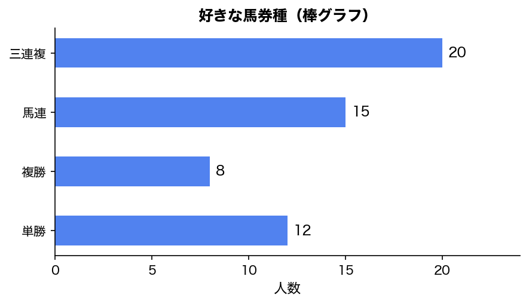
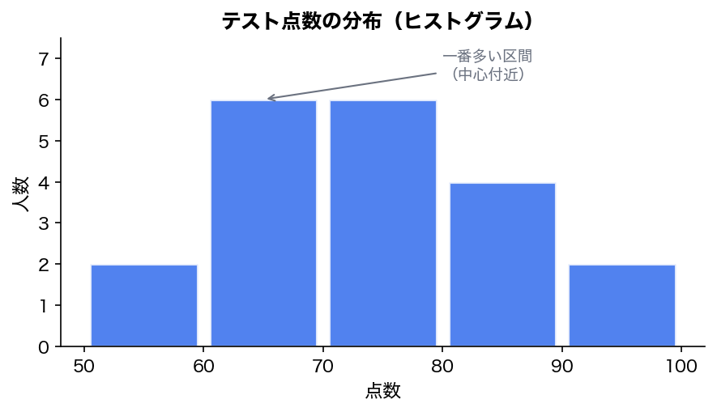
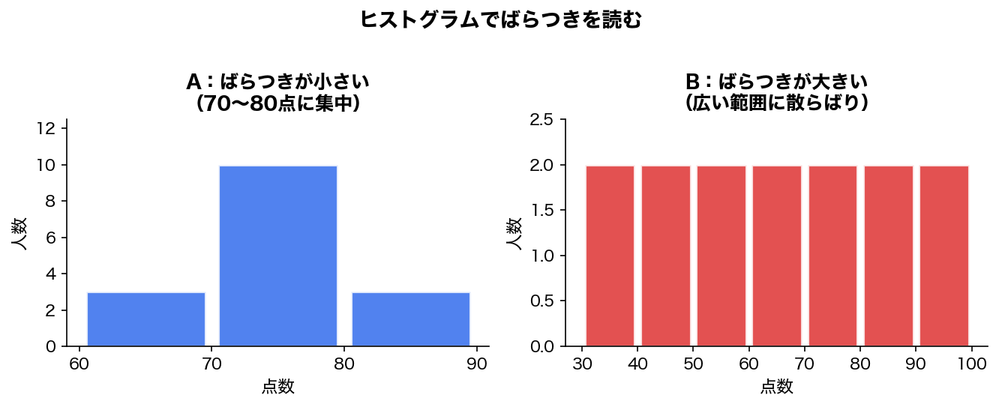
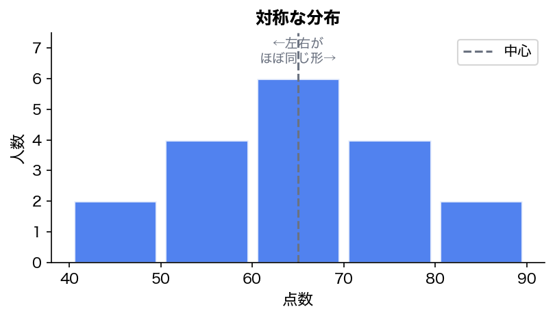
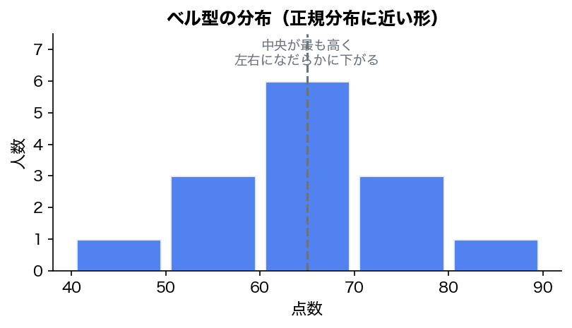
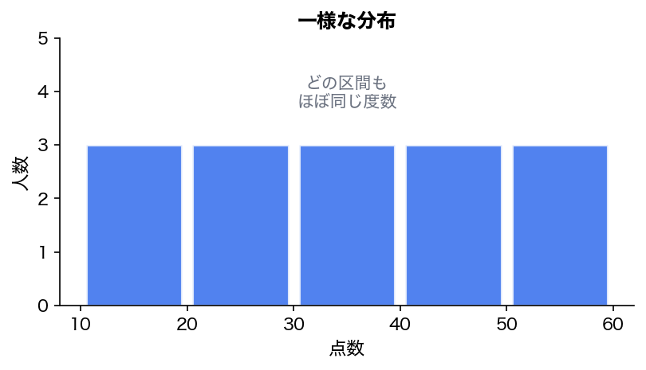
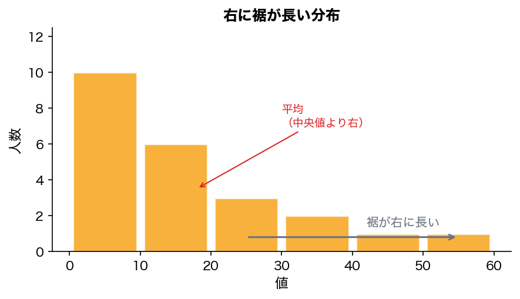
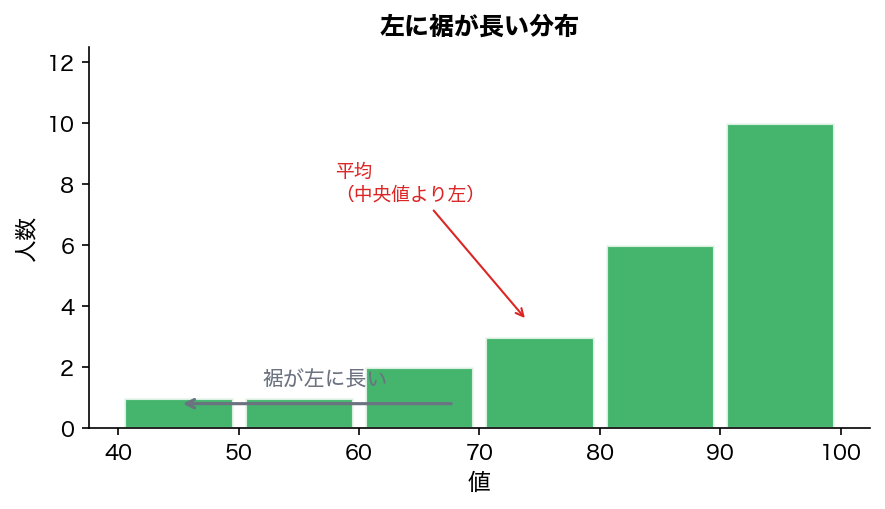
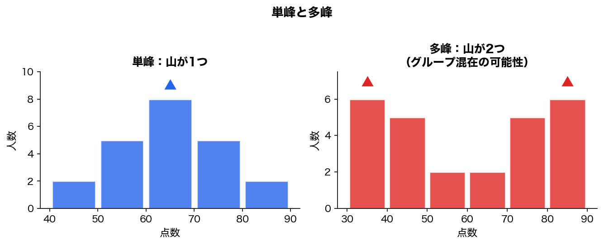
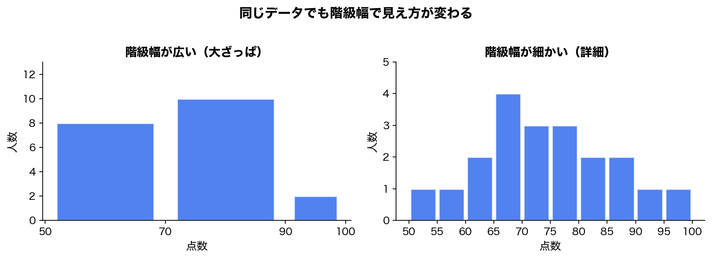

第27回のテーマは、**データをどう分類し、どう図で見るか**です。

これは地味ですが、統計検定2級ではかなり重要です。公式範囲にも、質的変数、量的変数、離散型、連続型、棒グラフ、円グラフ、度数分布表、ヒストグラム、累積度数グラフ、分布の形状が含まれています。

---

# 1. 今回のゴール

今回のゴールはこれです。

```text
データを見たときに、

1. これは質的変数か？量的変数か？
2. 量的変数なら離散型か？連続型か？
3. どのグラフで見るべきか？
4. ヒストグラムから分布の形を読めるか？

を判断できるようになること。
```

統計では、いきなり平均や分散を計算する前に、まず

```text
このデータは、そもそも何者なのか？
```

を確認します。

ここを間違えると、後続の分析もズレます。

---

# 2. データには種類がある

統計で扱うデータは、大きく分けると2種類です。

```text
データ
├── 質的変数：カテゴリ・種類を表す
└── 量的変数：数値の大きさを表す
```

## 質的変数

**質的変数**とは、カテゴリや種類を表すデータです。

例：

|データ|値の例|
|---|---|
|性別|男性、女性、その他|
|血液型|A型、B型、O型、AB型|
|職業|学生、会社員、自営業|
|好きな馬券種|単勝、複勝、馬連、三連複|
|都道府県|東京、大阪、北海道|

ポイントは、**数値の大小が本質ではない**ということです。

たとえば血液型を、

```text
A型 = 1
B型 = 2
O型 = 3
AB型 = 4
```

のように数値化しても、

```text
AB型はA型の4倍
```

とは言えません。

これはただのラベルです。

つまり、質的変数は**分類のためのデータ**です。

---

## 量的変数

**量的変数**とは、数値として大小や差を意味あるものとして扱えるデータです。

例：

|データ|値の例|
|---|---|
|身長|170.5cm|
|体重|62.3kg|
|年齢|20歳|
|点数|80点|
|年収|500万円|
|レースタイム|1分33秒2|
|単勝オッズ|3.5倍|

量的変数では、

```text
80点は40点より高い
170cmは160cmより10cm高い
オッズ10倍はオッズ5倍より大きい
```

のように、数値の大小や差に意味があります。

---

# 3. 量的変数はさらに2種類ある

量的変数は、さらに

```text
離散型
連続型
```

に分かれます。

## 離散型

**離散型**とは、値が飛び飛びになるデータです。

例：

|データ|値|
|---|---|
|家族の人数|1人、2人、3人|
|サイコロの目|1, 2, 3, 4, 5, 6|
|ゴール数|0点、1点、2点|
|出走頭数|8頭、12頭、16頭|
|正解数|0問、1問、2問|

離散型は、基本的に**数えられるデータ**です。

```text
1.5人
2.7頭
3.2問正解
```

のような値は普通ありません。

---

## 連続型

**連続型**とは、理論上どこまでも細かく測れるデータです。

例：

|データ|値|
|---|---|
|身長|170.1cm、170.12cm、170.123cm|
|体重|62.5kg|
|時間|12.35秒|
|距離|1600.5m|
|気温|23.4℃|
|レースタイム|1分33.2秒|

連続型は、基本的に**測るデータ**です。

---

# 4. ここで一つ注意：整数だから離散型とは限らない

ここは盲点です。

たとえば、身長データが次のように記録されていたとします。

```text
170cm
171cm
172cm
```

整数に見えます。

でも、身長は本来、

```text
170.1cm
170.12cm
170.123cm
```

のように細かく測れるものです。

だから、**記録上は整数でも、本質的には連続型**です。

逆に、出走頭数は、

```text
12頭
13頭
14頭
```

のように整数ですが、これは本当に数えるものなので離散型です。

つまり、判断基準はこれです。

```text
数えているなら離散型
測っているなら連続型
```

---

# 5. データの種類とグラフの対応

データの種類によって、使うグラフが変わります。

|データの種類|代表的なグラフ|
|---|---|
|質的変数|棒グラフ、円グラフ|
|離散型の量的変数|棒グラフ、度数分布表|
|連続型の量的変数|ヒストグラム、箱ひげ図、累積度数グラフ|
|2変数の量的変数|散布図|
|時系列データ|折れ線グラフ|

今回は、まず

```text
棒グラフ
円グラフ
度数分布表
ヒストグラム
```

を扱います。

---

# 6. 棒グラフ

棒グラフは、カテゴリごとの数を比較するグラフです。

例：

|好きな馬券種|人数|
|---|--:|
|単勝|12|
|複勝|8|
|馬連|15|
|三連複|20|

これを棒グラフにすると、



となります。

棒グラフのポイントは、

```text
カテゴリごとの大きさを比較しやすい
```

ことです。

---

## 棒グラフで見るべきこと

棒グラフでは、次を見ます。

|見るポイント|例|
|---|---|
|一番多いカテゴリ|三連複が多い|
|一番少ないカテゴリ|複勝が少ない|
|差が大きいか|三連複と複勝の差が大きい|
|特定カテゴリに偏っているか|三連複に偏っている|

---

# 7. 円グラフ

円グラフは、全体に対する割合を見るグラフです。

例：

|好きな馬券種|人数|割合|
|---|--:|--:|
|単勝|12|21.8%|
|複勝|8|14.5%|
|馬連|15|27.3%|
|三連複|20|36.4%|
|合計|55|100%|

円グラフは、

```text
全体のうち、どれくらいを占めるか
```

を見るためのグラフです。

---

## 棒グラフと円グラフの違い

|グラフ|得意なこと|
|---|---|
|棒グラフ|カテゴリ同士の比較|
|円グラフ|全体に対する割合|

たとえば、

```text
どの馬券種が一番多いか？
```

を見たいなら棒グラフ。

```text
三連複が全体の何割くらいか？
```

を見たいなら円グラフ。

ただし、率直に言うと、統計的には円グラフは読み取りにくい場面も多いです。  
カテゴリ同士の細かい比較なら、棒グラフの方が優秀です。

---

# 8. 度数分布表

次に、量的データを扱います。

たとえば、20人分のテスト点数があるとします。

```text
52, 58, 61, 63, 65,
67, 69, 70, 72, 74,
75, 77, 78, 80, 82,
85, 88, 90, 92, 96
```

これをそのまま見ても、全体像は少し分かりにくいです。

そこで、点数をいくつかの区間に分けます。

|点数の範囲|人数|
|---|--:|
|50点以上60点未満|2|
|60点以上70点未満|6|
|70点以上80点未満|6|
|80点以上90点未満|4|
|90点以上100点未満|2|

このように、データを区間ごとに数えた表を**度数分布表**といいます。

---

## 用語整理

|用語|意味|
|---|---|
|階級|データを分ける区間|
|階級幅|区間の幅|
|度数|その区間に入るデータの数|
|相対度数|全体に対する割合|
|累積度数|その階級までの度数の合計|

たとえば、

```text
60点以上70点未満
```

が階級です。

この階級の幅は、

```text
70 - 60 = 10
```

なので、階級幅は10です。

この区間に入る人数が6人なら、度数は6です。

---

# 9. 相対度数

相対度数は、全体に対する割合です。

さきほどのデータは20人分でした。

|点数の範囲|度数|相対度数|
|---|--:|--:|
|50点以上60点未満|2|0.10|
|60点以上70点未満|6|0.30|
|70点以上80点未満|6|0.30|
|80点以上90点未満|4|0.20|
|90点以上100点未満|2|0.10|
|合計|20|1.00|

計算は単純です。

```text
相対度数 = その階級の度数 / 全体のデータ数
```

たとえば、60点以上70点未満は6人なので、

```text
6 / 20 = 0.30
```

です。

つまり、30%です。

---

# 10. 累積度数

累積度数は、そこまでの度数を足したものです。

|点数の範囲|度数|累積度数|
|---|--:|--:|
|50点以上60点未満|2|2|
|60点以上70点未満|6|8|
|70点以上80点未満|6|14|
|80点以上90点未満|4|18|
|90点以上100点未満|2|20|

たとえば、70点以上80点未満までの累積度数は、

```text
2 + 6 + 6 = 14
```

です。

つまり、

```text
80点未満の人が14人いる
```

という意味になります。

---

# 11. ヒストグラム

度数分布表をグラフにしたものが、**ヒストグラム**です。

さきほどの表をヒストグラム風にすると、こうです。



ヒストグラムは、量的データの分布を見るためのグラフです。

---

## 棒グラフとヒストグラムの違い

ここは重要です。

棒グラフとヒストグラムは見た目が似ています。

でも、意味が違います。

|比較|棒グラフ|ヒストグラム|
|---|---|---|
|対象|カテゴリデータ|量的データ|
|横軸|種類|数値の区間|
|棒の順番|入れ替えてもよい|入れ替えてはいけない|
|棒の間隔|空けることが多い|くっつける|
|目的|カテゴリ比較|分布の形を見る|

たとえば、棒グラフの横軸が

```text
単勝、複勝、馬連、三連複
```

なら、順番を入れ替えても意味は壊れません。

でも、ヒストグラムの横軸が

```text
50-60, 60-70, 70-80, 80-90, 90-100
```

なら、順番を入れ替えると意味が壊れます。

なぜなら、数値の大小順だからです。

---

# 12. ヒストグラムで何を見るのか

ヒストグラムで見るべきことは、主に5つです。

```text
1. 中心はどこか
2. ばらつきは大きいか
3. 左右対称か
4. 裾がどちらに長いか
5. 山がいくつあるか
```

---

## 中心を見る

たとえば、次のヒストグラムを見ます。


一番多いのは、

```text
60-70
70-80
```

あたりです。

だから、このデータの中心はだいたい

```text
70点前後
```

にありそうだと分かります。

---

## ばらつきを見る

次の2つを比べます。



Aは70〜80点あたりに集中しています。

Bは広い範囲に散らばっています。

つまり、

```text
Aはばらつきが小さい
Bはばらつきが大きい
```

と読めます。

分散や標準偏差を計算する前に、ヒストグラムを見ると、ばらつきの雰囲気が分かります。

---

# 13. 分布の形

統計検定2級では、分布の形を言葉で判断できる必要があります。

公式範囲にも、右に裾が長い、左に裾が長い、対称、ベル型、一様、単峰、多峰が含まれています。

---

## 対称な分布

左右がだいたい同じ形の分布です。



中心を境に、左右の形が似ています。

このような分布では、平均と中央値が近くなりやすいです。

---

## ベル型の分布

中央が高く、左右に向かってなだらかに下がる形です。



正規分布に近い形です。

ただし、注意してください。

```text
ベル型っぽい = 必ず正規分布
```

ではありません。

ここを雑に考えると危ないです。

---

## 一様な分布

どの区間もだいたい同じくらいの度数になっている分布です。



これは、

```text
どの範囲にも同じくらいデータがある
```

という状態です。

---

## 右に裾が長い分布

右側、つまり大きい値の方向に長く伸びている分布です。



これは、

```text
多くのデータは小さい値に集まっている
でも、一部に大きい値がある
```

という形です。

例：

|データ|右に裾が長くなりやすい理由|
|---|---|
|年収|一部に非常に高い人がいる|
|商品売上|一部の商品だけ大きく売れる|
|Webアクセス数|一部ページだけ極端に多い|
|単勝オッズ|人気薄の馬が高いオッズを持つ|

右に裾が長い分布では、**平均が中央値より大きくなりやすい**です。

なぜなら、一部の大きい値が平均を右に引っ張るからです。

---

## 左に裾が長い分布

左側、つまり小さい値の方向に長く伸びている分布です。



これは、

```text
多くのデータは大きい値に集まっている
でも、一部に小さい値がある
```

という形です。

例：

|データ|左に裾が長くなりやすい理由|
|---|---|
|易しいテストの点数|多くの人が高得点|
|高評価サービスのレビュー|多くが高評価、一部だけ低評価|
|完走率が高いレースの完走タイム|一部だけ極端に遅い|

左に裾が長い分布では、**平均が中央値より小さくなりやすい**です。

一部の小さい値が平均を左に引っ張るからです。

---

# 14. 単峰と多峰

## 単峰

山が1つの分布です。



山が1つなので、単峰です。

---

## 多峰

山が複数ある分布です（上の図を参照）。

この場合、山が2つあります。

こういう分布を見たら、かなり重要なことを考えるべきです。

```text
もしかして、異なるグループが混ざっていないか？
```

たとえば、テスト点数で山が2つあるなら、

```text
勉強したグループ
勉強していないグループ
```

が混ざっているかもしれません。

競馬データなら、

```text
芝とダートが混ざっている
短距離と長距離が混ざっている
新馬戦と古馬戦が混ざっている
```

などがあり得ます。

これはかなり重要です。

多峰性は、**データを分けて見るべきサイン**になることがあります。

---

# 15. ヒストグラムを見るときの注意点

ヒストグラムは便利ですが、注意点があります。

## 階級幅で見え方が変わる

同じデータでも、階級幅を変えると見え方が変わります。

たとえば、階級幅を広くすると大ざっぱになり、細かくすると詳細に見えます。



つまり、ヒストグラムは

```text
階級幅によって印象が変わる
```

という弱点があります。

ここを忘れると、見た目に騙されます。

---

## ヒストグラムだけで因果は言えない

ヒストグラムは分布を見る道具です。

でも、

```text
なぜそうなったか
```

までは直接教えてくれません。

たとえば、点数のヒストグラムが二山になっていたとしても、

```text
勉強時間が原因だ
```

とはまだ言えません。

あくまで、

```text
何かグループが混ざっていそう
```

と疑う段階です。

---

# 16. 試験でよく問われる観点

統計検定2級では、こういう問い方があり得ます。

## 問い方1：データの種類を選ばせる

```text
血液型はどれか？

A. 量的変数・連続型
B. 量的変数・離散型
C. 質的変数
D. 時系列データ
```

答えは、**C. 質的変数**です。

---

## 問い方2：適切なグラフを選ばせる

```text
身長データの分布を見るのに適切なグラフはどれか？

A. 円グラフ
B. ヒストグラム
C. 散布図
D. 折れ線グラフ
```

答えは、**B. ヒストグラム**です。

身長は量的変数、しかも連続型なので、分布を見るならヒストグラムが適切です。

---

## 問い方3：ヒストグラムの形を読ませる

```text
年収データのヒストグラムが右に裾の長い形だった。
このとき起こりやすいことはどれか？

A. 平均は中央値より小さい
B. 平均は中央値より大きい
C. 平均と中央値は必ず一致する
D. 最頻値は必ず存在しない
```

答えは、**B. 平均は中央値より大きい**です。

一部の高年収者が平均を右に引っ張るからです。

---

# 17. ここまでのまとめ

今回の内容をまとめます。

|項目|要点|
|---|---|
|質的変数|カテゴリ・種類を表す|
|量的変数|数値の大小や差に意味がある|
|離散型|数えるデータ|
|連続型|測るデータ|
|棒グラフ|カテゴリの比較に使う|
|円グラフ|全体に対する割合を見る|
|度数分布表|数値データを階級ごとに数えた表|
|ヒストグラム|量的データの分布を見るグラフ|
|右に裾が長い|一部に大きい値がある|
|左に裾が長い|一部に小さい値がある|
|単峰|山が1つ|
|多峰|山が複数。グループ混在の可能性|

---

# 18. 今回の最重要ポイント

一番大事なのはこれです。

```text
データの種類によって、使うグラフも、使える統計量も変わる。
```

質的変数に平均を出しても意味がないことがあります。

連続型データを円グラフにしても分布は読みにくいです。

ヒストグラムを見れば、平均や分散を計算する前に、

```text
中心
ばらつき
歪み
外れ値っぽさ
グループ混在
```

を直感的に確認できます。

統計の順番としては、

```text
いきなり計算する
```

ではなく、

```text
まずデータの種類を見る
次にグラフで分布を見る
その後に平均・分散・検定へ進む
```

です。

ここを間違えると、統計はただの計算作業になります。

---

# 19. 確認問題

## 問題1

次のうち、質的変数はどれですか？

```text
A. 身長
B. 体重
C. 血液型
D. 試験時間
```

答え：**C. 血液型**

---

## 問題2

次のうち、連続型の量的変数はどれですか？

```text
A. サイコロの目
B. 家族の人数
C. 身長
D. 正解数
```

答え：**C. 身長**

---

## 問題3

カテゴリごとの人数を比較するのに適したグラフはどれですか？

```text
A. 棒グラフ
B. ヒストグラム
C. 散布図
D. 折れ線グラフ
```

答え：**A. 棒グラフ**

---

## 問題4

量的データの分布を見るのに適したグラフはどれですか？

```text
A. 円グラフ
B. ヒストグラム
C. 棒グラフ
D. レーダーチャート
```

答え：**B. ヒストグラム**

---

## 問題5

右に裾が長い分布では、一般にどちらが大きくなりやすいですか？

```text
A. 平均
B. 中央値
C. 必ず同じ
D. どちらも定義できない
```

答え：**A. 平均**

---

# 20. 次回につながる話

次回は、

```text
第28回：平均・中央値・四分位・箱ひげ図
```

に進むのが自然です。

今回、ヒストグラムで分布の形を見ました。

次回は、その分布を

```text
中心：平均・中央値・最頻値
位置：四分位数
ばらつき：四分位範囲
図：箱ひげ図
```

で要約します。

特に重要なのは、**平均だけ見てはいけない**という話です。

分布が歪んでいるとき、平均は簡単に引っ張られます。  
だから、中央値や四分位範囲が必要になります。