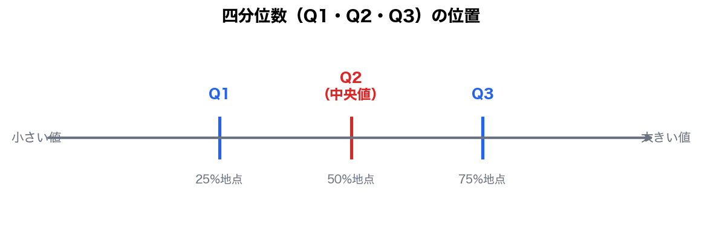
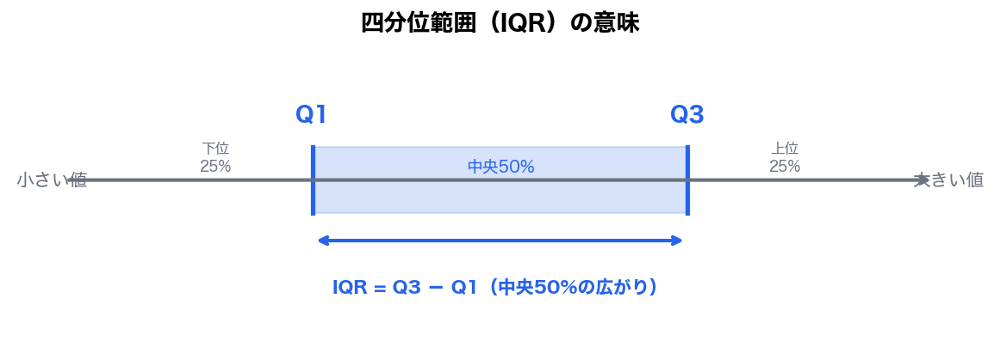
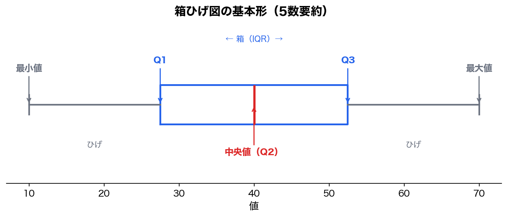
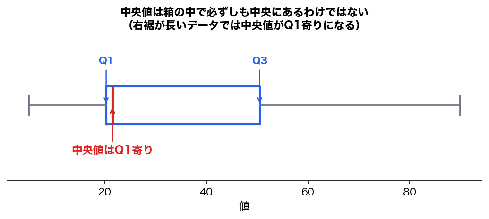
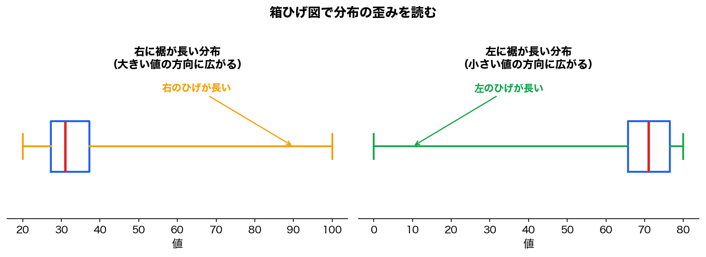
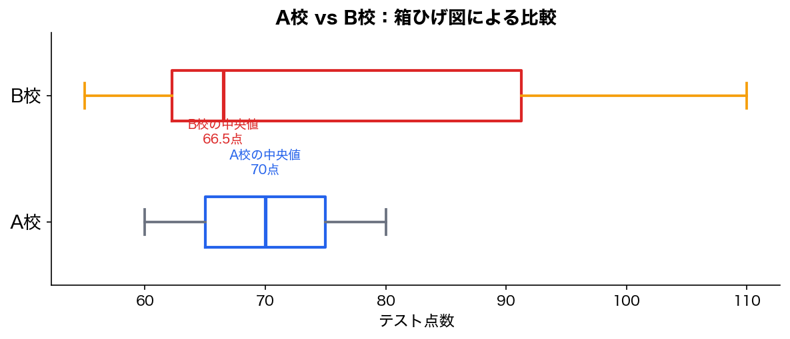

今回は、前回の「ヒストグラムで分布を見る」の続きです。

前回は、

```text
データには種類がある
量的データはヒストグラムで分布を見る
分布には、右に裾が長い・左に裾が長い・対称・多峰などの形がある
```

という話をしました。

今回は、その分布を数値で要約します。

テーマは、

```text
中心を表す指標：平均・中央値・最頻値
位置を表す指標：四分位数
ばらつきを表す指標：四分位範囲
図で表す方法：箱ひげ図
```

です。

---

# 1. 今回のゴール

今回のゴールはこれです。

```text
1. 平均・中央値・最頻値の違いを説明できる
2. 外れ値や歪んだ分布では、平均だけを見ると危ないと分かる
3. 四分位数と四分位範囲を理解する
4. 箱ひげ図からデータの中心・ばらつき・歪みを読める
```

統計検定2級の範囲にも、平均値、中央値、最頻値、四分位範囲、箱ひげ図が含まれています。

---

# 2. なぜ平均だけでは足りないのか

統計を学び始めると、まず平均を使いたくなります。

平均は便利です。

でも、平均だけを見ると騙されることがあります。

たとえば、次の2つのデータを見てください。

```text
A: 60, 65, 70, 75, 80
B: 60, 65, 70, 75, 500
```

Aの平均は、

```text
(60 + 65 + 70 + 75 + 80) / 5
= 350 / 5
= 70
```

Bの平均は、

```text
(60 + 65 + 70 + 75 + 500) / 5
= 770 / 5
= 154
```

Bの平均は154です。

でも、Bのデータを見て、

```text
だいたい154くらいのデータが多い
```

とは言えません。

実際には、5個中4個は60〜75の範囲にあります。

平均が500に引っ張られているだけです。

ここが平均の弱点です。

---

# 3. 平均とは何か

平均とは、すべての値を足して、データ数で割ったものです。

```text
平均 = データの合計 / データの個数
```

たとえば、

```text
60, 65, 70, 75, 80
```

なら、

```text
平均 = (60 + 65 + 70 + 75 + 80) / 5
     = 350 / 5
     = 70
```

平均は、データ全体のバランス点のようなものです。

---

## 平均の強み

平均の強みは、すべてのデータを使うことです。

|強み|内容|
|---|---|
|情報を全部使う|すべての値が計算に入る|
|計算しやすい|足して割るだけ|
|推測統計と相性がよい|標本平均、信頼区間、t検定などにつながる|

あなたがすでに学んだt検定や信頼区間は、平均を中心にした話でした。

つまり、平均は統計の中核にあります。

---

## 平均の弱み

ただし、平均には明確な弱点があります。

```text
外れ値に弱い
```

一部に極端な値があると、平均は簡単に引っ張られます。

たとえば、

```text
年収
売上
アクセス数
単勝オッズ
配当金
```

のようなデータは、右に裾が長くなりやすいです。

この場合、平均だけを見ると、実態より大きく見えることがあります。

---

# 4. 中央値とは何か

中央値とは、データを小さい順に並べたとき、真ん中にくる値です。

たとえば、

```text
60, 65, 70, 75, 80
```

では、真ん中は70です。

だから中央値は70です。

```text
中央値 = 並べたときの真ん中
```

---

## データ数が偶数の場合

データ数が偶数の場合は、真ん中が2つあります。

たとえば、

```text
60, 65, 70, 75
```

真ん中は65と70です。

この場合、中央値はその平均です。

```text
中央値 = (65 + 70) / 2
       = 67.5
```

---

## 中央値は外れ値に強い

さきほどのBをもう一度見ます。

```text
B: 60, 65, 70, 75, 500
```

平均は154でした。

でも中央値は70です。

なぜなら、小さい順に並べたとき、真ん中が70だからです。

```text
60, 65, 70, 75, 500
        ↑
      中央値
```

500があっても、中央値は70のままです。

つまり、中央値は外れ値に強いです。

---

# 5. 平均と中央値の使い分け

ここは重要です。

|データの形|見るべき指標|
|---|---|
|左右対称に近い|平均が使いやすい|
|外れ値が少ない|平均が使いやすい|
|右に裾が長い|中央値も見る|
|左に裾が長い|中央値も見る|
|外れ値がある|中央値も見る|
|所得・売上・アクセス数|中央値が重要|

前回やった、右に裾が長い分布では、平均が中央値より大きくなりやすいです。

```text
右に裾が長い：平均 > 中央値
```

左に裾が長い分布では、平均が中央値より小さくなりやすいです。

```text
左に裾が長い：平均 < 中央値
```

対称な分布では、平均と中央値が近くなりやすいです。

```text
対称：平均 ≒ 中央値
```

---

# 6. 最頻値とは何か

最頻値とは、最もよく出る値です。

たとえば、

```text
60, 70, 70, 80, 90
```

では、70が一番多く出ています。

だから最頻値は70です。

```text
最頻値 = 一番よく出る値
```

---

## 質的変数にも使える

平均や中央値は、基本的に量的データに使います。

でも、最頻値は質的変数にも使えます。

たとえば、

```text
好きな馬券種：
単勝, 馬連, 馬連, 三連複, 馬連, 複勝
```

なら、一番多いのは馬連です。

だから最頻値は馬連です。

これは平均ではできません。

```text
好きな馬券種の平均
```

というのは意味がありません。

---

# 7. 平均・中央値・最頻値の比較

|指標|意味|強み|弱み|
|---|---|---|---|
|平均|全部足して個数で割る|全データを使う。推測統計と相性がよい|外れ値に弱い|
|中央値|並べたときの真ん中|外れ値に強い|全データの細かい値は使わない|
|最頻値|一番多い値|質的変数にも使える|一意に決まらないことがある|

---

# 8. 四分位数とは何か

次に、四分位数です。

四分位数は、データを小さい順に並べて、4つの部分に分ける境目の値です。



|記号|名前|意味|
|---|---|---|
|Q1|第1四分位数|小さい方から25%地点|
|Q2|第2四分位数|小さい方から50%地点。中央値|
|Q3|第3四分位数|小さい方から75%地点|

つまり、

```text
Q2 = 中央値
```

です。

---

# 9. 実際に四分位数を求める

次のデータで考えます。

```text
10, 20, 30, 40, 50, 60, 70
```

データ数は7個です。

中央値Q2は真ん中なので、

```text
10, 20, 30, 40, 50, 60, 70
            ↑
           Q2
```

したがって、

```text
Q2 = 40
```

次に、中央値より下のグループを見ます。

```text
10, 20, 30
```

この真ん中がQ1です。

```text
Q1 = 20
```

中央値より上のグループを見ます。

```text
50, 60, 70
```

この真ん中がQ3です。

```text
Q3 = 60
```

したがって、

```text
Q1 = 20
Q2 = 40
Q3 = 60
```

です。

---

## 注意：四分位数の定義は複数ある

ここは少しだけ注意です。

四分位数の求め方には、流儀が複数あります。

統計ソフトによって、微妙に違う値が出ることがあります。

ただし、統計検定2級レベルでは、まずは

```text
データを並べる
中央値を取る
下半分の中央値をQ1にする
上半分の中央値をQ3にする
```

という理解で十分です。

細かい定義差よりも、**四分位数が何を表しているか**の方が重要です。

---

# 10. 四分位範囲とは何か

四分位範囲は、Q3からQ1を引いたものです。

```text
四分位範囲 = Q3 - Q1
```

英語では Interquartile Range といい、IQR と書きます。

```text
IQR = Q3 - Q1
```

さきほどの例では、

```text
Q1 = 20
Q3 = 60
```

なので、

```text
IQR = 60 - 20
    = 40
```

です。

---

## 四分位範囲の意味

四分位範囲は、中央50%のデータがどれくらい広がっているかを表します。



Q1からQ3の間には、データの真ん中あたりの50%が入っています。

つまり、四分位範囲は、

```text
外れ値の影響を受けにくいばらつき指標
```

です。

---

# 11. 範囲と四分位範囲の違い

範囲は、

```text
最大値 - 最小値
```

です。

四分位範囲は、

```text
Q3 - Q1
```

です。

違いを見ます。

```text
A: 10, 20, 30, 40, 50, 60, 70
B: 10, 20, 30, 40, 50, 60, 1000
```

Aの範囲は、

```text
70 - 10 = 60
```

Bの範囲は、

```text
1000 - 10 = 990
```

Bは1000に引っ張られて、範囲が極端に大きくなります。

一方、四分位範囲は、極端な最大値・最小値の影響を受けにくいです。

だから、外れ値がありそうなときは、

```text
範囲だけでなく、四分位範囲を見る
```

ことが重要です。

---

# 12. 箱ひげ図とは何か

箱ひげ図は、データの分布を5つの値で要約する図です。

よく使う5つの値はこれです。

```text
最小値
第1四分位数 Q1
中央値 Q2
第3四分位数 Q3
最大値
```

図にすると、こうです。



箱の左端がQ1、箱の中の線が中央値、箱の右端がQ3です。

箱から伸びている線を「ひげ」と呼びます。

---

# 13. 箱ひげ図で何を見るのか

箱ひげ図では、主に次の4つを見ます。

```text
1. 中央値はどこか
2. 箱の幅は広いか
3. ひげは長いか
4. 左右どちらに歪んでいるか
```

---

## 中央値を見る

箱の中の線が中央値です。



中央値が高い位置にあるか、低い位置にあるかを見ます。

複数グループを比較するときは、中央値の違いがかなり重要です。

---

## 箱の幅を見る

箱の幅は、四分位範囲です。

```text
箱の幅 = Q3 - Q1 = IQR
```

箱が広いほど、中央50%のばらつきが大きいです。

箱が狭いほど、中央50%のばらつきが小さいです。

---

## ひげを見る

ひげは、箱の外側にあるデータの広がりを表します。

```text
左のひげが長い：小さい値の方向に広がっている
右のひげが長い：大きい値の方向に広がっている
```

右のひげが長ければ、右に裾が長い可能性があります。

左のひげが長ければ、左に裾が長い可能性があります。

---

# 14. 箱ひげ図と分布の歪み

右に裾が長いデータでは、箱ひげ図も右側に伸びやすいです。



左パネルは右に裾が長い（大きい値の方向に広がる）、右パネルは左に裾が長い（小さい値の方向に広がる）。

---

# 15. 箱ひげ図が強い場面

箱ひげ図は、複数グループを比較するときに強いです。

たとえば、A校とB校のテスト点数を比較します。



このとき、次のことが見えます。

|見る点|解釈|
|---|---|
|中央値|どちらの中心が高いか|
|箱の幅|どちらのばらつきが大きいか|
|ひげの長さ|外れ値っぽい値があるか|
|歪み|高い方・低い方に偏っているか|

平均だけでは見えない情報が見えます。

---

# 16. ヒストグラムと箱ひげ図の違い

|グラフ|得意なこと|弱点|
|---|---|---|
|ヒストグラム|分布の形が見える|複数グループ比較では場所を取る|
|箱ひげ図|複数グループ比較に強い|山の数までは分かりにくい|

ここはかなり重要です。

たとえば、ヒストグラムなら「二山ある」ことが見えます。

でも、箱ひげ図だけでは、多峰性は見えにくいです。

逆に、箱ひげ図はA群・B群・C群を横に並べて比較するのに強いです。

---

# 17. 箱ひげ図だけで分からないこと

箱ひげ図は便利ですが、万能ではありません。

特に、

```text
山が1つか、2つか
```

は見えにくいです。

たとえば、次の2つのデータがあったとします。

```text
A: 40, 45, 50, 55, 60
B: 30, 30, 50, 70, 70
```

中央値が同じでも、分布の形はかなり違います。

Aは中央にまとまっています。

Bは低い値と高い値に分かれています。

でも、箱ひげ図だけでは細かい形が見えにくいことがあります。

だから、

```text
ヒストグラムで形を見る
箱ひげ図で要約と比較を見る
```

という使い分けが大事です。

---

# 18. 試験で問われやすいポイント

## 問い方1：外れ値に強い代表値

```text
外れ値の影響を受けにくい代表値はどれか？

A. 平均
B. 中央値
C. 分散
D. 標準偏差
```

答えは、**B. 中央値**です。

---

## 問い方2：四分位範囲

```text
第1四分位数が20、第3四分位数が60のとき、四分位範囲はいくつか？
```

```text
IQR = Q3 - Q1
    = 60 - 20
    = 40
```

答えは、**40**です。

---

## 問い方3：右に裾が長い分布

```text
右に裾が長い分布では、一般に平均と中央値の関係はどうなりやすいか？
```

答えは、

```text
平均 > 中央値
```

です。

理由は、一部の大きな値が平均を右に引っ張るからです。

---

## 問い方4：箱ひげ図の読み取り

```text
箱ひげ図で箱の幅が大きいほど、何が大きいと考えられるか？
```

答えは、

```text
中央50%のばらつき
```

です。

つまり、四分位範囲が大きいということです。

---

# 19. ここまでのまとめ

|用語|意味|ポイント|
|---|---|---|
|平均|全部足して個数で割る|外れ値に弱い|
|中央値|並べたときの真ん中|外れ値に強い|
|最頻値|一番多く出る値|質的変数にも使える|
|Q1|第1四分位数|下から25%地点|
|Q2|第2四分位数|中央値|
|Q3|第3四分位数|下から75%地点|
|四分位範囲|Q3 - Q1|中央50%のばらつき|
|箱ひげ図|五数要約を図にしたもの|複数グループ比較に強い|

---

# 20. 今回の最重要ポイント

今回の最重要ポイントはこれです。

```text
平均は便利だが、分布が歪んでいるときや外れ値があるときは危ない。
```

だから、平均だけでなく、

```text
中央値
四分位数
四分位範囲
箱ひげ図
```

を見る必要があります。

統計では、ひとつの数字だけでデータを分かった気になるのが一番危ないです。

特に、右に裾が長いデータでは、

```text
平均 > 中央値
```

になりやすい。

左に裾が長いデータでは、

```text
平均 < 中央値
```

になりやすい。

この関係は、試験でも実務でもかなり使います。

---

# 21. 確認問題

## 問題1

次のデータの平均と中央値を求めてください。

```text
10, 20, 30, 40, 100
```

### 解答

平均：

```text
(10 + 20 + 30 + 40 + 100) / 5
= 200 / 5
= 40
```

中央値：

```text
10, 20, 30, 40, 100
        ↑
      中央値
```

中央値は30です。

答え：

```text
平均 = 40
中央値 = 30
```

ここでは100が平均を右に引っ張っています。

---

## 問題2

次のデータの中央値を求めてください。

```text
12, 18, 20, 24
```

### 解答

データ数は4個なので、真ん中は18と20です。

```text
中央値 = (18 + 20) / 2
       = 19
```

答えは、**19**です。

---

## 問題3

次のデータの最頻値を求めてください。

```text
A, B, B, C, C, C, D
```

### 解答

一番多いのはCです。

答えは、**C**です。

---

## 問題4

次の値のとき、四分位範囲を求めてください。

```text
Q1 = 15
Q3 = 45
```

### 解答

```text
IQR = Q3 - Q1
    = 45 - 15
    = 30
```

答えは、**30**です。

---

## 問題5

右に裾が長いデータで、一般に大きくなりやすいのはどちらですか？

```text
A. 平均
B. 中央値
```

### 解答

答えは、**A. 平均**です。

一部の大きい値が平均を右に引っ張るからです。

---

# 22. 次回につながる話

次回は、

```text
第29回：標準化・変動係数・歪度・尖度・ジニ係数
```

に進むのが自然です。

今回やった平均・中央値・四分位範囲は、データを要約する基本指標でした。

次回はもう少し発展して、

```text
標準化：違う単位のデータを比べる
変動係数：平均の大きさが違うデータのばらつきを比べる
歪度：分布の左右の歪みを数値化する
尖度：分布の尖り具合・裾の重さを見る
ジニ係数：格差・偏りを見る
```

という話に進みます。