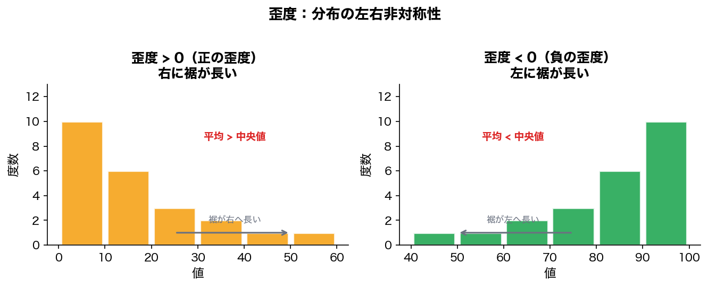
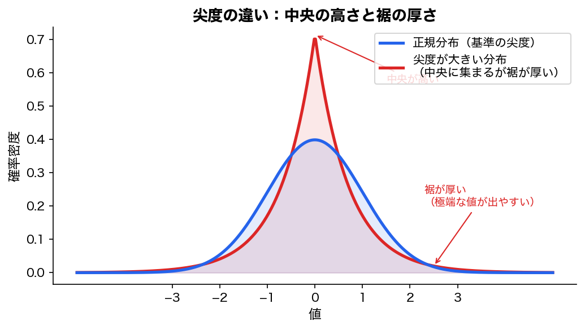
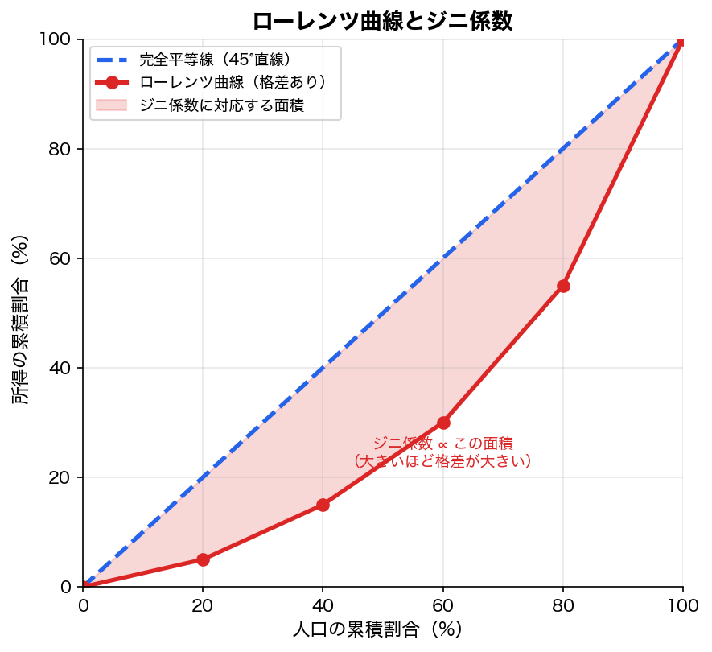

今回は、記述統計の中でも少し発展的な指標を扱います。

前回までに、

```text
第27回：データの種類・グラフ・ヒストグラム
第28回：平均・中央値・四分位・箱ひげ図
```

を学びました。

今回はその続きとして、

```text
標準化
z得点
変動係数
歪度
尖度
ローレンツ曲線
ジニ係数
```

を扱います。

統計検定2級の範囲にも、標準化、z得点、変動係数、ローレンツ曲線、ジニ係数、歪度、尖度が含まれています。

---

# 1. 今回のゴール

今回のゴールはこれです。

```text
1. 標準化とは何をしている操作か分かる
2. z得点を使って「平均との差」を標準偏差単位で読める
3. 変動係数で、単位や平均が違うデータのばらつきを比較できる
4. 歪度で、分布の左右の歪みを読める
5. 尖度で、分布の尖りや外れ値の出やすさを読める
6. ローレンツ曲線とジニ係数で、偏り・格差を読む感覚を持つ
```

今回の内容は、計算そのものよりも、

```text
この指標は何を見るためのものか？
```

を押さえるのが大事です。

---

# 2. まず全体像

今回扱う指標を、先に整理します。

|指標|何を見るか|一言でいうと|
|---|---|---|
|標準化|平均からどれくらい離れているか|単位を消して比較する|
|z得点|標準化した値|平均から標準偏差何個分か|
|変動係数|平均に対するばらつき|相対的なばらつき|
|歪度|分布の左右の歪み|右に長いか、左に長いか|
|尖度|分布の尖り・裾の重さ|極端な値が出やすいか|
|ローレンツ曲線|分布の偏り|格差の図|
|ジニ係数|偏りの強さ|格差を0〜1で表す|

---

# 3. 標準化とは何か

標準化とは、データを

```text
平均0、標準偏差1
```

の世界に変換することです。

代表的には、次の式を使います。

```text
z = (x - 平均) / 標準偏差
```

ここで、

|記号|意味|
|---|---|
|x|元のデータ|
|平均|データ全体の平均|
|標準偏差|データ全体のばらつき|
|z|標準化後の値、つまりz得点|

です。

---

# 4. 標準化は何をしているのか

標準化は、2段階の操作です。

```text
1. 平均を引く
2. 標準偏差で割る
```

## 1. 平均を引く

まず、

```text
x - 平均
```

をします。

これは、

```text
平均との差
```

を出しています。

たとえば、平均70点のテストで、ある人が80点だったら、

```text
80 - 70 = 10
```

です。

つまり、平均より10点高い。

---

## 2. 標準偏差で割る

次に、その差を標準偏差で割ります。

平均70点、標準偏差10点、本人80点なら、

```text
z = (80 - 70) / 10
  = 10 / 10
  = 1
```

これは、

```text
平均より標準偏差1個分高い
```

という意味です。

---

# 5. z得点の意味

z得点は、こう読めばいいです。

|z得点|意味|
|--:|---|
|z = 0|ちょうど平均|
|z = 1|平均より標準偏差1個分高い|
|z = 2|平均より標準偏差2個分高い|
|z = -1|平均より標準偏差1個分低い|
|z = -2|平均より標準偏差2個分低い|

つまり、z得点は、

```text
平均との差を、標準偏差を単位として表したもの
```

です。

---

# 6. 具体例：テストの点数を標準化する

次の状況を考えます。

|項目|値|
|---|--:|
|テスト平均|70点|
|標準偏差|10点|
|自分の点数|85点|

z得点は、

```text
z = (85 - 70) / 10
  = 15 / 10
  = 1.5
```

つまり、

```text
平均より標準偏差1.5個分高い
```

という意味です。

単に「85点」と見るよりも、

```text
このテストの中では、かなり高め
```

と分かります。

---

# 7. 標準化が必要になる理由

標準化は、単位やスケールが違うデータを比較するときに使います。

たとえば、次の2つを比べます。

|科目|平均|標準偏差|自分の点数|
|---|--:|--:|--:|
|数学|60|10|75|
|英語|80|5|90|

点数だけ見ると、

```text
英語90点の方が高い
```

です。

でも、その科目の中でどれくらい優秀かを見るには、標準化します。

数学：

```text
z = (75 - 60) / 10
  = 1.5
```

英語：

```text
z = (90 - 80) / 5
  = 2.0
```

つまり、

```text
数学：平均より標準偏差1.5個分高い
英語：平均より標準偏差2個分高い
```

なので、相対的には英語の方がよい成績です。

---

# 8. 偏差値との関係

日本でよく使う偏差値は、z得点を変換したものです。

```text
偏差値 = 50 + 10z
```

z得点が0なら、

```text
偏差値 = 50 + 10 × 0
       = 50
```

z得点が1なら、

```text
偏差値 = 50 + 10 × 1
       = 60
```

z得点が-1なら、

```text
偏差値 = 50 + 10 × (-1)
       = 40
```

つまり偏差値は、

```text
平均を50、標準偏差を10にした標準化スコア
```

です。

標準化の考え方を知ると、偏差値もかなり自然に理解できます。

---

# 9. 標準化の注意点

標準化は便利ですが、万能ではありません。

特に注意すべきなのは、分布の形です。

標準化は、

```text
平均から標準偏差何個分離れているか
```

を見る操作です。

しかし、分布が極端に歪んでいたり、外れ値が多かったりすると、平均と標準偏差自体が引っ張られます。

たとえば、年収、売上、オッズ、配当金のような右に裾が長いデータでは、z得点だけで判断すると危ないことがあります。

ここはかなり重要です。

```text
標準化すれば何でも公平に比較できる
```

と考えるのは雑です。

標準化の前に、ヒストグラムや箱ひげ図で分布の形を見る必要があります。

---

# 10. 変動係数とは何か

次に、変動係数です。

変動係数は、

```text
標準偏差 / 平均
```

で求めます。

英語では Coefficient of Variation といい、CV と書きます。

```text
CV = 標準偏差 / 平均
```

パーセントで表すなら、

```text
CV = 標準偏差 / 平均 × 100%
```

です。

---

# 11. 変動係数は何を見る指標か

変動係数は、

```text
平均に対して、どれくらいばらついているか
```

を見る指標です。

標準偏差は、元の単位に依存します。

たとえば、

```text
身長の標準偏差：5cm
体重の標準偏差：8kg
```

これだけを見ても、

```text
どちらの方がばらつきが大きいか
```

は単純には比較できません。

cmとkgで単位が違うからです。

そこで、平均で割って、相対的なばらつきを見ます。

---

# 12. 具体例：平均が違うデータの比較

A商品とB商品の月間売上を考えます。

|商品|平均売上|標準偏差|
|---|--:|--:|
|A商品|100万円|10万円|
|B商品|1,000万円|50万円|

標準偏差だけ見ると、

```text
B商品の方が50万円で大きい
```

です。

でも、平均の大きさも違います。

変動係数を計算します。

A商品：

```text
CV = 10 / 100
   = 0.10
   = 10%
```

B商品：

```text
CV = 50 / 1000
   = 0.05
   = 5%
```

つまり、

```text
A商品：平均に対して10%くらいばらつく
B商品：平均に対して5%くらいばらつく
```

です。

相対的には、A商品の方が不安定です。

---

# 13. 変動係数の使いどころ

変動係数は、次のような場面で使います。

|場面|理由|
|---|---|
|単位が違うデータを比較する|cmとkgなどをそのまま比べられない|
|平均の大きさが違うデータを比較する|平均100と平均1000では標準偏差の意味が違う|
|相対的な安定性を見たい|平均に対してどれくらいブレるかを見る|

あなたの文脈なら、競馬データでも使えます。

たとえば、

```text
単勝オッズのばらつき
配当金のばらつき
レースごとの売上のばらつき
```

を見るとき、平均水準が違うグループを比べるなら、標準偏差だけではなく変動係数を見る価値があります。

ただし、オッズや配当は分布が歪みやすいので、CVだけで判断するのは危険です。ヒストグラムや中央値も併用すべきです。

---

# 14. 変動係数の注意点

変動係数には注意点があります。

特に、平均が0に近いと危険です。

```text
CV = 標準偏差 / 平均
```

なので、平均が小さいとCVが極端に大きくなります。

また、平均が負になるデータでは、変動係数の解釈が難しくなることがあります。

つまり、変動係数は、

```text
平均が正で、平均の大きさに意味があるデータ
```

で使いやすい指標です。

---

# 15. 歪度とは何か

次に、歪度です。

歪度は、分布の左右の歪みを表す指標です。

ざっくり言えば、

```text
右に裾が長いか
左に裾が長いか
左右対称に近いか
```

を見る指標です。

---

# 16. 歪度の読み方

歪度は、符号で読むのが基本です。

|歪度|分布の形|特徴|
|--:|---|---|
|正|右に裾が長い|大きい値側に外れ値がある|
|0付近|左右対称に近い|平均と中央値が近い|
|負|左に裾が長い|小さい値側に外れ値がある|

---

## 歪度が正の分布

右に裾が長い分布です。



このような分布（左パネル）では、一部に大きい値があります。

例：

```text
年収
売上
アクセス数
単勝オッズ
配当金
```

この場合、平均は中央値より大きくなりやすいです。

```text
平均 > 中央値
```

---

## 歪度が負の分布

左に裾が長い分布です。

（上の図の右パネル参照）

このような分布では、一部に小さい値があります。

例：

```text
易しいテストの点数
高評価が多いレビュー
上限に近い成功率データ
```

この場合、平均は中央値より小さくなりやすいです。

```text
平均 < 中央値
```

---

# 17. 歪度で何が分かるか

歪度を見ると、

```text
平均を代表値として使ってよいか？
```

の判断材料になります。

たとえば、歪度が大きく正なら、平均は大きい値に引っ張られている可能性があります。

この場合、

```text
平均だけでなく中央値も見る
```

べきです。

逆に、歪度が0に近く、左右対称なら、平均は代表値として使いやすいです。

---

# 18. 尖度とは何か

次に、尖度です。

尖度は、分布の尖り具合や、裾の重さを表す指標です。

ただし、ここは少し誤解しやすいです。

尖度という名前から、

```text
山がどれだけ尖っているか
```

だけを見ていると思いがちです。

でも実務的には、

```text
極端な値がどれくらい出やすいか
裾がどれくらい重いか
```

を見る指標だと考えた方が安全です。

---

# 19. 尖度の読み方

尖度は、正規分布を基準に読まれることが多いです。

試験対策としては、ざっくり次の理解でよいです。

|尖度|解釈|
|--:|---|
|大きい|極端な値が出やすい。裾が重い|
|小さい|極端な値が出にくい。平たい|
|正規分布に近い|基準的な尖り具合|

統計ソフトによっては、正規分布の尖度を3とする場合と、正規分布を0とする「超過尖度」を出す場合があります。

ここは注意です。

---

# 20. 尖度が大きい分布のイメージ

尖度が大きい分布は、中央に集まりつつ、端の方にも極端な値が出やすいイメージです。



これは、

```text
多くは中心付近
でも、たまに極端な値も出る
```

という感じです。

金融データや配当データのように、極端な値が出る世界では、尖度が重要になります。

---

# 21. 歪度と尖度の違い

ここは混同しやすいです。

|指標|見ているもの|
|---|---|
|歪度|左右どちらに歪んでいるか|
|尖度|極端な値がどれくらい出やすいか|

歪度は「左右の非対称性」です。

尖度は「裾の重さ・極端値の出やすさ」です。

たとえば、

```text
右に長く伸びているか？
```

を見るのが歪度。

```text
端の方に極端な値が多いか？
```

を見るのが尖度。

---

# 22. 歪度・尖度の注意点

歪度と尖度は便利ですが、これだけで判断すると危険です。

なぜなら、数値だけ見ても分布の形を完全には理解できないからです。

たとえば、同じ歪度でも、分布の山の数が違うことがあります。

また、尖度が高いからといって、具体的にどこに外れ値があるかまでは分かりません。

だから順番としては、

```text
1. ヒストグラムを見る
2. 箱ひげ図を見る
3. 平均・中央値・標準偏差を見る
4. 必要なら歪度・尖度を見る
```

が自然です。

歪度・尖度だけを見て「分布を理解した」と思うのは危険です。

---

# 23. ローレンツ曲線とは何か

次に、ローレンツ曲線です。

ローレンツ曲線は、所得や資産などの偏りを見るためによく使われます。

簡単に言うと、

```text
下位何%の人が、全体の何%を持っているか
```

を見る曲線です。

---

# 24. 完全に平等な場合

たとえば、100人がいて、全員が同じ金額を持っているとします。

このとき、

|人口の下位割合|所得の累積割合|
|--:|--:|
|下位20%|20%|
|下位40%|40%|
|下位60%|60%|
|下位80%|80%|
|下位100%|100%|

になります。

これを図にすると、45度の直線になります。



これを完全平等線と呼びます（図中の青い破線）。

---

# 25. 格差がある場合

格差がある場合、下位の人たちが持つ割合は小さくなります。

たとえば、

|人口の下位割合|所得の累積割合|
|--:|--:|
|下位20%|5%|
|下位40%|15%|
|下位60%|30%|
|下位80%|55%|
|下位100%|100%|

この場合、ローレンツ曲線は完全平等線より下に膨らみます。

（上の図の赤い曲線参照）

曲線が下に膨らむほど、偏りが大きいです。

---

# 26. ジニ係数とは何か

ジニ係数は、ローレンツ曲線から求める格差の指標です。

値はだいたい、

```text
0から1
```

の範囲で考えます。

|ジニ係数|状態|
|--:|---|
|0|完全平等|
|1に近い|極端に不平等|
|大きい|偏りが大きい|
|小さい|偏りが小さい|

完全に平等なら、ローレンツ曲線は完全平等線と一致します。

このとき、ジニ係数は0です。

一部の人だけが全部を持っているような状態に近づくほど、ジニ係数は1に近づきます。

---

# 27. ジニ係数の直感

ジニ係数は、

```text
どれくらい一部に偏っているか
```

を見る指標です。

所得だけでなく、いろいろな偏りに応用できます。

たとえば、

```text
売上が一部の商品に集中しているか
アクセスが一部ページに集中しているか
配当が一部レースに集中しているか
馬券購入が一部条件に集中しているか
```

などにも使えます。

あなたの競馬AIの文脈で言うなら、

```text
利益が一部のレースに偏っている
回収が一部の馬券種に集中している
期待値が一部の条件に偏っている
```

を見るときにも、ジニ係数的な発想は役に立ちます。

ただし、試験ではそこまで応用しなくてよいです。

まずは、

```text
ローレンツ曲線が下に膨らむほど格差が大きい
ジニ係数が大きいほど偏りが大きい
```

を押さえればよいです。

---

# 28. ジニ係数の注意点

ジニ係数にも限界があります。

ジニ係数は、偏りの大きさを1つの数値にします。

しかし、

```text
どの層に偏りがあるのか
```

までは詳しく見えません。

同じジニ係数でも、偏り方が違うことがあります。

だから、ジニ係数を見るときも、

```text
ローレンツ曲線の形を見る
元データを見る
平均・中央値も見る
```

ことが必要です。

これは統計全般に言えることです。

```text
1つの指標だけで分かった気にならない
```

これがかなり大事です。

---

# 29. 今回の指標をまとめて比較する

|指標|使う場面|注意点|
|---|---|---|
|標準化|単位やスケールをそろえて比較したい|歪んだ分布では平均・標準偏差が不安定|
|z得点|平均からどれくらい離れているか見たい|正規分布前提で確率解釈するときは注意|
|変動係数|平均水準が違うデータのばらつきを比べたい|平均が0に近いと危険|
|歪度|分布の左右の偏りを見たい|数値だけで形を断定しない|
|尖度|極端な値の出やすさを見たい|ソフトにより定義が違うことがある|
|ローレンツ曲線|偏り・格差を図で見たい|曲線の形を見る必要がある|
|ジニ係数|偏り・格差を1つの数値で見たい|偏り方の詳細は失われる|

---

# 30. 試験で問われやすいポイント

## 問い方1：z得点

```text
平均70、標準偏差10のテストで、85点を取った。
このときのz得点はいくつか？
```

計算します。

```text
z = (85 - 70) / 10
  = 15 / 10
  = 1.5
```

答えは、**1.5**です。

---

## 問い方2：変動係数

```text
平均100、標準偏差15のデータの変動係数はいくつか？
```

```text
CV = 15 / 100
   = 0.15
```

パーセントなら、

```text
15%
```

です。

---

## 問い方3：歪度

```text
右に裾が長い分布では、歪度は正か負か？
```

答えは、**正**です。

```text
右に裾が長い → 歪度は正
左に裾が長い → 歪度は負
```

---

## 問い方4：ジニ係数

```text
ジニ係数が大きいほど、何を意味するか？
```

答えは、

```text
偏り・格差が大きい
```

です。

---

# 31. 今回のまとめ

今回の内容をまとめます。

|用語|意味|
|---|---|
|標準化|平均を0、標準偏差を1にする変換|
|z得点|平均から標準偏差何個分離れているか|
|変動係数|標準偏差を平均で割った相対的ばらつき|
|歪度|分布の左右の歪み|
|尖度|極端な値の出やすさ、裾の重さ|
|ローレンツ曲線|偏り・格差を表す曲線|
|ジニ係数|偏り・格差を0〜1程度で表す数値|

---

# 32. 今回の最重要ポイント

今回一番大事なのはこれです。

```text
指標には、それぞれ見る対象がある。
```

平均は中心を見る。

標準偏差はばらつきを見る。

標準化は平均との差を標準偏差単位で見る。

変動係数は平均に対する相対的なばらつきを見る。

歪度は左右の歪みを見る。

尖度は極端値の出やすさを見る。

ジニ係数は偏り・格差を見る。

つまり、統計指標は何でも同じではありません。

```text
何を見たいのか
どの指標がそれを見る道具なのか
その指標にはどんな弱点があるのか
```

をセットで考える必要があります。

ここを雑にすると、数値だけ見て間違った解釈をします。

---

# 33. 確認問題

## 問題1

平均50、標準偏差10のデータで、値70のz得点を求めてください。

### 解答

```text
z = (70 - 50) / 10
  = 20 / 10
  = 2
```

答えは、**2**です。

つまり、平均より標準偏差2個分高いです。

---

## 問題2

平均200、標準偏差20のデータの変動係数を求めてください。

### 解答

```text
CV = 20 / 200
   = 0.10
```

答えは、**0.10**、つまり**10%**です。

---

## 問題3

次のうち、右に裾が長い分布で起こりやすいものはどれですか？

```text
A. 歪度が正
B. 歪度が負
C. ジニ係数が必ず0
D. 標準偏差が必ず0
```

答えは、**A. 歪度が正**です。

---

## 問題4

ジニ係数が0に近いほど、どのような状態ですか？

```text
A. 偏りが大きい
B. 偏りが小さい
C. 必ず平均が大きい
D. 必ず外れ値が多い
```

答えは、**B. 偏りが小さい**です。

---

## 問題5

標準化について正しい説明はどれですか？

```text
A. データをすべて0にする操作
B. 平均0、標準偏差1のスケールに変換する操作
C. 外れ値を削除する操作
D. データを必ず正規分布に変える操作
```

答えは、**B. 平均0、標準偏差1のスケールに変換する操作**です。

ここでDを選ぶと危険です。

標準化しても、分布の形が自動的に正規分布になるわけではありません。

---

# 34. 次回につながる話

次回は、

```text
第30回：散布図・共分散・相関係数
```

に進むのが自然です。

ここからは、1変数データではなく、**2変数データ**に入ります。

今回までの内容は、

```text
1つの変数の分布を見る
```

話でした。

次回からは、

```text
2つの変数の関係を見る
```

話です。

たとえば、

```text
身長が高い人ほど体重も重いのか
勉強時間が長い人ほど点数が高いのか
オッズが高いほど的中率は低いのか
人気順位と着順には関係があるのか
```

こういう関係を見るために、散布図・共分散・相関係数を学びます。