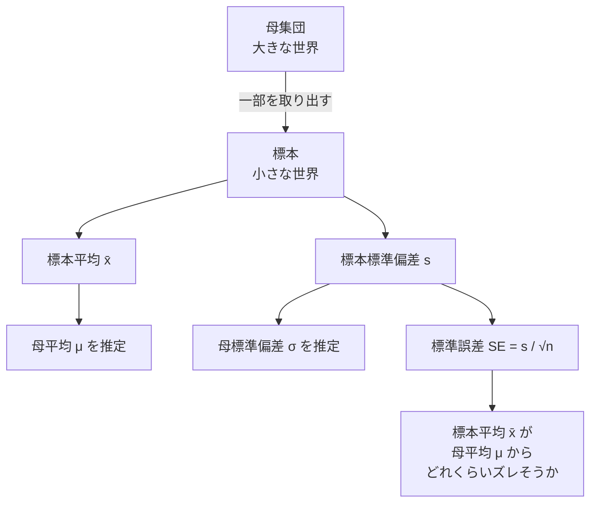
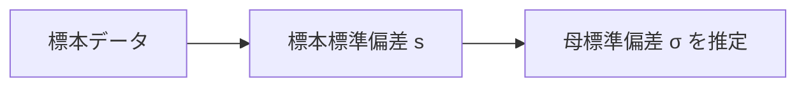
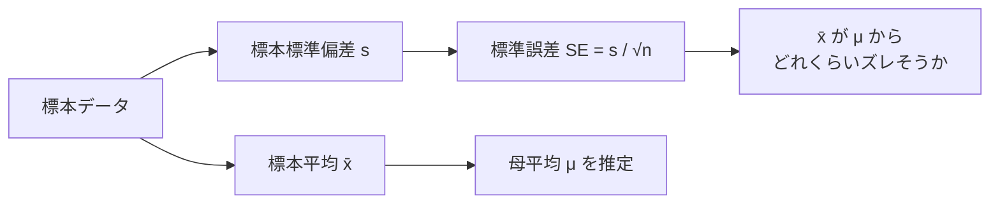
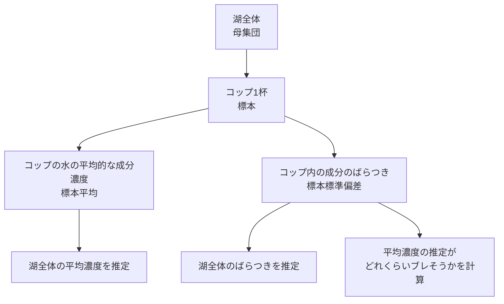
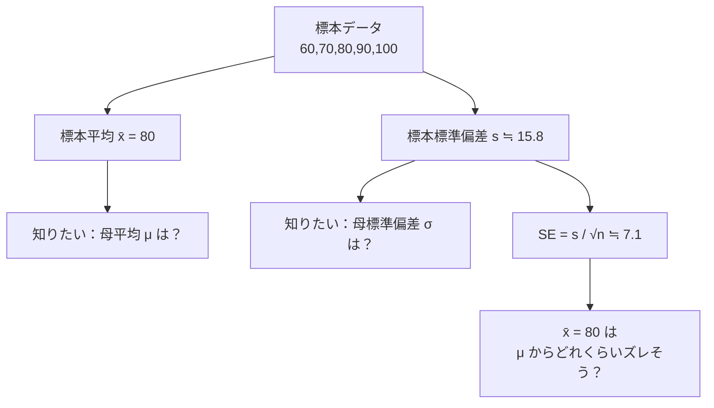
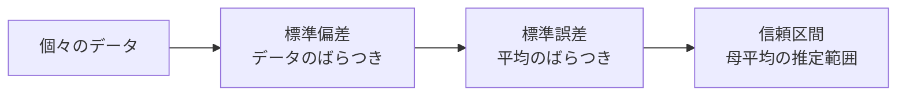

# 結論
もし何度も同じサイズの標本を取り直して、そのたびに標本平均を計算したら、その標本平均たちがどれくらい散らばるか  
＝ 標準誤差


標本を用意しました。 標準偏差を出します。 この標準偏差は、用意した標本の中でのばらつきを示します。 これは小さな世界のばらつきです。 しかしこの小さな世界は、この小さな世界を囲むもっと大きな世界の１部だとします。 この小さな世界のばらつきを元に大きな世界のばらつきを推定してみます。 でも、所詮、大きな世界の一部を使ったに過ぎません。 大きな世界のばらつきを推定したものの、それはどのくらいズレそうなのか？ それが標準誤差になります。
混ざっている点は、かなりピンポイントです。

あなたの文章の中では、ここです。

> 大きな世界のばらつきを推定したものの、それはどのくらいズレそうなのか？  
> それが標準誤差になります。

この文では、**「大きな世界のばらつき」＝母分散・母標準偏差** を推定していて、  
その推定がどれくらいズレるかを **標準誤差** と呼んでいます。

でも、統計検定2級でまず出てくる標準誤差は、基本的に

> **標本平均が、母平均からどれくらいズレそうか**

です。

つまり、混ざっているのはここです。

```text
A：母集団の「ばらつき」を推定する話
B：母集団の「平均」を推定する話
```

この2つが近くに出てくるので、混同しやすいです。

---

# まず全体像

図で見るとこうです。



ここで大事なのは、**標本標準偏差 s には2つの使い道がある**ことです。

1つ目は、

> 母集団のばらつき σ を推定するために使う

2つ目は、

> 標本平均 x̄ のブレを計算するために使う

です。

あなたはこの2つ目のところで、少しだけ1つ目に引っ張られています。

---

# 混同ポイントを分解する

## ルートA：ばらつきを推定する話

これはこうです。



これは、

> 小さな世界のばらつきから、大きな世界のばらつきを推定する

という話です。

あなたの理解の前半はここです。

これは合っています。

たとえば、5人の点数がある。

```text
60, 70, 80, 90, 100
```

この5人の点数のばらつきを計算する。  
それを使って、全国全体の点数のばらつきもこれくらいかな、と推定する。

これは **標準偏差・分散の話** です。

---

## ルートB：平均がどれくらいズレるかの話

標準誤差はこちらです。



ここで標準誤差が見ているのは、

```text
標本標準偏差 s が、母標準偏差 σ からどれくらいズレるか
```

ではありません。

見ているのは、

```text
標本平均 x̄ が、母平均 μ からどれくらいズレるか
```

です。

---

# かなり重要な整理

こう分けると分かりやすいです。

|推定したいもの|標本から計算するもの|何の話か|
|---|---|---|
|母平均 μ|標本平均 x̄|平均を推定する話|
|母標準偏差 σ|標本標準偏差 s|ばらつきを推定する話|
|標本平均のズレやすさ|s / √n|標準誤差の話|

ここで標準誤差は、**母標準偏差 σ の推定誤差**ではありません。

標準誤差は、

> 標本平均 x̄ の不安定さ

です。

---

# たとえで整理する

大きな湖から、コップ1杯の水をすくうとします。

母集団が湖。  
標本がコップ1杯です。



ここで、

- コップ内の成分がどれくらいバラついているか  
    → 標本標準偏差
    
- 湖全体の成分のばらつきはどれくらいか  
    → 母標準偏差の推定
    
- コップ1杯から出した平均濃度が、湖全体の平均濃度からどれくらいズレそうか  
    → 標準誤差
    

です。

標準誤差は「湖全体のばらつきの推定がどれくらいズレるか」ではありません。

標準誤差は、

> コップ1杯から出した平均が、湖全体の平均からどれくらい外しそうか

です。

---

# 具体例で見る

ある標本がこうだったとします。

```text
60, 70, 80, 90, 100
```

このとき、標本平均は

```text
80
```

です。

標本標準偏差はざっくり

```text
約15.8
```

だとします。

ここで2つの話があります。

---

## 話1：母集団のばらつきはどれくらいか？

5人の点数のばらつきが約15.8点だった。

では、全国全体の点数のばらつきも、だいたい15.8点くらいかもしれない。

これは、

```text
標本標準偏差 s から、母標準偏差 σ を推定している
```

話です。

---

## 話2：標本平均80点は、母平均からどれくらいズレそうか？

標本平均は80点。

でも、たった5人なので、全国平均からけっこうズレているかもしれない。

そこで、

```text
SE = s / √n
```

を計算します。

```text
SE = 15.8 / √5
   ≒ 15.8 / 2.236
   ≒ 7.1
```

つまり、

> この標本平均80点は、母平均からざっくり7点くらいブレそう

と考える。

これが標準誤差です。

---

# 何が違うのか

比較するとこうです。



標本標準偏差 s は、たしかに母標準偏差 σ の推定にも使います。

でも、標準誤差を計算するときは、s を材料にして、

> 標本平均 x̄ のズレやすさ

を見ています。

ここが分岐点です。

---

# あなたの文章を「正確版」に直す

あなたの文章を、混同しない形に直すとこうです。

```text
標本を用意しました。

標本標準偏差を出します。
この標準偏差は、用意した標本の中でのばらつきを示します。
これは小さな世界のばらつきです。

しかし、この小さな世界は、もっと大きな世界である母集団の一部です。

なので、この小さな世界のばらつきをもとに、
大きな世界のばらつき、つまり母標準偏差を推定します。

ただし、統計でよく知りたいのは、
大きな世界の平均、つまり母平均です。

そこで、標本平均を使って母平均を推定します。

でも、標本平均は所詮一部のデータから出した平均なので、
母平均からズレている可能性があります。

その標本平均のズレやすさを表すのが標準誤差です。
```

この文章なら正確です。

---

# 一言で区別するなら

こうです。

```text
標本標準偏差：
小さな世界の中で、個々のデータがどれくらい散らばっているか。

母標準偏差の推定：
小さな世界のばらつきから、大きな世界のばらつきを推測すること。

標準誤差：
小さな世界の平均が、大きな世界の平均からどれくらいズレそうか。
```

---

# よくある誤解

特に注意すべき誤解はこれです。

```text
標準誤差 = 標準偏差を推定したときの誤差
```

これは違います。

名前が悪いです。  
「標準誤差」という名前だけ見ると、標準偏差の誤差っぽく見えます。

でも実際には、多くの場合、

```text
標準誤差 = 標本平均の標準偏差
```

です。

もっと正確に言えば、

> 


です。

---

# 最後に、超短縮版

標準偏差と標準誤差の関係はこうです。



つまり、

```text
データがばらつく
↓
標本平均もブレる
↓
そのブレ幅が標準誤差
↓
標準誤差を使って信頼区間を作る
```

です。

あなたが混同していたのは、  
**「ばらつきそのものを推定する話」と「平均のズレやすさを推定する話」を同じレールに乗せてしまった点**です。

ただ、これはかなり自然な混同です。  
むしろここで一度引っかかった方が、あとで t 分布や信頼区間を理解しやすくなります。