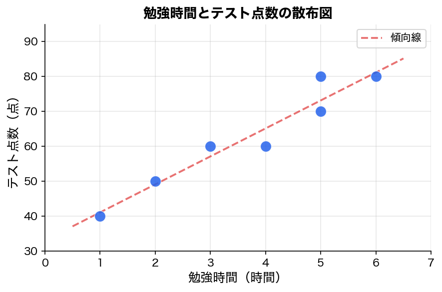
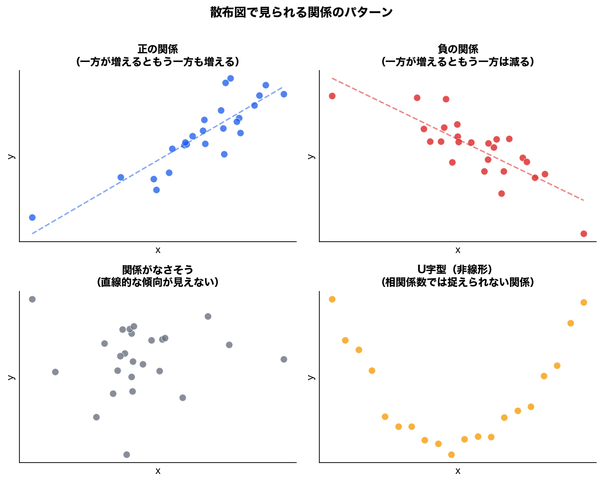
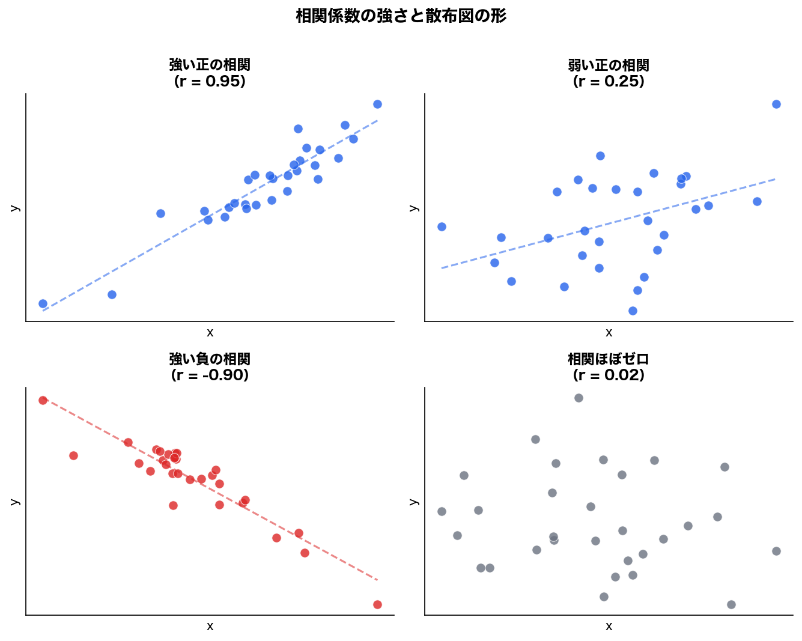
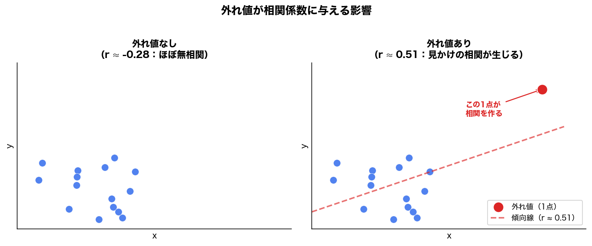

今回は、**2変数データ**に入ります。

第27〜29回までは、基本的に「1つの変数を見る」話でした。

たとえば、

```text
テスト点数の分布を見る
平均を見る
中央値を見る
標準偏差を見る
歪度を見る
```

という話です。

今回からは、

```text
2つの変数の関係を見る
```

に進みます。

統計検定2級の範囲にも、散布図、相関係数、共分散、層別した散布図、相関行列、見かけの相関、偏相関係数が含まれています。

---

# 1. 今回のゴール

今回のゴールはこれです。

```text
1. 散布図で2つの変数の関係を見られる
2. 正の関係・負の関係・関係なしを判断できる
3. 共分散が何を表しているか分かる
4. 相関係数が何を表しているか分かる
5. 相関係数の値を正しく解釈できる
6. 相関と因果を混同しない
```

今回かなり重要です。

なぜなら、回帰分析、重回帰分析、相関行列、多重共線性の土台になるからです。

---

# 2. 2変数データとは何か

2変数データとは、1つの対象に対して、2つの値がセットで記録されているデータです。

たとえば、10人の生徒について、

```text
勉強時間
テスト点数
```

を記録したとします。

|生徒|勉強時間|テスト点数|
|---|--:|--:|
|A|1|45|
|B|2|50|
|C|3|58|
|D|4|65|
|E|5|72|
|F|6|78|

この場合、

```text
勉強時間とテスト点数には関係があるのか？
```

を調べたくなります。

このように、2つの変数の関係を見るのが、2変数データの分析です。

---

# 3. まず散布図を見る

2変数データでは、いきなり相関係数を計算する前に、まず散布図を見ます。

散布図とは、横軸に1つの変数、縦軸にもう1つの変数を置いて、各データを点として打った図です。

たとえば、

```text
横軸：勉強時間
縦軸：テスト点数
```

にすると、こういうイメージです。



右に行くほど点数も上がっています。

つまり、

```text
勉強時間が長いほど、テスト点数も高い傾向がある
```

と読めます。

---

# 4. 散布図で見るべきこと

散布図では、主に次の4つを見ます。

```text
1. 右上がりか、右下がりか
2. 点がどれくらい一直線に近いか
3. 外れ値があるか
4. グループが混ざっていないか
```

相関係数は便利ですが、散布図を見ずに相関係数だけ見るのは危険です。

これはかなり大事です。

---

# 5. 正の関係

正の関係とは、一方が大きくなると、もう一方も大きくなる傾向です。



例：

|変数1|変数2|
|---|---|
|身長|体重|
|勉強時間|テスト点数|
|広告費|売上|
|距離|走破タイム|
|人気順位の悪さ|単勝オッズ|

注意点として、競馬の「人気順位」は数値が大きいほど人気が低いです。

だから、

```text
人気順位が大きいほど、単勝オッズも大きい
```

なら、数値上は正の関係です。

ただし意味としては、

```text
人気が低いほどオッズが高い
```

です。

このように、変数の符号や定義に注意する必要があります。

---

# 6. 負の関係

負の関係とは、一方が大きくなると、もう一方が小さくなる傾向です。

（上の図の右上パネル参照）

例：

|変数1|変数2|
|---|---|
|気温|暖房使用量|
|単勝オッズ|勝率|
|人気度|オッズ|
|商品価格|購入数|
|走破タイム|評価点|

たとえば、単勝オッズと勝率は、普通は負の関係になりやすいです。

```text
オッズが高い馬ほど、勝率は低い傾向がある
```

ということです。

---

# 7. 関係がなさそうな場合

点がバラバラに散っていて、右上がり・右下がりの傾向が見えない場合です。

（上の図の左下パネル参照）

この場合、

```text
2つの変数の間に、少なくとも直線的な関係は弱そう
```

と考えます。

ここで重要なのは、**相関係数は直線的な関係を見る指標**だということです。

相関係数が0に近くても、関係が完全にないとは限りません。

たとえば、U字型の関係だと相関係数は小さくなることがあります。

---

# 8. 相関係数が危ない例：U字型

たとえば、次のような関係です。

（上の図の右下パネル参照）

これは、明らかに何らかの関係があります。

でも、右上がりでも右下がりでもありません。

このような非線形の関係では、相関係数は小さく出ることがあります。

だから、

```text
相関係数が低い = 関係がない
```

と即断するのは危険です。

正しくは、

```text
相関係数が低い = 直線的な関係は弱い
```

です。

---

# 9. 共分散に入る前に：偏差を思い出す

共分散を理解するには、まず偏差を思い出す必要があります。

偏差とは、

```text
データ - 平均
```

でした。

たとえば、平均が70点で、ある人が80点なら、

```text
80 - 70 = 10
```

なので、平均より10点高い。

平均が70点で、ある人が60点なら、

```text
60 - 70 = -10
```

なので、平均より10点低い。

つまり、偏差は、

```text
平均との差
```

です。

---

# 10. 共分散とは何か

共分散とは、2つの変数が一緒にどう動くかを見る指標です。

式のイメージはこうです。

```text
共分散 = xの偏差 × yの偏差 の平均
```

もう少し書くと、

```text
共分散 = 平均{(x - xの平均)(y - yの平均)}
```

標本共分散では、nではなくn-1で割る形もあります。

ただし、最初は式を暗記するよりも、意味を押さえる方が大事です。

```text
xが平均より大きいとき、yも平均より大きいか？
xが平均より小さいとき、yも平均より小さいか？
```

これを見るのが共分散です。

---

# 11. 共分散が正になる場合

たとえば、勉強時間と点数を考えます。

|人|勉強時間 x|点数 y|
|---|--:|--:|
|A|1|50|
|B|2|60|
|C|3|70|
|D|4|80|
|E|5|90|

平均は、

```text
xの平均 = 3
yの平均 = 70
```

です。

偏差を出します。

|人|x|xの偏差|y|yの偏差|偏差の積|
|---|--:|--:|--:|--:|--:|
|A|1|-2|50|-20|40|
|B|2|-1|60|-10|10|
|C|3|0|70|0|0|
|D|4|1|80|10|10|
|E|5|2|90|20|40|

偏差の積が全部0以上です。

なぜなら、

```text
xが平均より小さいとき、yも平均より小さい
xが平均より大きいとき、yも平均より大きい
```

からです。

マイナス × マイナスはプラス。

プラス × プラスもプラス。

だから、共分散は正になります。

つまり、

```text
共分散が正：一方が大きいと、もう一方も大きい傾向
```

です。

---

# 12. 共分散が負になる場合

次は、気温と暖房使用量を考えます。

|日|気温 x|暖房使用量 y|
|---|--:|--:|
|A|5|50|
|B|10|40|
|C|15|30|
|D|20|20|
|E|25|10|

平均は、

```text
xの平均 = 15
yの平均 = 30
```

です。

|日|x|xの偏差|y|yの偏差|偏差の積|
|---|--:|--:|--:|--:|--:|
|A|5|-10|50|20|-200|
|B|10|-5|40|10|-50|
|C|15|0|30|0|0|
|D|20|5|20|-10|-50|
|E|25|10|10|-20|-200|

偏差の積がマイナスになります。

なぜなら、

```text
xが平均より小さいとき、yは平均より大きい
xが平均より大きいとき、yは平均より小さい
```

からです。

マイナス × プラスはマイナス。

プラス × マイナスもマイナス。

だから、共分散は負になります。

つまり、

```text
共分散が負：一方が大きいと、もう一方は小さい傾向
```

です。

---

# 13. 共分散の弱点

共分散には大きな弱点があります。

```text
単位に依存する
```

たとえば、身長をcmで測るか、mで測るかで、共分散の値は変わります。

```text
身長：170cm
身長：1.70m
```

同じ意味なのに、数値のスケールが違います。

そのため、共分散の値そのものを見て、

```text
共分散が100だから強い関係
共分散が2だから弱い関係
```

とは言いにくいです。

共分散は、主に符号を見るには便利です。

|共分散|意味|
|--:|---|
|正|正の関係|
|負|負の関係|
|0付近|直線的な関係が弱い|

ただし、強さを比較するには不便です。

そこで出てくるのが、相関係数です。

---

# 14. 相関係数とは何か

相関係数は、共分散を標準化したものです。

式はこうです。

```text
相関係数 = 共分散 / (xの標準偏差 × yの標準偏差)
```

記号では、よく r と書きます。

```text
r = cov(x, y) / (s_x s_y)
```

何をしているかというと、

```text
共分散から単位の影響を取り除いている
```

と考えるとよいです。

---

# 15. 相関係数の範囲

相関係数は、必ず -1 から 1 の間になります。

```text
-1 ≤ r ≤ 1
```

|相関係数 r|解釈|
|--:|---|
|r = 1|完全な正の直線関係|
|r が正|正の相関|
|r = 0|直線的な関係がない|
|r が負|負の相関|
|r = -1|完全な負の直線関係|

ここで注意するのは、

```text
r = 0 は「関係がない」ではなく「直線的な関係がない」
```

です。

さきほどのU字型のように、非線形な関係はあり得ます。

---

# 16. 相関係数の強さの目安

ざっくりした目安はこうです。

|相関係数の絶対値|目安|
|--:|---|
|0.0〜0.2|ほとんど直線関係なし|
|0.2〜0.4|弱い相関|
|0.4〜0.7|中程度の相関|
|0.7〜1.0|強い相関|

ただし、これは絶対的な基準ではありません。

分野によって、相関の強さの感覚は変わります。

医療・心理・社会科学では0.3でも意味があることがあります。  
物理測定のような世界では0.9でも弱く見えることがあります。

だから、試験ではざっくり目安でよいですが、実務では文脈が必要です。

---

# 17. 相関係数の例

## 強い正の相関



**r = 0.95（左上）** ：一方が大きいほど、もう一方も大きい。しかも点が直線に近い。

---

## 弱い正の相関

（上の図の右上パネル参照：r = 0.25）

なんとなく右上がりだが、ばらつきが大きい。

---

## 強い負の相関

（上の図の左下パネル参照：r = -0.90）

一方が大きいほど、もう一方は小さい。点が直線に近い。

---

## 相関ほぼゼロ

（上の図の右下パネル参照：r = 0.02）

直線的な傾向がほとんど見えない。

---

# 18. 相関係数で絶対に注意すべきこと

相関係数には、重要な注意点があります。

```text
相関は因果を意味しない
```

これは試験でも実務でも重要です。

たとえば、

```text
アイスの売上が増えると、水難事故も増える
```

という相関があったとします。

でも、

```text
アイスを食べると水難事故が起きる
```

とは言えません。

実際には、

```text
気温が高い
```

という第3の変数が関係している可能性があります。

```text
気温が高い
├── アイスが売れる
└── 水遊びが増えて水難事故も増える
```

このように、2つの変数に相関があっても、片方が片方の原因とは限りません。

---

# 19. 見かけの相関

第3の変数によって、2つの変数に関係があるように見えることを、**見かけの相関**、または**擬相関**といいます。

例：

```text
アイス売上と水難事故
```

この2つには相関があるかもしれません。

でも、本当は気温が影響している可能性があります。

```text
気温
├── アイス売上
└── 水難事故
```

この場合、アイス売上と水難事故の相関は、見かけの相関です。

---

# 20. 競馬データでの見かけの相関

競馬データでも、見かけの相関はかなり危険です。

たとえば、

```text
騎手Aの単勝回収率が高い
```

とします。

これを見て、

```text
騎手Aがうまいから儲かる
```

とすぐ考えるのは危ないです。

もしかすると、

```text
騎手Aは特定の厩舎の馬に多く乗っている
騎手Aは特定の競馬場・距離で多く乗っている
騎手Aは人気薄に乗る機会が多い
騎手Aはそもそもサンプル数が少ない
```

などの要因があるかもしれません。

つまり、

```text
騎手A
```

が原因に見えて、実は

```text
競馬場
距離
厩舎
人気帯
馬質
サンプルサイズ
```

が影響している可能性があります。

ここを無視すると、かなり簡単に自分を騙します。

---

# 21. 外れ値で相関が変わる

相関係数は外れ値に弱いです。

たとえば、多くの点はバラバラなのに、1つだけ極端な点があるとします。



この1点のせいで、相関係数が大きく見えることがあります。

逆に、本来は関係があるのに、外れ値のせいで相関が弱く見えることもあります。

だから、相関係数を見る前に散布図を見る必要があります。

```text
散布図を見ない相関分析は危険
```

これはかなり重要です。

---

# 22. 相関係数が同じでも形が違うことがある

相関係数は1つの数値です。

でも、1つの数値で散布図の形を完全に表すことはできません。

たとえば、次のような違いがあります。

```text
A：きれいな右上がり
B：外れ値1点で右上がりに見える
C：U字型
D：グループが2つに分かれている
```

これらは、相関係数だけでは区別しにくいことがあります。

だから順番はこれです。

```text
1. 散布図を見る
2. 外れ値やグループ混在を見る
3. 相関係数を見る
4. 必要なら層別・回帰・偏相関を考える
```

---

# 23. 共分散と相関係数の違い

ここで整理します。

|指標|意味|値の範囲|弱点|
|---|---|---|---|
|共分散|2つの変数が一緒にどう動くか|制限なし|単位に依存する|
|相関係数|共分散を標準化したもの|-1〜1|非線形・外れ値・擬相関に注意|

共分散は、方向を見る指標です。

相関係数は、方向と直線的な強さを見る指標です。

---

# 24. 相関係数と回帰分析の違い

相関係数と回帰分析は似ていますが、目的が違います。

|方法|目的|
|---|---|
|相関係数|2つの変数の直線的な関係の強さを見る|
|回帰分析|xからyを説明・予測する式を作る|

相関では、基本的にxとyは対等です。

```text
身長と体重の相関
```

というとき、どちらが原因・結果とは決めていません。

一方、回帰分析では、

```text
xでyを説明する
```

という方向があります。

たとえば、

```text
勉強時間でテスト点数を予測する
```

なら、

```text
説明変数：勉強時間
目的変数：テスト点数
```

です。

ここは後の重回帰分析でも重要になります。

---

# 25. 試験で問われやすいポイント

## 問い方1：相関係数の範囲

```text
相関係数としてあり得る値はどれか？

A. -1.5
B. -0.8
C. 1.2
D. 3.0
```

答えは、**B. -0.8**です。

相関係数は必ず -1 から 1 の間です。

---

## 問い方2：負の相関

```text
相関係数 r = -0.75 の解釈として適切なものはどれか？

A. 強めの正の相関がある
B. 強めの負の相関がある
C. 相関は存在しない
D. 因果関係が証明された
```

答えは、**B. 強めの負の相関がある**です。

Dは誤りです。相関は因果を証明しません。

---

## 問い方3：共分散の符号

```text
xが平均より大きいとき、yも平均より大きい傾向がある。
このとき共分散の符号はどうなりやすいか？
```

答えは、**正**です。

偏差の積がプラスになりやすいからです。

---

## 問い方4：相関係数0の解釈

```text
相関係数が0に近いとき、正しい説明はどれか？

A. 2変数の間にいかなる関係もない
B. 直線的な関係が弱い
C. 因果関係がないことが証明された
D. データに外れ値がない
```

答えは、**B. 直線的な関係が弱い**です。

Aは言いすぎです。

---

# 26. 今回のまとめ

|用語|意味|
|---|---|
|散布図|2つの量的変数の関係を点で見る図|
|正の関係|一方が大きいほど、もう一方も大きい傾向|
|負の関係|一方が大きいほど、もう一方は小さい傾向|
|共分散|2つの変数が一緒にどう動くかを見る指標|
|相関係数|共分散を標準化したもの|
|正の相関|r > 0|
|負の相関|r < 0|
|無相関|r が 0 に近い。直線関係が弱い|
|見かけの相関|第3の変数により相関があるように見えること|

---

# 27. 今回の最重要ポイント

今回一番大事なのはこれです。

```text
相関係数は、2つの変数の「直線的な関係の強さ」を表す。
ただし、因果関係は表さない。
```

ここを間違えると、統計の解釈でかなり大きく崩れます。

もう1つ大事なのはこれです。

```text
相関係数を見る前に、散布図を見る。
```

相関係数だけでは、

```text
外れ値
非線形関係
グループ混在
見かけの相関
```

を見落とします。

統計検定でも実務でも、これはかなり重要です。

---

# 28. 確認問題

## 問題1

次のうち、散布図を見るのに適したデータはどれですか？

```text
A. 血液型と人数
B. 好きな色と人数
C. 勉強時間とテスト点数
D. 都道府県と人口カテゴリ
```

答え：**C. 勉強時間とテスト点数**

散布図は、基本的に2つの量的変数の関係を見るために使います。

---

## 問題2

相関係数 r = 0.82 の解釈として適切なものはどれですか？

```text
A. 強い正の相関がある
B. 強い負の相関がある
C. 直線的な関係はない
D. 因果関係が証明された
```

答え：**A. 強い正の相関がある**

ただし、因果関係が証明されたわけではありません。

---

## 問題3

相関係数 r = -0.65 のとき、どのような関係ですか？

```text
A. 正の相関
B. 負の相関
C. 完全な正の相関
D. 相関係数としてあり得ない
```

答え：**B. 負の相関**

---

## 問題4

相関係数としてあり得ない値はどれですか？

```text
A. -1
B. -0.3
C. 0.7
D. 1.4
```

答え：**D. 1.4**

相関係数は -1 から 1 の間です。

---

## 問題5

「相関がある」と分かったとき、すぐに言ってよいことはどれですか？

```text
A. xがyの原因である
B. yがxの原因である
C. 2つの変数に直線的な関係がある可能性がある
D. 第3の変数は存在しない
```

答え：**C. 2つの変数に直線的な関係がある可能性がある**

A、B、Dは言いすぎです。

---

# 29. 次回につながる話

次回は、

```text
第31回：見かけの相関・偏相関・層別散布図
```

に進むのが自然です。

今回、相関係数は便利だが危険だという話をしました。

次回は、その危険性をさらに掘ります。

特に重要なのは、

```text
相関があるように見えたが、実は第3の変数のせいだった
```

というケースです。

これは統計検定だけでなく、実務・競馬AI・データ分析全般でかなり危険な罠です。