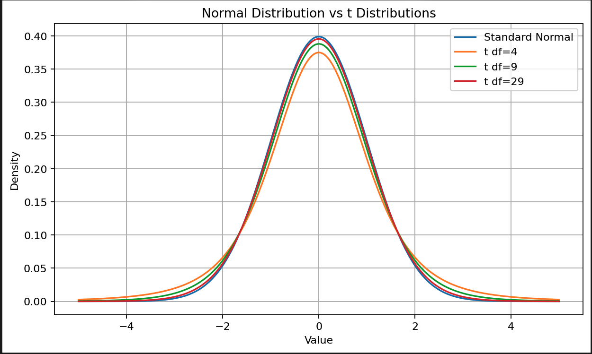
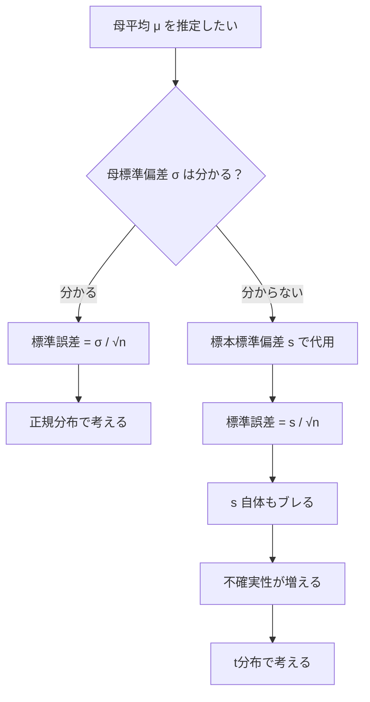
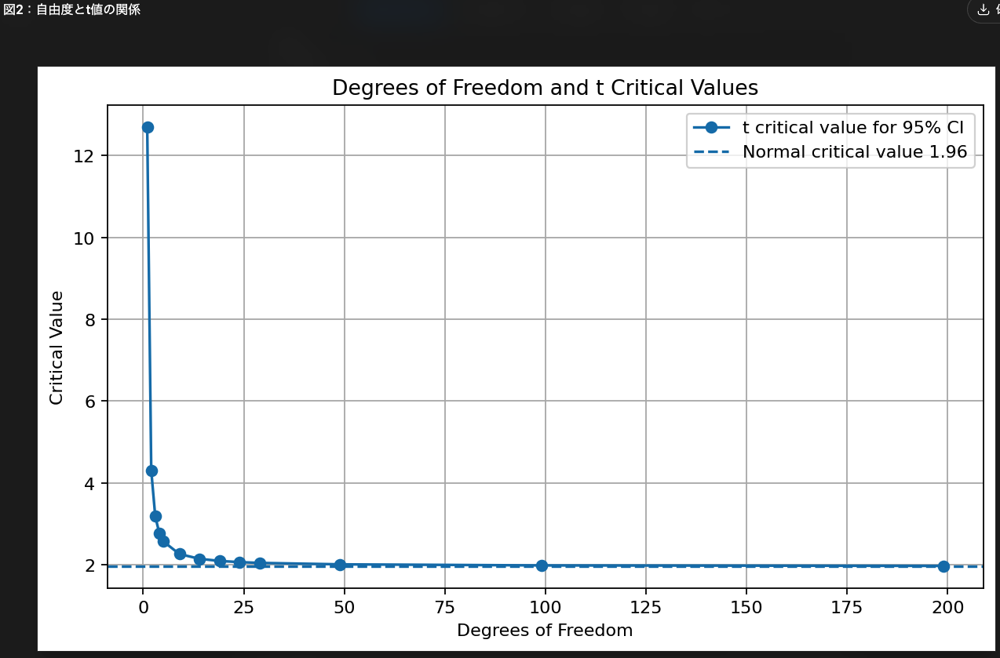
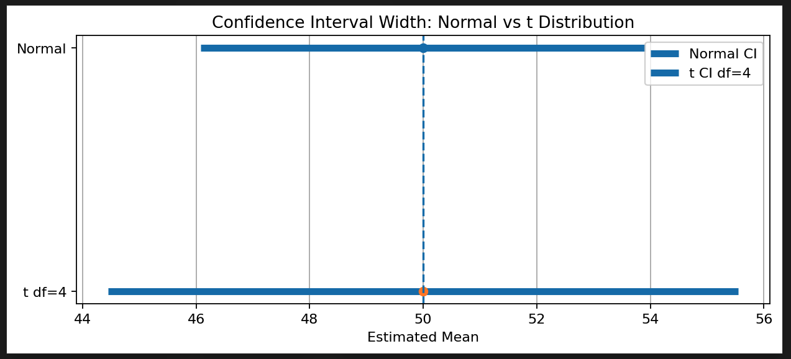
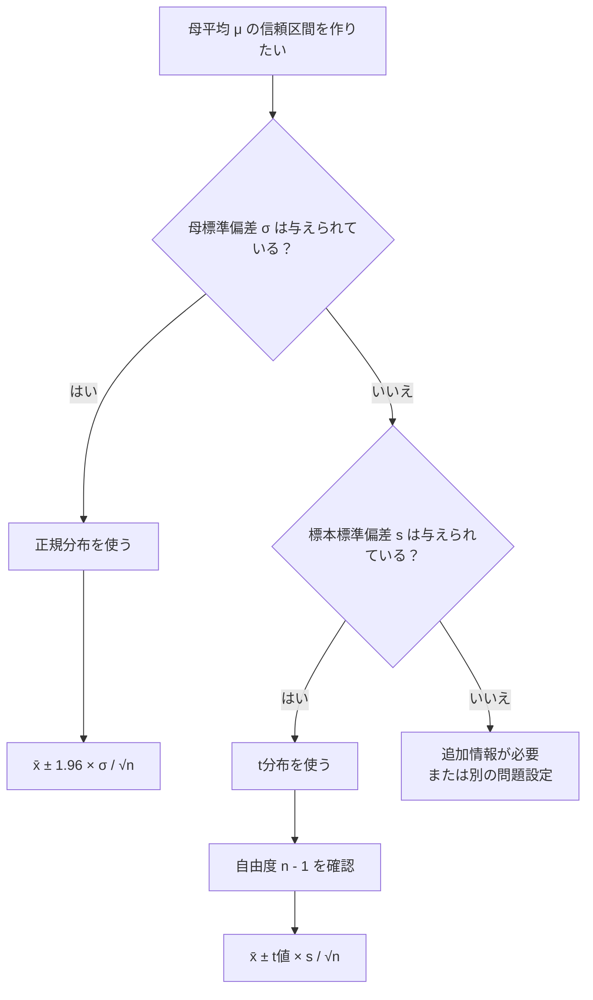

# 第4回：母標準偏差が分からないとき：t分布 図解完全版

## この回で理解すること

この回の目的は、次の3つです。

1. なぜ母標準偏差が分からないときに t分布を使うのか
2. t分布が正規分布とどう違うのか
3. t分布を使って母平均の95%信頼区間をどう作るのか

前回までの流れはこうでした。

```text
標本平均はブレる
↓
そのブレの大きさが標準誤差
↓
標準誤差を使って信頼区間を作る
```

前回の95%信頼区間では、次のような形を使いました。

```text
標本平均 ± 1.96 × 標準誤差
```

ただし、これはかなり理想的な場合です。

なぜなら、この式では基本的に、

```text
母標準偏差 σ が分かっている
```

という前提があるからです。

でも現実には、母標準偏差 σ は普通わかりません。

ここで出てくるのが **t分布** です。

---

## 1. まず結論：t分布とは何か

t分布は、ざっくり言うと、

> 母標準偏差 σ が分からないときに、標本平均のズレを少し慎重に見るための分布

です。

もう少し具体的に言うと、

```text
母標準偏差 σ が分からない
↓
標本標準偏差 s で代用する
↓
でも s も標本から計算した推定値なのでブレる
↓
その分だけ不確実性が増える
↓
正規分布より少し慎重な t分布を使う
```

という流れです。

---

## 2. 母標準偏差が分からないとはどういうことか

たとえば、全国の高校3年生の平均睡眠時間を知りたいとします。

本当に知りたいのは、

```text
母平均 μ
```

です。

でも、全国の高校3年生全体で睡眠時間がどれくらいバラついているか、つまり、

```text
母標準偏差 σ
```

も本当は分かりません。

なぜなら、全国の高校3年生全員を調べていないからです。

だから、標本から計算した標準偏差を使います。

```text
母標準偏差 σ は分からない
↓
標本標準偏差 s で代用する
```

ここまでは自然です。

問題はここからです。

標本標準偏差 s も、標本から計算した値です。

つまり、

```text
標本平均 x̄ もブレる
標本標準偏差 s もブレる
```

ということです。

この追加の不確実性を考慮するために、t分布を使います。

---

## 3. 正規分布とt分布の違い

正規分布とt分布は、どちらも左右対称の山型の分布です。

ただし、t分布の方が少しだけ裾が厚いです。



このグラフで見るべき点は3つです。

### 3.1 t分布は中心が少し低い

自由度が小さい t分布、特に df=4 は、中心の山が正規分布より低くなっています。

これは、確率が中心だけに集中していないということです。

### 3.2 t分布は左右の裾が厚い

x が ±2 より外側のあたりを見ると、自由度の小さい t分布の方が、正規分布より上にあります。

これが、

```text
t分布は裾が厚い
```

という意味です。

つまり t分布は、

> 平均から大きくズレる可能性を、正規分布より少し大きめに見る

分布です。

### 3.3 自由度が大きくなると正規分布に近づく

df=4 は正規分布とかなり違います。  
df=9 は少し近づきます。  
df=29 はかなり正規分布に近いです。

つまり、

```text
標本サイズが小さい
↓
自由度が小さい
↓
t分布は裾が厚い
↓
信頼区間が広くなる

標本サイズが大きい
↓
自由度が大きい
↓
t分布は正規分布に近づく
↓
信頼区間も正規分布の場合に近づく
```

ということです。

---

## 4. なぜt分布は裾が厚いのか

理由は単純です。

母標準偏差 σ が分かっている場合、標準誤差は次のように計算できます。

```text
SE = σ / √n
```

この場合、母集団のばらつき σ が分かっているので、標本平均のブレを比較的正確に見積もれます。

しかし、現実には σ が分からないことが多いです。

そのため、標本標準偏差 s を使って、

```text
SE = s / √n
```

と計算します。

でも、s は標本から計算した値です。  
標本の取り方によって s も変わります。

つまり、

```text
平均のブレ
+
標準偏差を標本から推定している不安
```

があります。

だから、正規分布よりも少し慎重に見る必要があります。

その慎重さが、t分布の「裾の厚さ」として現れます。



---

## 5. t分布を使うと何が変わるのか

前回の95%信頼区間はこうでした。

```text
標本平均 ± 1.96 × 標準誤差
```

t分布を使う場合はこうなります。

```text
標本平均 ± t値 × 標準誤差
```

つまり、変わるのは **1.96 の部分** です。

```text
正規分布：1.96を使う
t分布：自由度に応じたt値を使う
```

そして、母標準偏差 σ が分からないので、標準誤差は次のように計算します。

```text
SE = s / √n
```

したがって、母平均の95%信頼区間はこうなります。

```text
標本平均 ± t値 × s / √n
```

記号で書くと、

```text
x̄ ± t × s / √n
```

です。

---

## 6. 自由度とは何か

t分布では **自由度** が出てきます。

母平均の推定でよく使う自由度は、

```text
n - 1
```

です。

たとえば、

| 標本サイズ n | 自由度 n - 1 |
|---:|---:|
| 5 | 4 |
| 10 | 9 |
| 30 | 29 |
| 100 | 99 |

なぜ n - 1 なのか。

直感としては、

> 標本平均を先に計算したことで、データが自由に動ける数が1つ減る

と考えるとよいです。

### n - 1 の直感

たとえば、3人の点数があり、平均が80点だと分かっているとします。

3人の合計は、

```text
80 × 3 = 240
```

です。

ここで、1人目が70点、2人目が80点だと分かれば、3人目は自動的に決まります。

```text
70 + 80 + 3人目 = 240
```

だから、

```text
3人目 = 90
```

です。

つまり、3つの値があるように見えても、平均が固定されると、最後の1つは自由に動けません。

だから自由度は、

```text
3 - 1 = 2
```

になります。

これが n - 1 の直感です。

---

## 7. t値は標本サイズが小さいほど大きい

95%信頼区間で使うt値は、自由度によって変わります。

この図で重要なのは、

```text
自由度が小さい
↓
t値が大きい

自由度が大きい
↓
t値は1.96に近づく
```

ということです。

代表的な値は次の通りです。

| 標本サイズ n | 自由度 n - 1 | 95%用のt値 |
|---:|---:|---:|
| 5 | 4 | 約2.776 |
| 10 | 9 | 約2.262 |
| 30 | 29 | 約2.045 |
| 100 | 99 | 約1.984 |
| ∞ | ∞ | 1.960 |



ここから分かることは単純です。

> 標本サイズが小さいほど、不確実性が大きいので、信頼区間を広く取る

ということです。

---

## 8. 同じ標準誤差でも、t分布の方が信頼区間は広い

次の条件で比較します。

```text
標本平均 = 50
標準誤差 = 2
```

正規分布なら、95%信頼区間は、

```text
50 ± 1.96 × 2
= 50 ± 3.92
= 46.08 〜 53.92
```

です。

一方、t分布で自由度4の場合、t値は約2.776です。

```text
50 ± 2.776 × 2
= 50 ± 5.552
= 44.448 〜 55.552
```

図にするとこうです。

t分布の方が信頼区間が広くなっています。

これは、

> 母標準偏差が分からない分、外す可能性を少し大きめに見る

からです。

---

## 9. 具体例：t分布で95%信頼区間を求める

次の条件で考えます。

```text
標本サイズ n = 10
標本平均 x̄ = 50
標本標準偏差 s = 6
95%信頼区間を求める
```

母標準偏差 σ は分かりません。  
だから t分布を使います。

### 手順1：自由度を出す

```text
自由度 = n - 1
       = 10 - 1
       = 9
```

自由度9の95%用t値は、だいたい

```text
2.262
```

です。

### 手順2：標準誤差を出す

```text
SE = s / √n
   = 6 / √10
```

√10 はだいたい 3.162 なので、

```text
SE ≒ 6 / 3.162
   ≒ 1.897
```

### 手順3：誤差の幅を出す

```text
t値 × SE = 2.262 × 1.897
         ≒ 4.29
```

### 手順4：信頼区間を作る

```text
50 ± 4.29
```

なので、

```text
45.71 〜 54.29
```

です。

つまり、

> 母平均は95%信頼区間で、だいたい45.71〜54.29と推定される

となります。

---

## 10. もし正規分布の1.96を使ったら？

同じ条件で、無理やり1.96を使うと、

```text
1.96 × 1.897 ≒ 3.72
```

なので、

```text
50 ± 3.72
= 46.28 〜 53.72
```

になります。

t分布を使った場合は、

```text
45.71 〜 54.29
```

でした。

つまり、t分布の方が少し広いです。



```text
正規分布で作った区間：46.28〜53.72
t分布で作った区間：45.71〜54.29
```

これは、母標準偏差が分からないぶん、慎重に広く見積もっているからです。

---

## 11. いつt分布を使うのか

統計検定2級での基本判断はこうです。

| 状況 | 使う分布 |
|---|---|
| 母標準偏差 σ が分かっている | 正規分布 |
| 母標準偏差 σ が分からない | t分布 |
| 標本サイズが小さい | t分布が特に重要 |
| 標本サイズが大きい | t分布は正規分布にかなり近づく |

問題文に、

```text
母標準偏差は○○である
```

と書いてあれば、基本は正規分布です。

一方で、

```text
標本標準偏差は○○である
```

と書いてあれば、基本はt分布です。

ただし、試験問題では条件が丁寧に書かれていることが多いので、まずは問題文の「母標準偏差」なのか「標本標準偏差」なのかを見落とさないことが重要です。

---

## 12. 判断フロー



---

## 13. 競馬AIで考える

ある条件に該当するレースが10件しかないとします。

```text
n = 10
平均回収率 = 120%
標本標準偏差 = 80%
```

このとき、知りたいのは、

> 将来同じような条件での真の平均回収率

です。

でも、真の標準偏差なんて分かりません。

だから、過去10件の標本標準偏差を使います。

この場合、nが小さいので t値は大きくなります。

つまり、信頼区間は広くなります。

結果として、

```text
平均回収率120%
```

だけ見れば強そうでも、

```text
95%信頼区間はかなり広い
```

ということが普通に起きます。

これは、次のようなことを意味します。

```text
平均回収率120%
↓
一見強そう

でも n = 10
↓
標本平均も不安定
標本標準偏差も不安定

だから信頼区間は広い
↓
真の期待回収率が100%未満の可能性も普通に残る
```

ここで「120%出ているから強い」と判断するのは危険です。

平均値だけを見るのではなく、

```text
平均値 ± 不確実性
```

で見る必要があります。

---

## 14. 統計検定2級での問われ方

統計検定2級では、t分布はこういう形で出やすいです。

```text
標本サイズ n
標本平均 x̄
標本標準偏差 s
信頼係数 95%
```

が与えられて、

```text
母平均の信頼区間を求めよ
```

というタイプです。

または、

```text
どの分布を使うべきか？
```

を聞かれます。

この場合の判断は、

```text
母標準偏差 σ が未知
↓
標本標準偏差 s を使う
↓
t分布
```

です。

---

## 15. 小テスト

### 問1

母標準偏差 σ が分からず、標本標準偏差 s を使って母平均を推定するとき、基本的に使う分布はどれですか？

A. 正規分布  
B. t分布  
C. 二項分布  
D. ポアソン分布

答えは **B** です。

---

### 問2

標本サイズ n = 16 のとき、母平均の推定で使うt分布の自由度はいくつですか？

A. 16  
B. 15  
C. 14  
D. 8

答えは **B** です。

```text
自由度 = n - 1
       = 16 - 1
       = 15
```

---

### 問3

標本サイズが大きくなると、t分布はどうなりますか？

A. 正規分布に近づく  
B. 二項分布に近づく  
C. 必ず左右非対称になる  
D. t値がどんどん大きくなる

答えは **A** です。

標本サイズが大きくなると自由度が大きくなり、t分布は正規分布に近づきます。

---

### 問4

t分布が正規分布より裾が厚い理由として、最も適切なものはどれですか？

A. 母平均が分かっているから  
B. 標本標準偏差 s も推定値であり、不確実性が増えるから  
C. t分布は必ずデータ数が無限だから  
D. t分布は左右非対称だから

答えは **B** です。

---

## 16. 宿題

次の条件で、母平均の95%信頼区間を求めてください。

```text
標本サイズ n = 25
標本平均 x̄ = 80
標本標準偏差 s = 10
自由度24の95%用t値 = 2.064
```

手順はこうです。

```text
1. 標準誤差を求める
SE = s / √n

2. 誤差の幅を求める
t値 × SE

3. 信頼区間を作る
標本平均 ± 誤差の幅
```

### 解くための式

```text
SE = 10 / √25
```

```text
誤差の幅 = 2.064 × SE
```

```text
95%信頼区間 = 80 ± 誤差の幅
```

---

## 17. まとめ

t分布は、次のように理解するとよいです。

```text
母標準偏差 σ が分からない
↓
標本標準偏差 s で代用する
↓
でも s も不確か
↓
だから正規分布より少し慎重に見る
↓
信頼区間を少し広めに取る
↓
それがt分布
```

一番重要なのはこれです。

> t分布は、母標準偏差が分からないときに使う「慎重な正規分布」。

そして、計算上はこれです。

```text
母標準偏差 σ が分かる
→ 正規分布
→ x̄ ± 1.96 × σ / √n

母標準偏差 σ が分からない
→ t分布
→ x̄ ± t値 × s / √n
```

この違いが分かれば、統計検定2級の母平均の信頼区間はかなり見通しがよくなります。