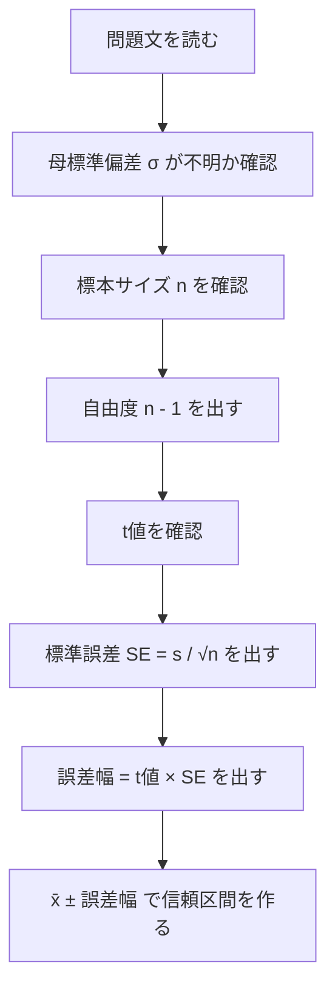
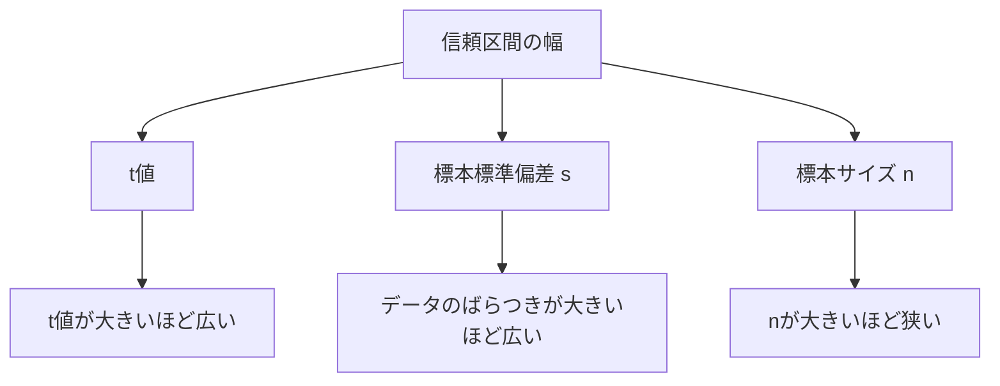

前回は、t分布の意味を学びました。

要点はこれです。

```text
母標準偏差 σ が分からない
↓
標本標準偏差 s で代用する
↓
でも s も標本から計算した値なのでブレる
↓
正規分布より少し慎重な t分布を使う
```

今回は、実際に **t分布を使って母平均の95%信頼区間を求める練習** をします。

統計検定2級では、ここはかなり出やすいです。

---

# 1. 今日使う公式

母標準偏差 σ が分からないとき、母平均 μ の95%信頼区間はこうです。

```text
標本平均 ± t値 × 標準誤差
```

標準誤差は、

```text
標準誤差 = 標本標準偏差 ÷ √標本サイズ
```

つまり、

```text
SE = s / √n
```

です。

まとめると、

```text
母平均の95%信頼区間 = x̄ ± t × s / √n
```

です。

|記号|意味|
|---|---|
|x̄|標本平均|
|s|標本標準偏差|
|n|標本サイズ|
|t|自由度 n - 1 に対応するt値|

---

# 2. 解く手順

毎回この順番で解きます。



この順番を崩さない方がいいです。

特に初心者がミスしやすいのは、

```text
自由度を n にしてしまう
```

ことです。

母平均の1標本t区間では、基本は

```text
自由度 = n - 1
```

です。

---

# 3. 例題1：基本問題

次の条件で、母平均の95%信頼区間を求めます。

```text
標本サイズ n = 25
標本平均 x̄ = 80
標本標準偏差 s = 10
自由度24の95%用t値 = 2.064
```

---

## 手順1：自由度を確認する

```text
自由度 = n - 1
       = 25 - 1
       = 24
```

問題文でも、自由度24のt値が与えられています。

---

## 手順2：標準誤差を出す

```text
SE = s / √n
   = 10 / √25
   = 10 / 5
   = 2
```

標準誤差は **2** です。

---

## 手順3：誤差幅を出す

```text
誤差幅 = t値 × SE
       = 2.064 × 2
       = 4.128
```

---

## 手順4：信頼区間を作る

```text
x̄ ± 誤差幅
= 80 ± 4.128
```

下限は、

```text
80 - 4.128 = 75.872
```

上限は、

```text
80 + 4.128 = 84.128
```

したがって、

```text
95%信頼区間 = 75.872 〜 84.128
```

です。

小数第2位くらいで丸めるなら、

```text
75.87 〜 84.13
```

です。

---

# 4. この結果の意味

この結果は、

> 母平均は95%信頼区間で、だいたい75.87〜84.13の範囲にあると推定される

という意味です。

ただし、前にも言った通り、

> 母平均がこの区間に入る確率が95%

と雑に覚えるのは危険です。

より正確には、

> 同じ方法で何度も標本を取り、同じ方法で信頼区間を作ると、その約95%が母平均を含む

です。

試験では、ここを聞かれる可能性があります。

---

# 5. 例題2：nが小さいケース

次の条件で、母平均の95%信頼区間を求めます。

```text
標本サイズ n = 9
標本平均 x̄ = 50
標本標準偏差 s = 12
自由度8の95%用t値 = 2.306
```

---

## 手順1：自由度

```text
自由度 = n - 1
       = 9 - 1
       = 8
```

---

## 手順2：標準誤差

```text
SE = s / √n
   = 12 / √9
   = 12 / 3
   = 4
```

---

## 手順3：誤差幅

```text
誤差幅 = 2.306 × 4
       = 9.224
```

---

## 手順4：信頼区間

```text
50 ± 9.224
```

下限：

```text
50 - 9.224 = 40.776
```

上限：

```text
50 + 9.224 = 59.224
```

したがって、

```text
95%信頼区間 = 40.78 〜 59.22
```

です。

---

# 6. 例題1と例題2の比較

|例題|n|s|SE|t値|信頼区間の幅|
|---|--:|--:|--:|--:|--:|
|例題1|25|10|2|2.064|±4.128|
|例題2|9|12|4|2.306|±9.224|

例題2の方が、信頼区間がかなり広いです。

理由は2つあります。

```text
nが小さい
↓
標準誤差が大きい

自由度が小さい
↓
t値が大きい
```

つまり、例題2は、

> データ数が少なく、ばらつきも大きいので、母平均の推定が不安定

ということです。

ここがt分布の本質です。

---

# 7. 信頼区間の幅は何で決まるか

信頼区間の半分の幅は、

```text
t値 × s / √n
```

です。

つまり、信頼区間の幅は3つで決まります。

|要素|大きくなるとどうなる？|
|---|---|
|t値|信頼区間が広くなる|
|標本標準偏差 s|信頼区間が広くなる|
|標本サイズ n|信頼区間が狭くなる|

図にするとこうです。



ここはかなり重要です。

---

# 8. よくあるミス

## ミス1：標準偏差 s をそのまま使う

間違い：

```text
80 ± 2.064 × 10
```

これはダメです。

正しくは、

```text
80 ± 2.064 × 10 / √25
```

です。

使うのは標準偏差そのものではなく、

```text
標準誤差 = s / √n
```

です。

---

## ミス2：自由度を n にしてしまう

n = 25 のとき、自由度は25ではありません。

```text
自由度 = n - 1 = 24
```

です。

---

## ミス3：t値と1.96を混ぜる

母標準偏差 σ が分からず、標本標準偏差 s を使っているなら、基本はt分布です。

```text
標本標準偏差 s を使う
↓
t分布
```

ここで何となく1.96を使うと、区間を狭く見積もりすぎます。

---

# 9. 競馬AIでの解釈

ある馬券戦略について、次のような結果があったとします。

```text
対象レース n = 25
平均回収率 x̄ = 120%
標本標準偏差 s = 50%
自由度24の95%用t値 = 2.064
```

この戦略の真の平均回収率を推定します。

---

## 手順1：標準誤差

```text
SE = 50 / √25
   = 50 / 5
   = 10
```

---

## 手順2：誤差幅

```text
誤差幅 = 2.064 × 10
       = 20.64
```

---

## 手順3：信頼区間

```text
120 ± 20.64
```

つまり、

```text
99.36% 〜 140.64%
```

です。

---

## この結果の意味

平均回収率は120%です。

でも95%信頼区間の下限は、

```text
99.36%
```

です。

これは、かなり微妙です。

なぜなら、控除率や実運用コストを考えると、下限が100%付近ではかなり不安定だからです。

ここで、

```text
平均120%だから勝てる
```

と判断するのは甘いです。

見るべきなのは、

```text
平均120%
かつ
信頼区間の下限がどこにあるか
```

です。

この例なら、

> 有望だが、まだ強い確証とは言いにくい

くらいの判断が妥当です。

---

# 10. 練習問題

## 問1

次の条件で、母平均の95%信頼区間を求めてください。

```text
n = 16
x̄ = 100
s = 20
自由度15の95%用t値 = 2.131
```

ヒント：

```text
SE = 20 / √16
```

---

## 問2

次の条件で、母平均の95%信頼区間を求めてください。

```text
n = 36
x̄ = 70
s = 12
自由度35の95%用t値 = 2.030
```

ヒント：

```text
SE = 12 / √36
```

---

## 問3

次の2つを比べてください。

```text
A：
n = 9
x̄ = 80
s = 15
t値 = 2.306

B：
n = 64
x̄ = 80
s = 15
t値 = 2.000
```

どちらの信頼区間の方が狭いですか？  
理由も説明してください。

---

# 11. 解答

## 問1

```text
SE = 20 / √16
   = 20 / 4
   = 5
```

誤差幅：

```text
2.131 × 5 = 10.655
```

信頼区間：

```text
100 ± 10.655
```

したがって、

```text
89.345 〜 110.655
```

小数第2位までなら、

```text
89.35 〜 110.66
```

---

## 問2

```text
SE = 12 / √36
   = 12 / 6
   = 2
```

誤差幅：

```text
2.030 × 2 = 4.060
```

信頼区間：

```text
70 ± 4.060
```

したがって、

```text
65.94 〜 74.06
```

---

## 問3

Aから見ます。

```text
SE_A = 15 / √9
     = 15 / 3
     = 5
```

誤差幅：

```text
2.306 × 5 = 11.53
```

Aの信頼区間：

```text
80 ± 11.53
= 68.47 〜 91.53
```

Bは、

```text
SE_B = 15 / √64
     = 15 / 8
     = 1.875
```

誤差幅：

```text
2.000 × 1.875 = 3.75
```

Bの信頼区間：

```text
80 ± 3.75
= 76.25 〜 83.75
```

したがって、**Bの方が狭い**です。

理由は、

```text
Bの方が標本サイズ n が大きい
↓
標準誤差が小さい
↓
t値も小さい
↓
信頼区間が狭い
```

からです。

---

# 今日のまとめ

母標準偏差 σ が分からないとき、母平均の95%信頼区間は、

```text
x̄ ± t × s / √n
```

です。

手順は、

```text
1. nを見る
2. 自由度 n - 1 を出す
3. t値を見る
4. SE = s / √n を計算する
5. 誤差幅 = t値 × SE を計算する
6. x̄ ± 誤差幅 で信頼区間を作る
```

です。

一番重要なのはこれです。

> 標本標準偏差 s を使うなら、標準偏差そのものではなく、s / √n にして標準誤差を作る。

ここを間違えると、信頼区間が完全にズレます。