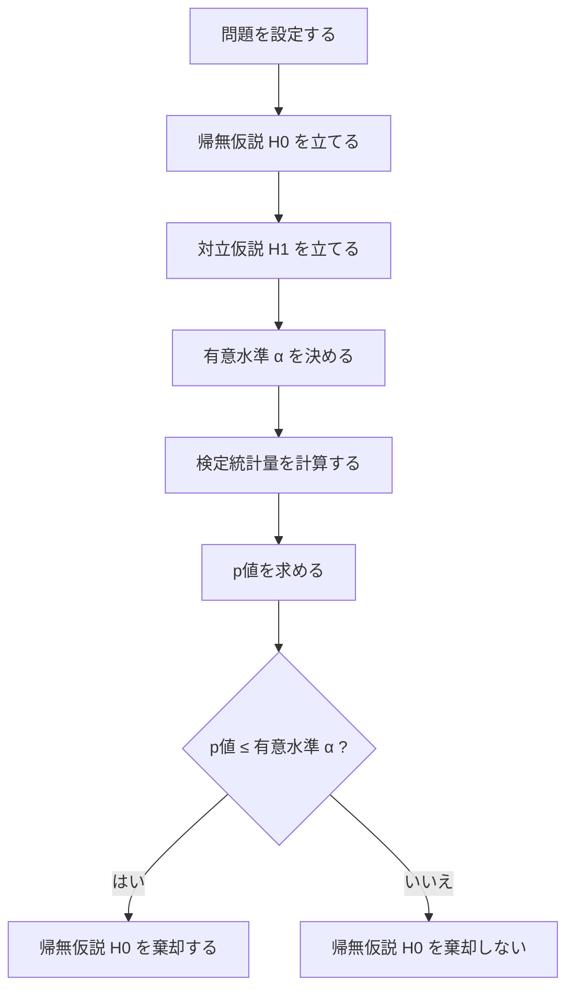

前回までは、**信頼区間**を扱いました。

流れはこうでした。

```text
標本平均はブレる
↓
標準誤差でブレの大きさを見る
↓
母標準偏差が分からないときは t分布を使う
↓
母平均の信頼区間を作る
```

今回からは、統計検定2級の大きな山である **仮説検定** に入ります。

仮説検定は、ざっくり言うと、

> データを見て、「偶然のブレでは説明しにくい」と言えるかを判断する方法

です。

---

# 1. まず例から考える

ある学校で、新しい勉強法を導入したとします。

これまでの平均点は、

```text
70点
```

だったとします。

新しい勉強法を使った生徒25人の平均点が、

```text
74点
```

でした。

ここで、すぐにこう言いたくなります。

```text
新しい勉強法は効果がある
```

でも、それは早いです。

なぜなら、25人の平均点が74点だったとしても、それは単なる偶然かもしれないからです。

たまたま成績の良い生徒が多かっただけかもしれません。

---

# 2. 統計が考える問い

統計では、こう考えます。

> 本当に効果がないとしても、25人を取ったら平均74点くらいになることはありえるのか？

これが仮説検定の入口です。

つまり、最初から、

```text
効果があるか？
```

と考えるのではありません。

まず、

```text
効果がないと仮定したら、このデータはどれくらい珍しいか？
```

を考えます。

ここがかなり大事です。

---

# 3. 帰無仮説と対立仮説

仮説検定では、2つの仮説を立てます。

## 帰無仮説

帰無仮説は、基本的に

> 差がない  
> 効果がない  
> 変化がない

という仮説です。

記号では **H₀** と書きます。

今回の例なら、

```text
H₀：新しい勉強法を使っても、平均点は70点のままである
```

です。

---

## 対立仮説

対立仮説は、

> 差がある  
> 効果がある  
> 変化がある

という仮説です。

記号では **H₁** または **Hₐ** と書きます。

今回の例なら、

```text
H₁：新しい勉強法によって、平均点は70点より高くなる
```

です。

---

# 4. 検定の考え方

仮説検定では、まず帰無仮説を仮に正しいものとして扱います。

つまり、

```text
本当は平均70点のままだ
```

と仮定します。

そのうえで、

```text
それなのに、標本平均74点が出るのはどれくらい珍しいか？
```

を調べます。

もしかなり珍しいなら、

```text
平均70点のままという仮定は怪しい
```

と判断します。

そして帰無仮説を棄却します。

---

# 5. 「棄却」とは何か

**棄却**とは、

> その仮説はデータと合わないので、採用しない

という意味です。

帰無仮説を棄却するとは、

```text
差がない、効果がない、という仮説はデータと合いにくい
```

という意味です。

ただし、ここで注意です。

帰無仮説を棄却したからといって、

```text
対立仮説が100%正しい
```

とは言えません。

言えるのは、

```text
帰無仮説のままだと、このデータはかなり起きにくい
```

ということです。

ここを雑にすると、検定の解釈を間違えます。

---

# 6. 棄却しないとは何か

逆に、データがそこまで珍しくなければ、帰無仮説は棄却しません。

ここで重要なのは、

> 帰無仮説を棄却しない  
> ＝ 帰無仮説が正しいと証明された

ではないことです。

これはかなり大事です。

棄却しないというのは、あくまで、

```text
帰無仮説を否定するほどの証拠はなかった
```

という意味です。

たとえば、新しい勉強法の平均点が72点だった場合、

```text
効果がないとは言い切れない
でも、効果があると言えるほどの証拠もない
```

という状態になります。

---

# 7. 仮説検定の流れ

仮説検定の流れは、基本的にこうです。



今日は、この流れ全体を掴むのが目標です。

細かい計算は次回以降で反復します。

---

# 8. 有意水準とは何か

**有意水準**とは、

> どれくらい珍しかったら「珍しすぎる」と判断するかの基準

です。

よく使われるのは、

```text
5%
```

です。

記号では、

```text
α = 0.05
```

と書きます。

つまり、

> 帰無仮説が正しいとしたとき、5%以下の珍しいことが起きたら、帰無仮説を疑う

というルールです。

---

# 9. p値とは何か

p値は、ざっくり言うと、

> 帰無仮説が正しいとしたとき、今回のデータ以上に極端な結果が出る確率

です。

今回の例なら、

> 本当は平均70点のままだと仮定したとき、25人の平均点が74点以上になる確率

のようなものです。

p値が小さいほど、

```text
帰無仮説のもとでは起きにくい結果
```

ということです。

---

# 10. p値と有意水準の関係

判断はかなりシンプルです。

```text
p値 ≤ 有意水準
→ 帰無仮説を棄却する

p値 > 有意水準
→ 帰無仮説を棄却しない
```

たとえば、有意水準5%なら、

|p値|判断|
|--:|---|
|0.01|棄却する|
|0.03|棄却する|
|0.049|棄却する|
|0.051|棄却しない|
|0.10|棄却しない|

p値0.049と0.051は、実質的にはほとんど同じです。

でも、ルール上は判断が分かれます。

ここは「境界を作る方法」の弱点でもあります。

だから、p値だけを神の判定のように扱うのは危険です。

---

# 11. 片側検定と両側検定

対立仮説には向きがあります。

## 片側検定

片側検定は、

```text
平均が70点より高いか？
```

のように、方向を指定する検定です。

今回の勉強法の例なら、

```text
H₁：μ > 70
```

です。

これは「上がったかどうか」だけを見る検定です。

---

## 両側検定

両側検定は、

```text
平均が70点と違うか？
```

を見る検定です。

この場合は、

```text
H₁：μ ≠ 70
```

です。

上がった場合も、下がった場合も、どちらも「違う」と見ます。

---

# 12. 片側と両側の違い

図でイメージするとこうです。

```text
片側検定：
右側だけを見る

                  棄却域
                    ↓
--------------------|====>
                  高い側


両側検定：
左右両方を見る

 棄却域                         棄却域
   ↓                              ↓
<====|----------------------------|====>
 低い側                         高い側
```

重要なのは、**検定の前に片側か両側かを決める**ことです。

結果を見た後で、

```text
上がっていたから片側検定にしよう
```

とやるのはダメです。

それは後出しです。

---

# 13. 競馬AIで考える

ある戦略の平均回収率が、過去データで110%だったとします。

ここで本当に知りたいのは、

```text
この戦略の真の平均回収率は100%を超えているのか？
```

です。

仮説で書くと、

```text
H₀：真の平均回収率は100%以下、または100%と変わらない
H₁：真の平均回収率は100%より高い
```

になります。

これは片側検定です。

なぜなら、知りたいのは

```text
100%と違うか
```

ではなく、

```text
100%を上回るか
```

だからです。

ただし、ここでも注意があります。

検定で有意になったとしても、それだけで実運用OKではありません。

なぜなら、競馬AIでは、

- リーク
    
- 後出し条件選択
    
- サンプルの独立性
    
- 市場構造の変化
    
- 買えるオッズかどうか
    
- 最大ドローダウン
    
- 資金管理
    

が別問題として残るからです。

p値が小さいだけで投資判断をするのは危険です。

---

# 14. 仮説検定で一番危険な誤解

仮説検定で一番危険なのはこれです。

```text
p値が小さい
↓
仮説が正しい
```

これは違います。

p値が小さいというのは、

```text
帰無仮説のもとでは、今回のようなデータは起きにくい
```

という意味です。

それ以上でも、それ以下でもありません。

また、

```text
p値が大きい
↓
差がないことが証明された
```

これも違います。

p値が大きいのは、

```text
差があると言えるほどの証拠がない
```

という意味です。

---

# 15. 今日の小テスト

## 問1

仮説検定で、最初に「差がない」「効果がない」と置く仮説を何といいますか？

A. 対立仮説  
B. 帰無仮説  
C. 標本仮説  
D. 平均仮説

答えは **B** です。

---

## 問2

p値が0.03、有意水準が0.05のとき、判断はどうなりますか？

A. 帰無仮説を棄却する  
B. 帰無仮説を必ず正しいとする  
C. 対立仮説を棄却する  
D. 判断できない

答えは **A** です。

```text
0.03 ≤ 0.05
```

なので、帰無仮説を棄却します。

---

## 問3

「帰無仮説を棄却しない」の正しい意味はどれですか？

A. 帰無仮説が正しいと証明された  
B. 対立仮説が絶対に間違っている  
C. 帰無仮説を否定するほどの証拠がなかった  
D. データに意味がない

答えは **C** です。

---

## 問4

新しい薬によって血圧が「変わるか」を調べたい。上がる場合も下がる場合も対象にする。この場合はどちらですか？

A. 片側検定  
B. 両側検定

答えは **B** です。

「高くなるか」ではなく「変わるか」なので、両側検定です。

---

# 16. 今日のまとめ

今日の要点はこれです。

|用語|意味|
|---|---|
|帰無仮説 H₀|差がない・効果がないという仮説|
|対立仮説 H₁|差がある・効果があるという仮説|
|有意水準 α|どれくらい珍しければ棄却するかの基準|
|p値|帰無仮説のもとで、今回以上に極端な結果が出る確率|
|棄却|帰無仮説はデータと合いにくいと判断すること|
|棄却しない|帰無仮説を否定するほどの証拠がないこと|
|片側検定|高い・低いなど方向を決める検定|
|両側検定|違いがあるかだけを見る検定|

一番重要なのはこれです。

> 仮説検定は、「効果があることを直接証明する方法」ではない。  
> 「効果がないと仮定したとき、このデータは珍しすぎるか」を見る方法。

次回は、実際に **1標本t検定** を使って、

```text
標本平均が基準値と違うと言えるか？
```

を計算します。