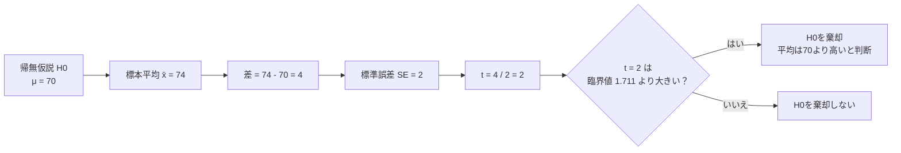
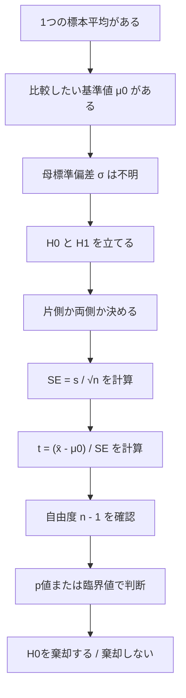

では第7回です。


前回は、仮説検定の考え方を学びました。

```text
帰無仮説 H₀：差がない・効果がない
対立仮説 H₁：差がある・効果がある
p値 ≤ 有意水準なら、H₀を棄却する
```

今回は、実際に **1標本t検定** を使って、

> 標本平均が、ある基準値と違うと言えるか？

を判定します。

---

# 1. 1標本t検定とは何か

1標本t検定は、

> 1つの標本平均が、基準となる母平均とズレていると言えるかを調べる検定

です。

たとえば、

```text
これまでの平均点は70点だった。
新しい勉強法を使った25人の平均点は74点だった。
この74点は、偶然のブレではなく、本当に70点より高いと言えるのか？
```

こういう場面で使います。

---

# 2. 使う場面

1標本t検定は、次のような問題で使います。

|例|調べたいこと|
|---|---|
|平均点が70点より高いか|勉強法に効果があるか|
|平均睡眠時間が6時間と違うか|睡眠時間に変化があるか|
|平均回収率が100%を超えるか|戦略に期待値があるか|
|平均体温が36.5度と違うか|ある集団に特徴があるか|

共通しているのは、

```text
1つの標本平均
vs
1つの基準値
```

です。

---

# 3. なぜt検定を使うのか

母標準偏差 σ が分かっているなら、正規分布を使えます。

でも現実には、母標準偏差 σ はほとんど分かりません。

そこで、標本標準偏差 s を使います。

```text
母標準偏差 σ は分からない
↓
標本標準偏差 s で代用する
↓
t分布を使う
```

つまり、1標本t検定は、

> 母標準偏差が分からない状態で、標本平均が基準値からどれくらい離れているかを見る方法

です。

---

# 4. 1標本t検定の公式

1標本t検定で使う検定統計量はこれです。

```text
t = (標本平均 - 基準値) / 標準誤差
```

記号で書くと、

```text
t = (x̄ - μ₀) / (s / √n)
```

|記号|意味|
|---|---|
|x̄|標本平均|
|μ₀|帰無仮説で仮定する基準値|
|s|標本標準偏差|
|n|標本サイズ|
|s / √n|標準誤差|

この式の意味は単純です。

> 標本平均が基準値から、標準誤差何個分ズレているか

を計算しています。

---

# 5. t値の直感

たとえば、

```text
標本平均 - 基準値 = 4点
標準誤差 = 2点
```

なら、

```text
t = 4 / 2 = 2
```

です。

これは、

> 標本平均は、基準値から標準誤差2個分離れている

という意味です。

逆に、

```text
標本平均 - 基準値 = 4点
標準誤差 = 10点
```

なら、

```text
t = 4 / 10 = 0.4
```

です。

同じ4点差でも、標準誤差が大きければ、たいしたズレとは言えません。

ここが重要です。

```text
差の大きさだけでは判断しない。
差が、ブレの大きさに対して十分大きいかを見る。
```

---

# 6. 例題：新しい勉強法に効果はあるか？

次の条件で考えます。

```text
これまでの平均点：70点
新しい勉強法を使った標本サイズ n = 25
標本平均 x̄ = 74点
標本標準偏差 s = 10点
有意水準 α = 0.05
対立仮説：平均点は70点より高い
```

これは、1標本t検定です。

---

# 7. 仮説を立てる

まず、帰無仮説と対立仮説を立てます。

今回知りたいのは、

```text
新しい勉強法によって平均点が70点より高くなったか
```

です。

なので、

```text
H₀：μ = 70
H₁：μ > 70
```

です。

これは **片側検定** です。

「70点と違うか」ではなく、「70点より高いか」を見ているからです。

---

# 8. 標準誤差を求める

標準誤差は、

```text
SE = s / √n
```

です。

今回、

```text
s = 10
n = 25
```

なので、

```text
SE = 10 / √25
   = 10 / 5
   = 2
```

標準誤差は **2点** です。

---

# 9. t値を求める

検定統計量は、

```text
t = (x̄ - μ₀) / SE
```

です。

今回、

```text
x̄ = 74
μ₀ = 70
SE = 2
```

なので、

```text
t = (74 - 70) / 2
  = 4 / 2
  = 2
```

t値は **2** です。

これは、

> 標本平均74点は、基準値70点から標準誤差2個分高い

という意味です。

---

# 10. 自由度を求める

1標本t検定の自由度は、

```text
n - 1
```

です。

今回、

```text
n = 25
```

なので、

```text
自由度 = 25 - 1 = 24
```

です。

---

# 11. 棄却するか判断する

今回は片側検定、有意水準5%、自由度24です。

このときの臨界値は、だいたい、

```text
t = 1.711
```

です。

今回の t値は、

```text
2.000
```

です。

比較すると、

```text
2.000 > 1.711
```

なので、帰無仮説を棄却します。

つまり、

> 有意水準5%で、新しい勉強法によって平均点は70点より高くなったと言える

と判断します。

---

# 12. 図で見る

イメージはこうです。

```text
片側検定なので、右側だけを見る

                         棄却域
                           ↓
---------------------------|========>
                         1.711

今回のt値 = 2.000
なので棄却域に入る
```



---

# 13. p値で考える場合

臨界値ではなく、p値で判断しても同じです。

今回の条件では、

```text
t = 2
自由度 = 24
片側検定
```

なので、p値はおよそ、

```text
p ≒ 0.028
```

です。

有意水準は、

```text
α = 0.05
```

なので、

```text
p = 0.028 ≤ 0.05
```

です。

したがって、帰無仮説を棄却します。

```text
p値で判断：
p ≤ α なら棄却

臨界値で判断：
t値が棄却域に入れば棄却
```

どちらでも同じ結論になります。

---

# 14. 両側検定ならどうなるか

もし問題が、

```text
新しい勉強法によって、平均点は70点と違うか？
```

だったら、対立仮説は、

```text
H₁：μ ≠ 70
```

になります。

これは **両側検定** です。

両側検定では、左右両方のズレを見るので、同じ有意水準5%でも片側より厳しくなります。

自由度24、両側5%の臨界値は、だいたい、

```text
±2.064
```

です。

今回の t値は、

```text
2.000
```

なので、

```text
2.000 < 2.064
```

です。

したがって、両側検定では棄却できません。

---

# 15. ここがかなり重要

同じデータでも、

```text
片側検定：棄却する
両側検定：棄却しない
```

ということがあります。

今回がまさにそれです。

|検定|対立仮説|臨界値|t値|判断|
|---|---|--:|--:|---|
|片側検定|μ > 70|1.711|2.000|棄却|
|両側検定|μ ≠ 70|±2.064|2.000|棄却しない|

だから、片側か両側かは、結果を見てから決めてはいけません。

検定前に、問いに基づいて決めます。

---

# 16. 1標本t検定の全体フロー



---

# 17. 競馬AIで考える

ある馬券戦略について、次の結果があったとします。

```text
対象レース n = 25
平均回収率 x̄ = 120%
標本標準偏差 s = 50%
基準値 μ₀ = 100%
有意水準 α = 0.05
対立仮説：真の平均回収率は100%より高い
```

これは、

```text
H₀：μ = 100
H₁：μ > 100
```

の片側1標本t検定です。

---

## 標準誤差

```text
SE = 50 / √25
   = 50 / 5
   = 10
```

---

## t値

```text
t = (120 - 100) / 10
  = 20 / 10
  = 2
```

---

## 自由度

```text
df = 25 - 1 = 24
```

片側5%、自由度24の臨界値は約1.711です。

```text
2.000 > 1.711
```

なので、形式上は帰無仮説を棄却できます。

つまり、

> 有意水準5%で、真の平均回収率は100%を超えると言える

という判断になります。

---

# 18. ただし、競馬AIではここで止まるな

ここはかなり重要です。

統計検定の教材としては、ここで「有意」と言ってよいです。

でも、実運用の競馬AIではこれだけでは足りません。

なぜなら、検定が見ているのはかなり限定的だからです。

```text
検定が見ているもの：
平均回収率が100%より高いと言えるか

検定が見ていないもの：
リーク
後出し条件選択
市場構造の変化
独立性
最大ドローダウン
買えるオッズか
資金管理
```

つまり、

> p値が小さいことと、運用して勝てることは同じではない

です。

ここを混同すると、バックテストで自分を騙します。

---

# 19. よくあるミス

## ミス1：差だけを見る

```text
平均74点だから70点より高い
```

これは雑です。

必要なのは、

```text
差が、標準誤差に対して十分大きいか
```

です。

---

## ミス2：片側・両側を後出しで決める

結果が上がっていたから、

```text
片側検定にしよう
```

はダメです。

問いが、

```text
高くなったか
```

なら片側。

問いが、

```text
変わったか
```

なら両側。

結果を見る前に決めます。

---

## ミス3：「棄却しない」を「差がない」と読む

棄却しないとは、

```text
差があると言えるほどの証拠がない
```

という意味です。

```text
差がないことが証明された
```

ではありません。

---

# 20. 練習問題

## 問1

あるテストの基準平均は60点です。  
新しい教材を使った16人の平均点は66点、標本標準偏差は12点でした。

有意水準5%、片側検定で、

```text
平均点は60点より高くなったと言えるか？
```

を判定してください。

自由度15の片側5%の臨界値は、

```text
1.753
```

とします。

---

## 問2

ある商品の平均評価はこれまで3.5点でした。  
新しいデザインに変えた後、25人の平均評価は3.8点、標本標準偏差は0.75点でした。

有意水準5%、両側検定で、

```text
平均評価は3.5点と違うと言えるか？
```

を判定してください。

自由度24の両側5%の臨界値は、

```text
±2.064
```

とします。

---

# 21. 解答

## 問1

条件：

```text
n = 16
x̄ = 66
μ₀ = 60
s = 12
```

標準誤差：

```text
SE = 12 / √16
   = 12 / 4
   = 3
```

t値：

```text
t = (66 - 60) / 3
  = 6 / 3
  = 2
```

自由度15、片側5%の臨界値は1.753です。

```text
2 > 1.753
```

なので、帰無仮説を棄却します。

結論：

> 有意水準5%で、平均点は60点より高くなったと言える。

---

## 問2

条件：

```text
n = 25
x̄ = 3.8
μ₀ = 3.5
s = 0.75
```

標準誤差：

```text
SE = 0.75 / √25
   = 0.75 / 5
   = 0.15
```

t値：

```text
t = (3.8 - 3.5) / 0.15
  = 0.3 / 0.15
  = 2
```

自由度24、両側5%の臨界値は±2.064です。

```text
|2| < 2.064
```

なので、帰無仮説を棄却しません。

結論：

> 有意水準5%では、平均評価が3.5点と違うとは言えない。

---

# 今日のまとめ

1標本t検定は、

> 1つの標本平均が、基準値と違うと言えるかを調べる検定

です。

使う式は、

```text
t = (x̄ - μ₀) / (s / √n)
```

判断の流れは、

```text
1. H₀ と H₁ を立てる
2. 片側か両側か決める
3. SE = s / √n を求める
4. t値を求める
5. 自由度 n - 1 を確認する
6. p値または臨界値で棄却判断する
```

です。

一番重要なのはこれです。

> 1標本t検定は、「差そのもの」ではなく、「差が標準誤差に対してどれくらい大きいか」を見る。

次回は、**片側検定・両側検定・p値の図解** をやるのが自然です。