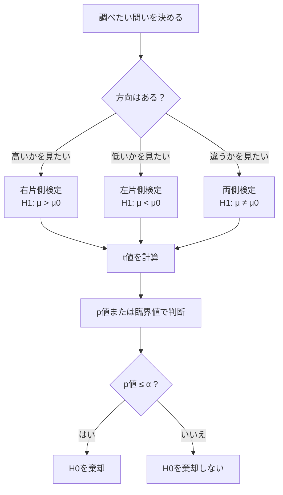

前回は、**1標本t検定**をやりました。

使った式はこれです。

```text
t = (x̄ - μ₀) / (s / √n)
```

意味は、

> 標本平均が、基準値から標準誤差何個分ズレているか

でした。

今回は、その t値を使って、

```text
片側検定
両側検定
p値
棄却域
```

を整理します。

ここは統計検定2級でもかなり重要です。  
特に、**同じt値でも、片側検定なら棄却、両側検定なら棄却しない**ということが起こります。

---

# 1. 今日の結論

先に結論です。

|検定|何を調べる？|棄却域|
|---|---|---|
|右片側検定|基準値より大きいか|右側だけ|
|左片側検定|基準値より小さいか|左側だけ|
|両側検定|基準値と違うか|左右両方|

たとえば、

```text
H₁：μ > 70
```

なら右片側検定です。

```text
H₁：μ < 70
```

なら左片側検定です。

```text
H₁：μ ≠ 70
```

なら両側検定です。

---

# 2. 片側検定とは何か

片側検定は、**方向を決めて調べる検定**です。

たとえば、

> 新しい勉強法で平均点が70点より高くなったか？

を調べるなら、

```text
H₀：μ = 70
H₁：μ > 70
```

です。

これは、**右片側検定**です。

なぜなら、知りたいのは「高くなったか」だからです。

---

# 3. 右片側検定の図

前回と同じ例を使います。

```text
n = 25
x̄ = 74
μ₀ = 70
s = 10
SE = 2
t = 2.000
自由度 = 24
有意水準 α = 0.05
```

右片側検定、自由度24、有意水準5%の臨界値は約 **1.711** です。

![[Pasted image 20260430143513.png]]

図の見方はこうです。

```text
青い山：帰無仮説 H₀ が正しいとしたときの t分布
薄い青の右端：棄却域
破線：臨界値 1.711
点線：今回の t値 2.000
```

今回の t値は、

```text
2.000 > 1.711
```

なので、棄却域に入っています。

したがって、

> 帰無仮説 H₀ を棄却する

となります。

結論は、

> 有意水準5%で、平均点は70点より高いと言える

です。

---

# 4. 両側検定とは何か

両側検定は、**上か下かを決めずに、基準値と違うかを見る検定**です。

たとえば、

> 新しい勉強法で平均点が70点と違うか？

を調べるなら、

```text
H₀：μ = 70
H₁：μ ≠ 70
```

です。

これは両側検定です。

上がっても、下がっても、「70点と違う」と考えます。

---

# 5. 両側検定の図

同じデータで、両側検定を考えます。

自由度24、有意水準5%の両側検定では、左右に2.5%ずつ棄却域を置きます。

このときの臨界値は約 **±2.064** です。
![[Pasted image 20260430143550.png]]
図の見方はこうです。

```text
左右の端：棄却域
破線：臨界値 ±2.064
点線：今回の t値 2.000
```

今回の t値は、

```text
2.000
```

です。

右側の臨界値は、

```text
2.064
```

なので、

```text
2.000 < 2.064
```

です。

つまり、棄却域に届いていません。

したがって、両側検定では、

> 帰無仮説 H₀ を棄却しない

となります。

---

# 6. 同じデータなのに結論が変わる理由

ここが重要です。

同じデータでも、

|検定|対立仮説|臨界値|t値|判断|
|---|---|--:|--:|---|
|右片側検定|μ > 70|1.711|2.000|棄却する|
|両側検定|μ ≠ 70|±2.064|2.000|棄却しない|

ということが起こります。

理由は、棄却域の置き方が違うからです。

片側検定では、5%の棄却域を右側だけに置きます。

```text
右側に5%
```

両側検定では、5%を左右に分けます。

```text
左側に2.5%
右側に2.5%
```

そのため、両側検定の方が、片側あたりの基準が厳しくなります。

---

# 7. 片側か両側かは、結果を見る前に決める

ここは絶対に大事です。

片側検定か両側検定かは、**データを見る前に、問いで決めます**。

悪い例：

```text
結果を見たら平均が高かった
↓
じゃあ片側検定にしよう
```

これはダメです。

後出しで有利な検定を選んでいるからです。

正しい決め方はこうです。

|問い|対立仮説|検定|
|---|---|---|
|平均が高くなったか|μ > μ₀|右片側検定|
|平均が低くなったか|μ < μ₀|左片側検定|
|平均が変わったか|μ ≠ μ₀|両側検定|

---

# 8. p値とは何か

p値は、ざっくり言うと、

> 帰無仮説が正しいとしたとき、今回の結果以上に極端な結果が出る確率

です。

ここで大事なのは、**「帰無仮説が正しいとしたとき」** です。

p値は、

```text
対立仮説が正しい確率
```

ではありません。

また、

```text
帰無仮説が正しい確率
```

でもありません。

p値はあくまで、

```text
H₀が正しいと仮定した世界で、今回のようなデータがどれくらい珍しいか
```

です。

---

# 9. p値と有意水準の判断

判断ルールは単純です。

```text
p値 ≤ 有意水準 α
→ H₀を棄却する

p値 > 有意水準 α
→ H₀を棄却しない
```

たとえば、有意水準5%なら、

|p値|判断|
|--:|---|
|0.010|棄却する|
|0.030|棄却する|
|0.049|棄却する|
|0.051|棄却しない|
|0.100|棄却しない|

ただし、0.049と0.051に本質的な大差があるわけではありません。

ここで、

```text
p < 0.05 だから真実
p > 0.05 だから無意味
```

と考えるのは雑です。

p値は判断材料であって、神の判定ではありません。

---

# 10. 片側検定と両側検定でp値は変わる

同じ t = 2.000 でも、片側検定と両側検定では p値が変わります。

前回の例では、

```text
t = 2.000
自由度 = 24
```

でした。

このとき、おおよそ、

|検定|p値|
|---|--:|
|右片側検定|約0.028|
|両側検定|約0.057|

です。

だから、

```text
片側検定：0.028 ≤ 0.05 → 棄却
両側検定：0.057 > 0.05 → 棄却しない
```

となります。

ここでも、同じデータなのに判断が変わります。

---

# 11. p値の図解イメージ

右片側検定なら、p値は右側の面積です。

```text
今回のt値より右側の面積
```

```text
-----------------------------|====>
                            t
                         p値
```

両側検定なら、p値は左右両方の面積です。

```text
今回のt値と同じくらい極端な左右の面積
```

```text
<====|-----------------------|====>
    -t                       t
        左右を足してp値
```

だから、同じ t値なら、両側検定のp値は片側検定のだいたい2倍になります。

---

# 12. 判断フロー

仮説検定の判断は、次の流れです。



---

# 13. 競馬AIで考える

たとえば、ある戦略の平均回収率が120%だったとします。

このとき、問いが何かで検定は変わります。

## 問い1：100%を超えるか？

```text
H₀：μ = 100
H₁：μ > 100
```

これは右片側検定です。

なぜなら、投資判断で知りたいのは、

```text
100%と違うか
```

ではなく、

```text
100%を上回るか
```

だからです。

## 問い2：100%と違うか？

```text
H₀：μ = 100
H₁：μ ≠ 100
```

これは両側検定です。

これは、

```text
100%より高い場合も、低い場合も、どちらも違いとして見る
```

という問いです。

競馬AIの戦略評価なら、多くの場合は片側検定の問いになります。

ただし、ここで油断してはいけません。

```text
片側検定の方が通りやすいから片側にする
```

はダメです。

本当に事前の問いが「100%を超えるか」だから片側にする、という順番でないといけません。

---

# 14. p値で自分を騙しやすいパターン

競馬AIやバックテストでは、次の自己欺瞞が起きやすいです。

```text
たくさん条件を試す
↓
たまたまp値が小さい条件が出る
↓
それを「有意」と呼ぶ
```

これは危険です。

なぜなら、多数の条件を試せば、偶然p値が小さいものは出やすいからです。

たとえば、有意水準5%なら、完全に無意味な条件でも、20個試せば1個くらいは偶然「有意」に見える可能性があります。

だから検定では、

```text
事前に問いを決める
条件を後出ししない
検証用データを分ける
複数比較に注意する
```

が重要です。

ここを無視すると、検定は「真実を知る道具」ではなく「都合のいい物語を作る道具」になります。

---

# 15. よくある誤解

## 誤解1：p値は仮説が正しい確率である

違います。

p値は、

```text
H₀が正しいとしたとき、今回以上に極端な結果が出る確率
```

です。

## 誤解2：p値が0.03なら、対立仮説が97%正しい

違います。

これは典型的な誤解です。

p値は、対立仮説が正しい確率ではありません。

## 誤解3：p値が0.06なら効果なし

これも違います。

p値0.06は、

```text
有意水準5%では棄却できない
```

というだけです。

効果がないことを証明したわけではありません。

## 誤解4：両側検定より片側検定の方が有利だから片側にする

これは後出しならアウトです。

片側・両側は、データを見る前の問いで決めます。

---

# 16. 小テスト

## 問1

「平均が基準値より高いか」を調べたい場合、どの検定ですか？

A. 右片側検定  
B. 左片側検定  
C. 両側検定

答えは **A** です。

---

## 問2

「平均が基準値と違うか」を調べたい場合、どの検定ですか？

A. 右片側検定  
B. 左片側検定  
C. 両側検定

答えは **C** です。

---

## 問3

p値の正しい説明はどれですか？

A. 対立仮説が正しい確率  
B. 帰無仮説が正しい確率  
C. 帰無仮説が正しいとしたとき、今回以上に極端な結果が出る確率  
D. 標本平均が必ず正しい確率

答えは **C** です。

---

## 問4

有意水準5%、p値0.07のとき、正しい判断はどれですか？

A. H₀を棄却する  
B. H₀を棄却しない  
C. H₀が正しいと証明された  
D. H₁が正しいと証明された

答えは **B** です。

ただし、**H₀が正しいと証明されたわけではありません**。

---

# 17. 今日のまとめ

今日の要点はこれです。

|用語|意味|
|---|---|
|右片側検定|基準値より大きいかを見る|
|左片側検定|基準値より小さいかを見る|
|両側検定|基準値と違うかを見る|
|棄却域|H₀のもとでは珍しすぎる領域|
|p値|H₀のもとで、今回以上に極端な結果が出る確率|
|有意水準|どれくらい珍しければ棄却するかの基準|

一番重要なのはこれです。

> 片側・両側は、結果を見てから決めるものではない。  
> データを見る前の問いで決める。

次回は、**第1種の過誤・第2種の過誤・検出力** に進むのが自然です。ここをやると、「有意にならなかった」をどう解釈すべきかがかなり整理できます。