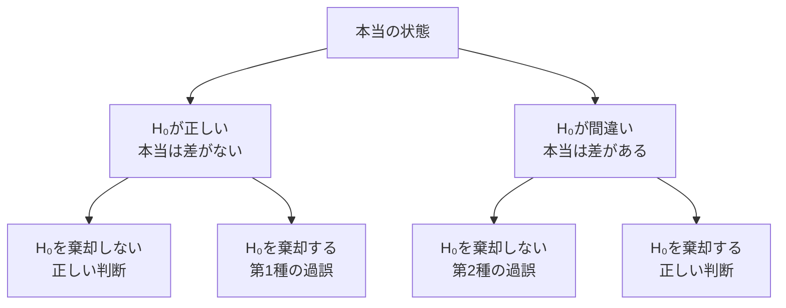
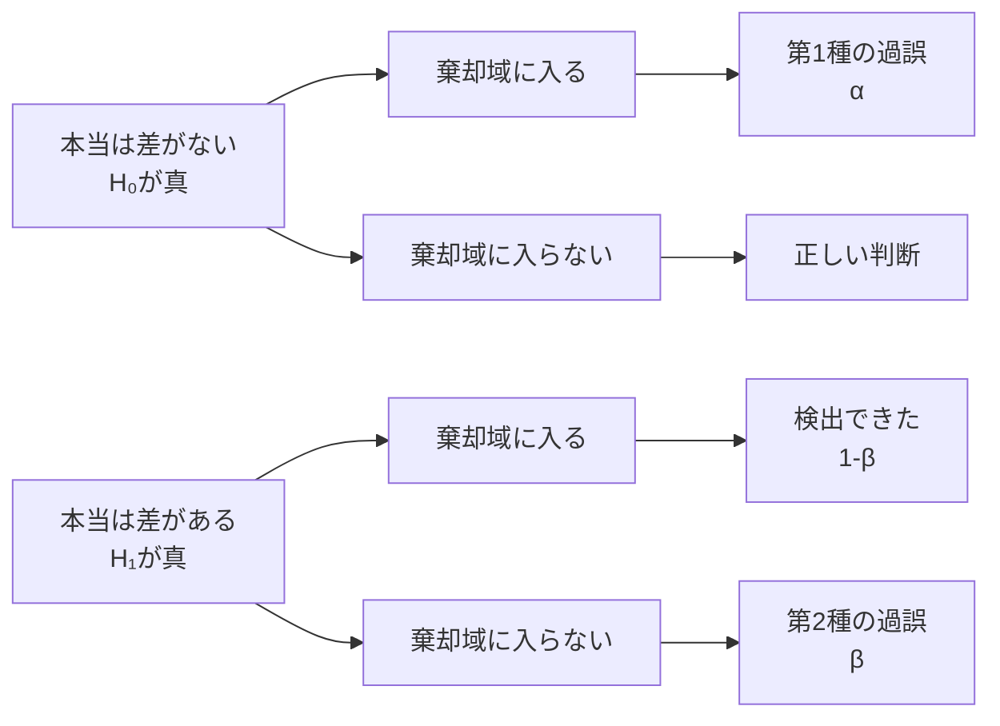
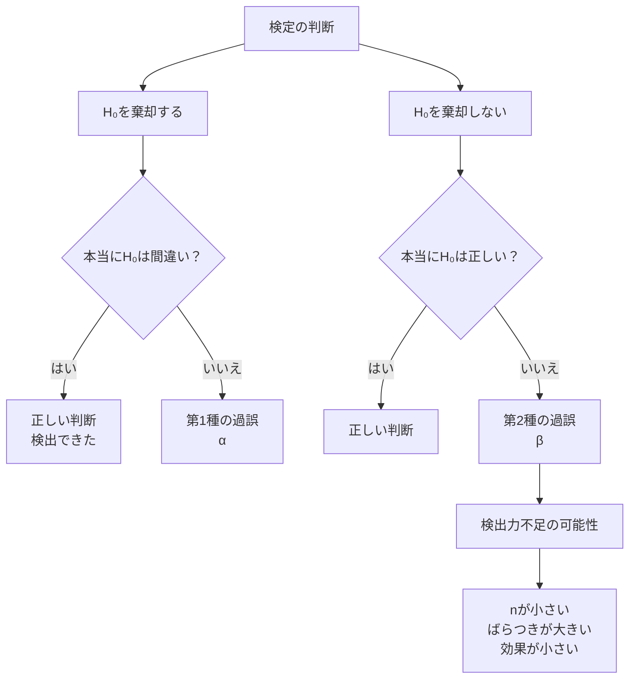

前回は、片側検定・両側検定・p値を学びました。

今回のテーマは、

```text
仮説検定では、どんな間違いが起こるのか？
```

です。

仮説検定は、データを使って判断する方法です。  
ただし、データにはブレがあります。

だから、仮説検定では常に **間違える可能性** があります。

その代表が、

```text
第1種の過誤
第2種の過誤
検出力
```

です。

---

# 1. まず結論

仮説検定で起こる間違いは、大きく2種類あります。

|本当の状態|検定の判断|名前|
|---|---|---|
|本当は差がない|差があると判断する|第1種の過誤|
|本当は差がある|差があると判断できない|第2種の過誤|

一言で言うと、

```text
第1種の過誤：
本当は差がないのに、差があると言ってしまうミス

第2種の過誤：
本当は差があるのに、差があると言えないミス
```

です。

---

# 2. 裁判でたとえる

仮説検定は、よく裁判にたとえられます。

裁判では、基本的にこう考えます。

```text
最初は「無罪」と仮定する
↓
証拠が十分に強ければ有罪と判断する
```

仮説検定も似ています。

```text
最初は「差がない」と仮定する
↓
データが十分に珍しければ「差がある」と判断する
```

対応させるとこうです。

|裁判|仮説検定|
|---|---|
|無罪と仮定|帰無仮説 H₀|
|有罪と主張|対立仮説 H₁|
|証拠|データ|
|有罪判決|H₀を棄却|
|無罪判決ではなく「有罪にする証拠不足」|H₀を棄却しない|

ここで重要なのは、

> H₀を棄却しない  
> ＝ H₀が真実だと証明された

ではないことです。

裁判で「有罪にする証拠が足りない」ことと、「本当に無罪である」ことは同じではありません。

---

# 3. 4パターンの判断表

仮説検定では、現実と判断の組み合わせで4パターンあります。



表で見るとこうです。

||H₀を棄却しない|H₀を棄却する|
|---|---|---|
|H₀が正しい|正しい判断|第1種の過誤|
|H₀が間違い|第2種の過誤|正しい判断|

この表はかなり大事です。

---

# 4. 第1種の過誤とは

第1種の過誤は、

> 本当は差がないのに、差があると言ってしまうミス

です。

記号では、

```text
α
```

で表します。

前に出てきた **有意水準 α** と同じです。

つまり、有意水準5%で検定するということは、

```text
本当は差がないときに、
間違って「差がある」と言ってしまう確率を5%まで許す
```

ということです。

---

# 5. 有意水準 α の意味

有意水準5%とは、

```text
p値が5%以下ならH₀を棄却する
```

というルールでした。

でも、別の言い方をすると、

```text
第1種の過誤を5%まで許す
```

という意味でもあります。

ここはかなり重要です。

```text
α = 0.05
↓
本当は差がないのに、差があると言ってしまうリスクを5%に設定
```

つまり、αは「ミスを許す基準」です。

---

# 6. 第2種の過誤とは

第2種の過誤は、

> 本当は差があるのに、差があると言えないミス

です。

記号では、

```text
β
```

で表します。

たとえば、新しい勉強法に本当は効果があるのに、サンプル数が少なすぎたり、データのばらつきが大きすぎたりして、検定では有意にならない場合があります。

このとき、

```text
H₀を棄却しない
```

となります。

でも本当は効果があります。

これが第2種の過誤です。

---

# 7. 検出力とは

検出力とは、

> 本当に差があるときに、正しく差があると判断できる確率

です。

記号では、

```text
1 - β
```

です。

つまり、

```text
第2種の過誤 β：
本当は差があるのに見逃す確率

検出力 1 - β：
本当は差があるときに見つけられる確率
```

です。

表にするとこうです。

|用語|意味|
|---|---|
|β|本当は差があるのに見逃す確率|
|1 - β|本当に差があるときに見つける確率|

---

# 8. 図で理解する

イメージとしては、2つの世界があります。

```text
H₀の世界：差がない
H₁の世界：差がある
```

たとえば、右片側検定なら、右側に棄却域を作ります。

```text
H₀の世界で、棄却域に入る
→ 第1種の過誤

H₁の世界で、棄却域に入らない
→ 第2種の過誤

H₁の世界で、棄却域に入る
→ 検出できた
```

Mermaidで流れを見るとこうです。



---

# 9. なぜ第2種の過誤が起こるのか

第2種の過誤は、主に次の理由で起こります。

|原因|何が起こるか|
|---|---|
|サンプルサイズが小さい|標準誤差が大きくなり、差を検出しにくい|
|データのばらつきが大きい|差がノイズに埋もれる|
|本当の差が小さい|検出しにくい|
|有意水準を厳しくしすぎる|棄却しにくくなる|

特に重要なのは、

```text
nが小さい
↓
標準誤差が大きい
↓
t値が小さくなりやすい
↓
H₀を棄却しにくい
↓
第2種の過誤が増えやすい
```

という流れです。

---

# 10. αを小さくすると何が起こるか

有意水準 α を小さくすると、第1種の過誤は減ります。

たとえば、

```text
α = 0.05
```

よりも、

```text
α = 0.01
```

の方が、間違って「差がある」と言いにくくなります。

これは良いことに見えます。

でも、その分、H₀を棄却しにくくなります。

つまり、

```text
第1種の過誤は減る
第2種の過誤は増えやすい
検出力は下がりやすい
```

というトレードオフがあります。

---

# 11. トレードオフの整理

|αをどうするか|第1種の過誤|第2種の過誤|検出力|
|---|---|---|---|
|αを大きくする|増えやすい|減りやすい|上がりやすい|
|αを小さくする|減りやすい|増えやすい|下がりやすい|

かなり大事です。

有意水準を厳しくすれば常に良い、というわけではありません。

「誤検出を避けたい」のか、「見逃しを避けたい」のかで、判断が変わります。

---

# 12. 例：薬の副作用検査

薬の副作用を調べるとします。

```text
H₀：副作用はない
H₁：副作用がある
```

このとき、第1種の過誤は、

```text
本当は副作用がないのに、副作用があると判断する
```

です。

これは、良い薬を不当に危険だと判断するミスです。

一方、第2種の過誤は、

```text
本当は副作用があるのに、副作用があると判断できない
```

です。

これは危険な薬を見逃すミスです。

この場合、どちらのミスがより重大か？

多くの場合、第2種の過誤の方が深刻です。  
危険な副作用を見逃すからです。

つまり、状況によって「避けるべきミス」は変わります。

---

# 13. 例：冤罪

裁判で考えると、

```text
H₀：無罪
H₁：有罪
```

と置けます。

このとき、第1種の過誤は、

```text
本当は無罪なのに、有罪にしてしまう
```

です。

これは冤罪です。

第2種の過誤は、

```text
本当は有罪なのに、無罪としてしまう
```

です。

これは真犯人を逃すことです。

裁判では、多くの場合、第1種の過誤、つまり冤罪を重く見ます。

だから、有罪にするにはかなり強い証拠が必要です。

---

# 14. 競馬AIで考える

競馬AIの場合、たとえばこう置けます。

```text
H₀：この戦略の真の回収率は100%を超えない
H₁：この戦略の真の回収率は100%を超える
```

このとき、第1種の過誤は、

```text
本当は期待値がないのに、期待値があると判断してしまう
```

です。

これは実運用ではかなり痛いです。

なぜなら、期待値がない戦略に資金を投入することになるからです。

第2種の過誤は、

```text
本当は期待値があるのに、期待値があると判断できずに見送る
```

です。

これは機会損失です。

つまり、

|過誤|競馬AIでの意味|ダメージ|
|---|---|---|
|第1種の過誤|負ける戦略を採用する|資金を失う|
|第2種の過誤|勝てる戦略を見送る|機会損失|

競馬AIでは、基本的に第1種の過誤を重く見るべきです。

理由は単純です。

> 負ける戦略を採用すると資金が減る。  
> 勝てるかもしれない戦略を見送っても、資金は減らない。

ただし、慎重すぎると第2種の過誤が増えて、いつまでも何も採用できません。

だから実運用では、

```text
第1種の過誤を抑えつつ、
第2種の過誤で機会を逃しすぎない
```

というバランスが必要です。

---

# 15. p値だけでは足りない理由

p値は、第1種の過誤に関係する判断には使いやすいです。

でも、p値だけでは第2種の過誤や検出力はよく分かりません。

たとえば、

```text
p = 0.20
```

だったとします。

このとき言えるのは、

```text
有意水準5%ではH₀を棄却できない
```

だけです。

しかし、それが、

```text
本当に差がないから有意にならなかった
```

のか、

```text
サンプルサイズが小さすぎて検出力が足りなかった
```

のかは、p値だけでは判断できません。

ここが大事です。

---

# 16. 「有意でない」の正しい読み方

有意でないとき、正しい読み方はこうです。

```text
差があると言えるほどの証拠はなかった
```

です。

間違った読み方はこうです。

```text
差がないことが証明された
```

これはダメです。

特に n が小さい場合、有意にならないのは単に検出力不足かもしれません。

---

# 17. 検出力を上げるには

検出力を上げる方法は、主に次の通りです。

|方法|理由|
|---|---|
|サンプルサイズを増やす|標準誤差が小さくなる|
|測定誤差を減らす|ばらつきが小さくなる|
|効果が大きい対象を調べる|差が見えやすくなる|
|片側検定を使う|事前に方向が決まっているなら検出しやすい|
|有意水準を大きくする|棄却しやすくなるが第1種の過誤も増える|

ただし、最後の2つは注意が必要です。

片側検定は、**事前に方向が決まっている場合だけ**使えます。  
結果を見てから片側にするのはダメです。

有意水準を大きくすると検出力は上がりますが、第1種の過誤も増えます。

---

# 18. かなり重要なまとめ図



---

# 19. 小テスト

## 問1

第1種の過誤とはどれですか？

A. 本当は差がないのに、差があると判断する  
B. 本当は差があるのに、差がないと判断する  
C. 標本平均を計算し間違える  
D. 標準偏差を計算しない

答えは **A** です。

---

## 問2

第2種の過誤とはどれですか？

A. 本当は差がないのに、差があると判断する  
B. 本当は差があるのに、差があると判断できない  
C. p値が0になる  
D. 有意水準を設定しない

答えは **B** です。

---

## 問3

検出力とはどれですか？

A. 本当は差がないときに、差がないと判断する確率  
B. 本当は差があるときに、正しく差があると判断する確率  
C. p値が小さくなる確率  
D. 標本平均が母平均と一致する確率

答えは **B** です。

---

## 問4

有意水準 α を小さくすると、一般にどうなりますか？

A. 第1種の過誤は増える  
B. 第1種の過誤は減る  
C. 第2種の過誤は必ず0になる  
D. 検出力は必ず上がる

答えは **B** です。

ただし、第2種の過誤は増えやすく、検出力は下がりやすいです。

---

# 20. 今日のまとめ

今日の要点はこれです。

|用語|意味|
|---|---|
|第1種の過誤 α|本当は差がないのに、差があると判断するミス|
|第2種の過誤 β|本当は差があるのに、差があると判断できないミス|
|検出力 1 - β|本当に差があるときに、正しく差を見つける確率|
|有意水準 α|第1種の過誤をどこまで許すか|
|有意でない|差がない証明ではなく、差がある証拠が足りないという意味|

一番重要なのはこれです。

> 仮説検定は、必ず間違える可能性を持つ判断方法である。  
> 第1種の過誤と第2種の過誤はトレードオフになる。

次回は、**2標本t検定** に進むのが自然です。  
ここから「2つのグループの平均に差があるか」を扱います。